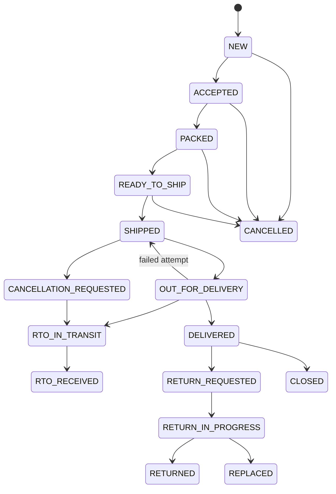

# BluBuy Marketplace Workflows: Research and Build Specification

| Field | Value |
|---|---|
| Document | 01-marketplace-workflows |
| Version | 1.0 |
| Date | 2026-10-01 |
| Status | Source of truth for dashboard build (web) and backend design; Flutter apps reuse the same contracts |
| Scope | Customer storefront, Seller Hub, Admin console, Support desk, Logistics hub console, Delivery associate app, Fulfillment center (warehouse) console |
| Reference marketplaces | Amazon.in, Flipkart (plus Indian regulation that binds both) |

How to read this document:

- Part A (sections 1 to 6) is research: how Amazon.in and Flipkart actually work in 2025-2026, with numbers. Numbers marked "indicative" come from third-party calculators or press coverage and must not be treated as official rate cards.
- Part B (sections 7 to 16) is the BluBuy specification derived from the research: roles, surfaces, modules and pages, state machines with exact status names, data entities, business rules and an example rate card.
- Where Part B makes a product decision that differs from Amazon or Flipkart, the reason is stated.
- Status names in section 11 are canonical. Use them verbatim (UPPER_SNAKE_CASE) in the database, APIs, and UI mapping tables.

## Table of contents

- Part A: Research
  - 1. Indian regulatory frame every marketplace must follow
  - 2. Customer journey (Amazon.in and Flipkart)
  - 3. Seller journey (Amazon Seller Central India and Flipkart Seller Hub)
  - 4. Platform admin and operations
  - 5. Logistics
  - 6. Customer support
- Part B: BluBuy specification
  - 7. BluBuy programs and brand names
  - 8. User roles and permissions
  - 9. Surfaces, modules and pages
  - 10. Cross-cutting business rules and policies
  - 11. Canonical state machines
  - 12. Core data entities
  - 13. Example fee rate card (example only)
  - 14. Settlement and tax calculation
  - 15. Notification events and support taxonomy
  - 16. Open decisions and assumptions
- Sources

---

# Part A: Research

## 1. Indian regulatory frame every marketplace must follow

These rules shape screens, data fields, and workflows. They are not optional.

### 1.1 Consumer Protection (E-Commerce) Rules, 2020

| Requirement | Product impact |
|---|---|
| Platform must appoint a Grievance Officer who acknowledges a consumer complaint within 48 hours and redresses it within 1 month of receipt | Support desk needs a "Grievance" ticket type with a 48 hour acknowledgement SLA and a 30 day resolution SLA; Grievance Officer name and contact shown in footer and Help |
| Platform must display its legal name, HQ and branch address, website details, customer care and grievance officer contacts | Static legal page and footer block managed in CMS |
| Seller details must be available: legal name, geographic address, customer care number, ratings | PDP "Sold by" panel links to a seller profile page with these fields; seller KYC must capture them |
| Country of origin and all relevant product details must be displayed | `country_of_origin` is a mandatory listing attribute in every category |
| Marketplace sellers must also appoint a grievance officer | Seller onboarding captures seller grievance contact |
| No manipulation of prices, no unfair trade practice, explicit consent for purchases (no pre-ticked boxes) | Checkout must never pre-select add-ons (insurance, extended warranty, donations) |

### 1.2 Legal Metrology (Packaged Commodities) Rules, 2011 (as amended for e-commerce)

Every pre-packaged commodity sold online must show these declarations on the listing (except month and year of packing): name and address of manufacturer / packer / importer, common or generic name of the commodity, net quantity, retail sale price (MRP, inclusive of all taxes), consumer care details, and dimensions where applicable. One identical commodity must not carry two different MRPs.

Product impact: the attribute engine has a mandatory "Legal declarations" attribute group for all physical goods: `mrp`, `net_quantity` + `unit`, `manufacturer_name_address`, `packer_name_address`, `importer_name_address` (if imported), `country_of_origin`, `consumer_care_details`, `generic_name`. Listing QC rejects listings missing these.

### 1.3 Guidelines for Prevention and Regulation of Dark Patterns, 2023 (CCPA)

Notified 30 November 2023. Thirteen named dark patterns are prohibited: false urgency, basket sneaking, confirm shaming, forced action, subscription trap, interface interference, bait and switch, drip pricing, disguised advertisement, nagging, trick question, SaaS billing, rogue malware.

In 2025 the Ministry of Consumer Affairs opened a probe into extra charges on cash-on-delivery orders and fees such as "offer handling fee", "payment handling fee" and "protect promise fee", calling extra COD charges a dark pattern. Amazon.in introduced a flat Rs 5 marketplace fee per order (June 2025) and a Rs 49 processing fee on bank-offer redemptions (March 2025); Flipkart added a Rs 3 platform fee (August 2024) and various handling fees.

BluBuy decisions derived from this:

- No COD surcharge, no "payment handling fee", no "offer handling fee". If BluBuy ever charges a customer platform fee, it must be shown on the PDP and in cart from the first price display (no drip pricing).
- "Only N left" and countdown timers must be driven by real inventory and real deal end times.
- Sponsored placements must carry a visible "Sponsored" label.
- BluBuy Plus cancellation must be as easy as sign-up (one flow, no confirm-shaming copy).
- Cart must never auto-add items.

### 1.4 GST, TCS and TDS on marketplace sellers

| Item | Current rule (as of October 2026) |
|---|---|
| GST registration | Required for sellers of taxable goods on e-commerce (category exemptions exist, for example books). Amazon and Flipkart allow GST-exempt categories with PAN only |
| TCS under section 52 CGST Act | 0.5% of net value of taxable supplies (0.25% CGST + 0.25% SGST intra-state, or 0.5% IGST inter-state), reduced from 1% with effect from 10 July 2024. Net value = taxable supplies minus returns in the month |
| TCS return | E-commerce operator files GSTR-8 by the 10th of the following month; seller claims credit in their electronic cash ledger |
| TDS under section 194-O Income Tax Act | 0.1% of gross amount of sales (reduced from 1% with effect from 1 October 2024). Not deducted for resident individual / HUF sellers whose gross sales through the operator do not exceed Rs 5 lakh in the financial year and who have furnished PAN or Aadhaar |
| GST on marketplace fees | 18% GST is charged on commission, fixed fee, shipping and all other marketplace fees; recoverable as input tax credit by registered sellers |
| E-invoicing | Mandatory for sellers whose aggregate turnover exceeds Rs 5 crore; BluBuy must be able to accept or generate IRN-bearing invoices |
| E-way bill | Required for movement of goods with consignment value above Rs 50,000 (relevant for inbound stock transfers to fulfillment centers and high-value shipments) |

### 1.5 RBI payment rules

| Rule | Impact |
|---|---|
| RBI (Regulation of Payment Aggregators) Directions, 2025, issued 15 September 2025, consolidating the 2020 PA-PG guidelines | Customer money for marketplace orders must flow through a licensed payment aggregator's escrow, not BluBuy's operating account. Marketplaces are now included in the merchant definition. Non-bank PAs cannot route cash-on-delivery money through the escrow |
| Settlement timing (PA framework) | Settlement to merchant on T+1 where T is: date of shipment intimation (if PA is responsible for delivery), or date of delivery confirmation (if merchant is responsible), or expiry of the refund period (if the agreement says funds are held until then) |
| Harmonised TAT for failed transactions (RBI circular, 20 September 2019) | Failed UPI / IMPS / wallet debits must auto-reverse by T+1; compensation of Rs 100 per day applies for delays beyond the TAT. BluBuy's payment reconciliation must detect "debited but order not created" within minutes and auto-refund |
| Card-on-file tokenisation (effective 1 October 2022) | BluBuy must never store card numbers; saved cards are network tokens held via the PA |
| Prepaid payment instruments | A gift card or wallet usable only on BluBuy is a closed-system PPI (no RBI authorisation needed). Amazon Pay gift cards are valid 1 year from activation; non-reloadable, not redeemable for cash |

### 1.6 Digital Personal Data Protection Act, 2023 and DPDP Rules, 2025

DPDP Rules notified 14 November 2025 with an 18 month phased compliance window (to about May 2027). BluBuy needs purpose-specific consent notices, consent withdrawal, data principal rights (access, correction, erasure), breach notification workflow, and retention limits. Customer account settings must include "Download my data" and "Delete my account".

---

## 2. Customer journey (Amazon.in and Flipkart)

### 2.1 Discovery

| Surface | Amazon.in / Flipkart behaviour |
|---|---|
| Home | Personalised feed of widgets: hero banners (sale events, bank offers), category shortcuts, deals carousels, "continue shopping", recommendations, sponsored brand banners, membership upsell. Heavily CMS-driven and changes daily during sale events |
| Category navigation | Multi-level taxonomy (department > category > sub-category > leaf/"browse node"). Category landing pages are curated (banners, top brands, price-band tiles) |
| Search | Typo tolerant, transliterated (Hindi in Latin script), voice search, auto-suggest with category scoping, sponsored results mixed in and labelled "Sponsored" |
| Filters (facets) | Price range, brand, customer rating (4 stars and up), discount band, delivery speed / membership-eligible (Prime / Flipkart Assured), pay on delivery availability, seller, category-specific attributes (RAM, size, colour, fabric), availability (include out of stock) |
| Sort | Relevance (default), Price low to high, Price high to low, Avg. customer review / Popularity, Newest arrivals, Discount |
| Deals pages | Today's deals, Lightning deals with claimed percentage bars, Deal of the Day, bank offer landing pages |

### 2.2 Product detail page (PDP)

Elements present on both platforms:

- Title, brand link (to brand store), rating summary and count, "Bought in past month" style social proof.
- Image gallery with zoom (main image on pure white background; secondary lifestyle images; video).
- Variation selectors (size, colour, storage). Each variation is its own child item with its own price and stock; the selection updates price, images and delivery date.
- Price block: selling price, MRP strikethrough with percentage off, "Inclusive of all taxes", unit price for consumables.
- Offers: bank instant discounts (card-issuer specific, minimum order value, cap), no-cost EMI, cashback, partner offers, coupon "clip" checkbox, membership-only price.
- Delivery block: pincode entry or saved address; promised date ("FREE delivery Tuesday, 7 October"), fastest option with order-within countdown, pay on delivery availability, return policy summary ("10 days Return and Exchange", "7 days Replacement").
- Buy box (Amazon "Featured Offer"): one seller's offer is shown as the default with Add to Cart / Buy Now. "Other sellers on Amazon" / "See other sellers" lists all offers with price, delivery date, seller rating, fulfillment badge.
- Seller panel: "Sold by X" with rating, link to seller profile, "Ships from".
- Highlights / About this item bullets, specifications table, A+ (enhanced brand content) section, legal metrology "Product information" (manufacturer, packer, importer, country of origin, net quantity).
- Ratings and reviews (histogram, review highlights, media reviews, verified purchase tag), Q&A (Amazon has been replacing classic Q&A with AI answers; Flipkart retains Q&A).
- Recommendations: frequently bought together, similar items, sponsored products.

Buy box / featured offer eligibility (Amazon, observed): FBA offers are automatically eligible; otherwise eligibility depends on seller performance (ODR under 1%, low cancellation and late shipment rates), price competitiveness (landed price), delivery speed and stock availability, and sufficient sales history. Amazon does not publish the algorithm.

### 2.3 Cart, Save for later, Wishlist

- Cart holds offers (product + seller), not just products. If the buy box changes, the cart line keeps the seller chosen but shows a price change notice.
- "Save for later" moves a line out of the cart; it stays visible below the cart and can be moved back.
- Wishlist / Lists: multiple named lists (Amazon), single wishlist (Flipkart); price drop and back-in-stock alerts.
- Cart shows delivery charges threshold: Amazon.in charges non-Prime customers a delivery fee on orders below Rs 499 (Rs 40 per item observed); Flipkart has a similar threshold and Plus/VIP exemptions.

### 2.4 Checkout

1. Login: mobile number + OTP (primary on both), email + password optional. Guest checkout is not offered.
2. Address: select saved address or add new (pincode first, auto-fill city/state, house / building, area, landmark, address type Home / Work, delivery instructions, weekend delivery preference).
3. Delivery options: standard, one-day / same-day where serviceable, scheduled slot for large appliances and furniture (date and time window, installation request).
4. Payment methods: UPI (intent, collect, QR), credit / debit card (tokenised saved cards), net banking, wallets, platform balance (Amazon Pay balance; gift card balance), EMI (credit card EMI, no-cost EMI where brand / seller subvents interest, debit card EMI, cardless EMI), Pay Later (Amazon Pay Later; Flipkart Pay Later relaunched July 2026 with 30 day credit, "Pay in 3" and 3 to 12 month EMI via PayU Finance), Pay on Delivery (cash or UPI QR at doorstep, restricted by pincode, category, order value and customer risk).
5. Offers application: bank offers auto-applied when the method matches; coupons; reward coins redemption (Flipkart SuperCoins); gift card redemption.
6. Review and place order: per-seller shipment grouping, delivery dates per shipment, price breakdown (items, delivery, platform fee if any, discounts, total), terms.
7. Payment authentication (OTP / UPI PIN), then order confirmation page with order ID(s), expected delivery dates, and "continue shopping".

### 2.5 Order confirmation, tracking and delivery

- Order confirmation SMS / email / push / WhatsApp; order appears in "Your Orders" with per-item tracking.
- Tracking timeline: Ordered > Packed > Shipped > Out for delivery > Delivered, with courier events and expected date; delivery associate name and masked call during the out-for-delivery stage.
- Secure delivery: Amazon delivers selected high-value orders only after a 6-digit OTP is given to the associate, and seals some orders in tamper-evident bags whose bag ID is scanned at doorstep. Flipkart uses OTP on high-value and open-box deliveries.
- Open box delivery: the associate opens the package in front of the customer; damaged / wrong items are rejected on the spot and refunded; after acceptance, only manufacturing-defect returns are allowed.

### 2.6 Cancellation rules

| Platform | Rule |
|---|---|
| Amazon.in | Customer can cancel items that have not been dispatched from the Orders page; after shipment, "Request cancellation" may stop delivery, otherwise refuse delivery or return. Seller-fulfilled orders: customer request goes to the seller who must act |
| Flipkart | Cancellation allowed before dispatch only; once out for delivery, cancellation is not allowed but rejection at the doorstep is. Category-specific cancellation windows are shown at checkout; post-window cancellations may incur a fee. Seller-initiated cancellations are refunded in full within 5 to 7 business days |

### 2.7 Returns, replacement and refunds

Flipkart return windows (policy as published September 2026):

| Category | Window | Resolution |
|---|---|---|
| Lifestyle (apparel, footwear, watches, bags, luggage, sunglasses, belts, winterwear) | 10 days | Refund, replacement or exchange |
| Furniture and rest of home; items under "No Questions Asked" | 10 days | Refund or replacement |
| Home decor, furnishing, household | 7 days | Refund or replacement |
| Mobiles (non-listed brands), electronics, small appliances, books, sports, toys, stationery, musical instruments, refurbished | 7 days | Replacement only |
| Listed phone / electronics / large appliance brands (Apple, Samsung, etc.) | 7 days | Brand service centre repair or replacement only |
| Fresh grocery, dairy, bakery, medicine | 1 to 3 days (2 days typical) | Refund only |
| Hygiene (diapers, intimate care, toothbrushes), wind instruments | Non-returnable | None |

Five pickup conditions checked at the doorstep (Flipkart): correct product (MRP tag, IMEI / serial must match), complete (accessories, freebies, combo items), unused (unwashed, unsoiled; devices formatted, locks disabled), undamaged, original packaging. Only one replacement per item. Installation-required items are returnable only if installed by authorised personnel.

Amazon.in: windows range from 7 to 30 days by category; mobiles, tablets, laptops and other electronics are replacement-only for defective / damaged items within 10 days; non-returnable items with damage, defect or wrong item can still be reported within 10 days of delivery.

Refund timelines published by Amazon.in (after return received, or seller confirms receipt):

| Refund destination | FBA orders | Seller-fulfilled orders |
|---|---|---|
| Amazon Pay balance | 2 hours | 2 hours |
| Credit / debit card | 2 to 4 business days | 3 to 5 business days |
| Net banking | 2 to 4 business days | 3 to 5 business days |
| UPI-linked bank account | 2 to 4 business days | 2 to 4 business days |
| Pay on Delivery: NEFT to bank account | 2 to 4 business days | 3 to 5 business days |

Patterns to copy: instant refund to platform balance on pickup for trusted customers; refund on QC pass at seller / warehouse for others; replacement shipped on pickup (or immediately for trusted customers, with pickup in parallel).

### 2.8 Reviews and Q&A

- Only customers can review; "Verified Purchase" tag when bought on the platform at a non-discounted (not free, not 50%+ discount) price.
- Sellers may not offer any compensation, discount or refund in exchange for reviews; incentivised reviews are allowed only through Amazon Vine. Violations lead to permanent removal of selling privileges and fund withholding.
- Separate "seller feedback" (rating the seller, used in ODR) and "product review" (rating the product).
- Reviews are moderated (automated plus manual) before publication; abuse reporting by customers and brands.

### 2.9 Memberships

| Program | Price (2026) | Key benefits |
|---|---|---|
| Amazon Prime | Rs 299 per month or Rs 1,499 per year | Free fast delivery, early deal access, Prime Video, Music, Prime-only deals |
| Amazon Prime Lite | Rs 799 per year | Free delivery, reduced video benefits |
| Amazon Prime Shopping Edition | Rs 399 per year | Shopping benefits only |
| Flipkart Plus | Free; Silver after 10 orders a year, Gold after 20 | Loyalty tiers, more SuperCoins, early access |
| Flipkart VIP | Rs 799 per year | 5% back in SuperCoins (cap 100 per order), bonus coins on large orders |
| Flipkart Black | Rs 1,499 per year (introductory Rs 990) | 5% SuperCoins, YouTube Premium, early sale access, priority support, travel perks |

### 2.10 Coins, rewards and gift cards

- Flipkart SuperCoins: earned per Rs 100 spent (rates vary by tier; for example 6 coins per Rs 100 for non-Plus and 12 for Plus with per-order caps), redeemed on purchases and partner rewards; coins expire about 6 months after credit; value per coin varies by redemption use.
- Gift cards: closed-loop, valid 1 year from activation, non-reloadable, cannot be resold or encashed; balance sits in the customer account and is used at checkout.

### 2.11 Customer support and A-to-z style guarantee

- Self-service first: order-level "Need help?" with guided flows (where is my order, cancel, return, refund status, payment issue).
- Chat (bot then human), call-back, email; escalation to grievance officer.
- Amazon A-to-z Guarantee: covers third-party seller orders (seller-fulfilled or FBA) where the item was not received, was materially different, or a refund was not issued. Customer must contact the seller first; claim is filed within 90 days of the maximum estimated delivery date. Amazon investigates and may refund and debit the seller. A-to-z claims count toward the seller's Order Defect Rate.

---

## 3. Seller journey (Amazon Seller Central India and Flipkart Seller Hub)

### 3.1 Registration and KYC

| Step | Amazon.in | Flipkart |
|---|---|---|
| Account | Email / mobile, OTP verification | Mobile + email OTP |
| Tax | GSTIN (mandatory unless only GST-exempt categories), PAN | GSTIN (or exempt category such as books), PAN and legal business name |
| Bank | Active bank account in business name, IFSC, proof (cancelled cheque / statement) | Same, verified by penny drop |
| Address | Business address; pickup address; for FBA add FCs as Additional Place of Business (APOB) on GST | Pickup address |
| Signature | Digital signature uploaded (used on tax invoices) | Upload or draw signature |
| Store | Display (store) name | Store name and description |
| Identity docs by constitution | Proprietor: PAN, ID and address proof. Company: CIN, incorporation certificate, MOA, company PAN. Partnership / LLP: deed, LLP certificate, firm PAN, partner IDs | Same |
| Timeline | About 15 minutes to register; verification follows | 8 steps in one sitting; document verification 24 to 72 hours; full onboarding 3 to 7 working days |

### 3.2 Brand approval, Brand Registry and category approval

- Brand Registry (Amazon): needs an active registered trademark or a pending application with IP India; word mark or design mark with words. Pending Indian applications are accepted. IP Accelerator gives faster enrolment through empanelled law firms. Benefits: A+ content, Brand Store, Sponsored Brands, counterfeit takedown tools, control of catalog attributes.
- Brand approval to sell a brand (both platforms): own brand needs trademark number; reseller of another brand needs a brand authorisation letter or invoices from the brand / authorised distributor.
- Category approval (ungating): restricted categories (jewellery, watches, health and personal care, food (FSSAI licence), toys (BIS mark), electronics with BIS registration, medical devices) need documents and sometimes performance history.

### 3.3 Listing products

- Match existing catalog: search by name, model or GTIN; if the product exists (Amazon ASIN / Flipkart FSN), the seller adds an offer (price, quantity, condition, fulfillment channel, handling time). No new content created.
- Create new: choose category (leaf), fill mandatory attributes per category template, variation theme (size, colour), product identifiers (EAN / UPC / ISBN; GTIN exemption on request for unbranded or private-label goods), images, description, bullet points, search keywords, legal metrology fields, HSN code and GST rate.
- Bulk: category-specific Excel / flat-file templates, upload, processing report with row-level errors, re-upload fixes.
- QC: Flipkart runs listing QC before a listing goes live (images, attributes, policy). Amazon applies automated checks and suppresses listings that miss required attributes or have image violations ("Search suppressed").
- Image requirements (Amazon main image): pure white background RGB 255,255,255; product fills 85% or more of the frame; at least 1000 px on the longest side for zoom; JPEG / PNG / TIFF; no text, logos, watermarks, borders, or props not included; real photo, not illustration.

### 3.4 Pricing and inventory

- Offer price must be at or below MRP. Optional "business price" and quantity discounts. Automated repricing rules (match featured offer, floor and ceiling).
- Inventory per fulfillment location; for FBA, inventory is held by Amazon FCs and auto-replenished on resellable returns.
- Handling time (days from order to dispatch) set per offer or account, drives promised delivery date.
- Vacation / holiday mode marks listings inactive.

### 3.5 Fulfillment models

| Model | Who stores | Who picks and packs | Who delivers | Badge / speed | Fees |
|---|---|---|---|---|---|
| Amazon FBA | Amazon FC (35+ FCs in India) | Amazon | Amazon | Prime badge, same / next-day | Referral + closing fee + fulfillment fees (pick and pack, weight handling, storage) |
| Amazon Easy Ship | Seller | Seller | Amazon logistics picks up from seller | Prime by invitation; COD supported | Referral + closing fee + weight handling (shipping) fee |
| Amazon Self Ship | Seller | Seller | Seller's own courier or staff | Prime only via Local Shops for nearby pincodes; no COD via Amazon | Referral + closing fee; seller pays courier |
| Amazon Seller Flex | Seller's warehouse run on Amazon systems and standards (invite-only) | Seller | Amazon picks up from seller warehouse | Prime eligible | Referral + per-shipment delivery fee; no storage fee |
| Local Shops on Amazon | Physical retailer | Retailer | Retailer / partner, nearby pincodes | Same / next-day | As Self Ship |
| Fulfilment by Flipkart (FBF) | Flipkart warehouse | Flipkart | Ekart | F-Assured badge (extra QC, 2 to 4 day delivery) | Commission + fixed fee + shipping + FBF fees |
| Non-FBF (seller fulfilled) | Seller | Seller | Ekart picks up (or approved courier) | F-Assured can be earned by high-performing seller listings | Commission + fixed fee + shipping |
| Flipkart Smart Fulfilment | Seller warehouse verified by Flipkart | Seller | Ekart | F-Assured | Discontinued in 2022 |

### 3.6 Order processing (seller-packed orders)

Amazon Easy Ship (India): new order appears as Unshipped; invoice is generated by Amazon at order time; seller packs, selects a pickup slot ("schedule package"), which generates the shipping label; seller prints invoice + label (+ warranty documents), affixes label, hands over at pickup; Amazon logistics delivers and collects COD. Documents available as PDF / PNG / ZPL.

Flipkart Seller Hub: Pending Labels (generate label and invoice) > Pending RTD (pack and mark Ready To Dispatch) > Pending Handover (added to an open manifest per transporter; print manifest) > Handed over / In transit. Rules: never mark RTD before the package is fully packed with label and invoice; an order not marked RTD by the Dispatch By Date is an SLA breach; repeated breaches or failed pickups lead to "Cancelled by Seller" and the listing is forced out of stock for 7 days.

### 3.7 Returns handling and seller claims

- Amazon SAFE-T (Seller Assurance for E-commerce Transactions): seller claims reimbursement when a return arrives damaged, used, wrong, or missing; eligible for FBA, Easy Ship, Seller Flex and prepaid-return-label orders; evidence (photos, unboxing video) required. Amazon India runs proactive reimbursement in some cases after 21 days from refund date, which makes manual claims temporarily ineligible.
- Flipkart Seller Protection Fund (SPF): claim within 14 days of return delivery for damaged, defective, missing or wrong returned products; returns TAT 60 days from approval (45 days during Big Billion Days); claim decision in 12 days; payout 3 to 4 days after approval. Evidence: photos from all angles, shipping label image, description.

### 3.8 Payments and settlement cycle

| Platform | Cycle |
|---|---|
| Amazon.in | Sellers become eligible for payment 7 days after order delivery; disbursement every 7 days including Pay on Delivery orders; net of fees, TCS and TDS |
| Flipkart | Tier-based. Historically Gold 7, Silver 10, Bronze 15 business days; indicative 2026: Diamond / Platinum about 2 business days from delivery, Gold about 3, Silver about 10, Bronze about 15. Payments released Monday, Wednesday, Friday; credited within 24 to 48 hours |

### 3.9 Fee structures

#### 3.9.1 Amazon.in

| Fee | Basis | 2025-2026 facts |
|---|---|---|
| Referral fee | Percentage of item price (category-wise, historically 2% to 16% for most, up to 30% for some) | Zero referral fee on products under Rs 300 in 135+ categories from 7 April 2025; expanded to products under Rs 1,000 across 1,800+ categories from 16 March 2026 (12.5 crore+ products). Indicative rates above Rs 1,000: apparel about 7%, footwear 10%, mobiles 4%, laptops 4%, electronics accessories 8%, home and kitchen 9%, beauty 10%, grocery 6%, books 5%, toys 9%, watches 13%, furniture 12% |
| Closing fee | Fixed per unit by price band and channel | Indicative 2025 slabs (Easy Ship / FBA / Self Ship): Rs 0-250: 5 / 25 / 7; Rs 251-500: 9 / 28 / 20; Rs 501-1,000: 30 / 40 / 36; Rs 1,001-5,000: 50 / 65 / 55; above Rs 5,000: 65 / 80 / 70. From 7 September 2026: plus Rs 1 for items up to Rs 500 and plus Rs 3 above Rs 500 (FC, Easy Ship, Seller Flex) |
| Weight handling fee (Easy Ship / FBA shipping) | By weight slab and zone (local, regional, national) | National rate from Rs 65 (down from Rs 77) from April 2025; under 1 kg reduced by up to Rs 17; Easy Ship fees cut 20%+ for items under Rs 300 from March 2026. Indicative Easy Ship: under 500 g: 29 / 44 / 65; 500 g-1 kg: 39 / 54 / 75; 1-2 kg: 55 / 70 / 90; 2-5 kg: 80 / 100 / 130 |
| FBA pick and pack | Per unit | Rs 11 standard, Rs 50 heavy / bulky (official FAQ); third-party guides cite Rs 14 to 40 by size |
| FBA storage | Per cubic foot per month | Rs 33 (official FAQ); higher in peak months; long-term storage fee beyond 365 days |
| Multi-unit discount | Second unit in same box | Up to 90%+ lower selling fees on the second unit |
| Cancellation fee | Seller-initiated cancellations (Easy Ship, Self Ship), including auto-cancel for not shipping within 24 hours of estimated ship date | From 17 August 2026: 10% of order value below Rs 10,000; 8% for Rs 10,001-50,000; 5% for Rs 50,001-1,00,000; 2% above Rs 1,00,000; plus 18% GST |
| New FBA seller benefit | | FBA-specific fees waived for first 100 units or 3 months |

#### 3.9.2 Flipkart

| Fee | Basis | 2025-2026 facts |
|---|---|---|
| Commission | Percentage, category-wise | 0% on all products under Rs 1,000 from November 2025; 0% on all fashion at any price from 8 July 2026. Indicative above Rs 1,000: mobiles 2-5%, consumer electronics 5-9%, laptops 5-8%, home and kitchen 8-14%, beauty 10-15%, sports 7-12%, FMCG 3-8% |
| Fixed fee (closing fee) | Per order by price band, fulfillment type and seller tier (base to base + Rs 10 by tier) | Indicative Gold tier (NFBF / FBF): up to Rs 250: 11 / 9; 251-500: 18 / 14; 501-1,000: 30 / 24; 1,001-5,000: 65 / 50; above 5,000: 90 / 70 |
| Collection fee | Percentage of order value | Indicative: prepaid 1.8-2%, COD 2-3% (Flipkart has been folding components into a simpler two-part card: fixed + commission) |
| Shipping fee | By weight (higher of actual or volumetric, L x W x H / 5000) and zone | Free local and zonal under 500 g. Indicative: under 500 g: free / free / 40; 500 g-1 kg: 28 / 40 / 63; 1-2 kg: 48 / 63 / 85; 2-5 kg: 75 / 98 / 125 |
| Reverse shipping | Per return | Indicative Rs 160-175 per return, reduced by about Rs 35 in late 2025 |
| Fulfilment penalties | Flat, from 23 August 2026 | Rs 30 per shipment not ready by Dispatch By Date; Rs 60 per seller-cancelled shipment (or auto-cancelled after 3 missed dispatch dates); Rs 90 if delayed and then cancelled. Replaced earlier account locking |
| Shipping discount by tier | | Gold 20%, Silver 10% off forward shipping (historical) |
| GST | | 18% on every fee line |

### 3.10 Account health metrics and thresholds

Amazon (Seller Central, applies to India):

| Metric | Definition | Target | Window |
|---|---|---|---|
| Order Defect Rate (ODR) | Orders with negative feedback (1-2 star seller rating), A-to-z claim, or chargeback divided by total orders | Under 1% | 60 days |
| Pre-fulfillment Cancel Rate | Seller-initiated cancellations before shipment divided by orders (customer-requested cancellations excluded) | Under 2.5% | 7 days |
| Late Dispatch Rate | Orders confirmed shipped after the expected ship date divided by orders | Under 4% | 10 and 30 days |
| Valid Tracking Rate | Self-shipped packages with valid tracking ID divided by packages | Over 95% | 30 days |
| On-Time Delivery Rate | Packages delivered by promised date | Over 90% | 14 days |
| Buyer message response | Respond within 24 hours, including weekends | Over 90% within 24 hours | 90 days |
| Account Health Rating (AHR) | Score 0 to 1000 from policy compliance over about 180 days; new accounts start at 200 | 200+ healthy; 100-199 at risk; 0-99 deactivation-eligible | 180 days |

Flipkart:

| Metric | Threshold | Consequence |
|---|---|---|
| Seller Cancellation Rate | 0.25% | Account suspension minimum 3 days (historical), now Rs 60 per cancellation penalty |
| RTD (Ready To Dispatch) Breach Rate | 0.5% | Suspension minimum 1 day (historical), now Rs 30 per breach |
| Pickup Reattempts Rate (seller not ready) | 2% | Suspension minimum 1 day |
| Customer Returns Rate | Category (vertical) benchmark | Tier impact, listing actions |
| Weight Anomaly Rate | 5% | Penalties, recovery of shipping difference |
| Product rating | Vertical benchmark | Tier and visibility impact |

### 3.11 Seller tiers (Flipkart model)

Evaluated every 90 days on revenue, cancellations, RTD breaches, returns and ratings. Example (historical): Gold needs revenue of Rs 50 lakh or 6,000 units in the window, seller cancellation under 0.15%, RTD breaches under 1%, returns and product rating at vertical benchmark; Silver needs Rs 25 lakh or 3,000 units, cancellation under 0.5%, RTD breaches under 1.4%. Benefits: lower fixed fee, faster payments, shipping discounts, account manager, sale event priority. Tiers now named Platinum, Gold, Silver, Bronze.

### 3.12 Advertising

| Item | Amazon Ads (India) | Flipkart Ads |
|---|---|---|
| Formats | Sponsored Products (SP, keyword / product targeting, search and PDP placements), Sponsored Brands (SB, headline banner with logo and 3 products, video; Brand Registry needed), Sponsored Display (SD, audience and product targeting on and off Amazon) | Product Listing Ads (PLA) in 6 placements: home, search slot 1, rest of search, PDP below Add to Cart, browse and category pages; display ads; brand ads |
| Pricing | CPC auction, second-price style; indicative CPC Rs 2 to 35 (SP Rs 5-25, SB Rs 8-30, SD Rs 3-15); minimum daily budget around Rs 100 | CPC (typical Rs 1-5), Smart ROI campaigns where Flipkart bids to a target ROI |
| KPIs | ACoS = ad spend / ad sales (15-25% considered good, 30-40% acceptable at launch); ROAS = ad sales / ad spend; impressions, clicks, CTR, CPC, conversion rate, TACoS | ROI, CPC, CTR, conversions |
| Billing | Prepaid wallet or charged against seller balance / card | Prepaid wallet |

### 3.13 Promotions and sale events

- Promotion types: Coupons (percentage or amount off, clip on PDP, budget-capped), Lightning Deals (time-boxed, limited quantity, progress bar), Deal of the Day / Best Deals (multi-day hero deals), Prime-exclusive deals, percentage-off and buy-more-save-more promotions, bundle offers, bank offers (funded by bank / platform), no-cost EMI (seller or brand subvents interest).
- Deal fees: Amazon charges a per-deal fee (higher during Prime Day and festive events) and coupon fees; amounts vary by marketplace and event.
- Sale events: Amazon Great Indian Festival (2025 started 23 September with 24 hour Prime early access and "Early Deals" from 13 September; 10% instant discount with partner bank; no-cost EMI up to 24 months), Prime Day; Flipkart Big Billion Days, Big Saving Days, Diwali sales. Seller participation: invitation by category team, deal submission with minimum discount and stock commitments, price lock windows, seller must keep stock in FC for fulfilled programs.

### 3.14 Business reports

Standard seller reports: sales dashboard (ordered product sales, units, sessions, page views, unit session percentage / conversion, buy box percentage), by date and by SKU / child item; inventory (available, inbound, reserved, unfulfillable, stranded, ageing); orders report; returns report; payments (settlement statements, transaction-level fee breakdown, deferred transactions); tax reports (GST, TCS, TDS certificates); advertising reports (search term, targeting, placement); fulfillment reports; account health history.

### 3.15 Customer messaging rules (Amazon buyer-seller messaging)

- Respond to buyer messages within 24 hours, including weekends and holidays.
- Prohibited: marketing, promotions, coupons, cross-sells, external links, seller's own website / social / email / phone, logos linking off-platform, "thank you" messages with no service purpose, review requests that ask for positive ratings or offer anything in return, emojis, GIFs, tracking pixels.
- Permitted: necessary messages (problem with order, info needed to complete return) and proactive messages (invoice, scheduling heavy item delivery), within 30 days of order.
- Messages are relayed through anonymised platform email addresses.

---

## 4. Platform admin and operations

Both marketplaces run large internal tool suites. Functions observed (from seller-facing artefacts and public coverage):

| Function | What it does |
|---|---|
| Seller onboarding verification | Verifies GSTIN (GST portal), PAN (NSDL / Protean), bank (penny drop), address, signature, constitution documents; risk screening (duplicate accounts, linked bad actors); approves / rejects / requests more info |
| Category and attribute management | Taxonomy tree, leaf categories, attribute sets with types and validations, variation themes, HSN mapping, return policy per category, restricted category gating |
| Catalog moderation | Listing QC (images, title rules, prohibited keywords, legal metrology), duplicate detection and merge, catalog contribution ranking (brand owner wins), suppression and blocking |
| Brand approvals and IP | Brand creation, brand registry verification against IP India, authorisation letters, counterfeit and IP complaints (notice and takedown) |
| Rate cards | Category commission tables, fixed fee slabs, shipping slabs, tier modifiers, effective-dated versions, promotional fee waivers (for example zero commission bands) |
| Payments reconciliation | Gateway settlement files vs orders, COD remittance vs delivered COD orders, refunds vs gateway refunds, escrow balance, seller payout runs, fee invoices to sellers, TCS / TDS filings |
| Refunds and claims | Refund approvals above thresholds, failed refund rerouting, A-to-z style claims, seller claims (SAFE-T / SPF), chargebacks |
| Fraud and risk | COD fraud (fake orders, repeated refusals), return abuse (empty box, wardrobing, swaps; about 14% of returns are estimated fraudulent in India), payment fraud, coupon abuse, seller fraud (fake orders, review manipulation, counterfeits), delivery associate fraud (fake attempts, cash shortages). Controls: OTP verification, COD limits by pincode / customer, unboxing evidence, risk scoring, open box delivery |
| Merchandising and CMS | Homepage widgets, banners, collections, sale event microsites, search boosts and synonyms, sponsored slot inventory |
| Coupons and sale events | Platform coupons, bank offer configuration, event calendar, deal approval queues, price validation (no inflated MRP or pre-event price hikes) |
| Notifications | SMS, email, push, WhatsApp templates (DLT registration required for SMS in India), transactional vs promotional consent |
| Reviews moderation | Automated filters, manual queue, abuse reports, review manipulation detection |
| Internal RBAC and audit | Role-based access per function, maker-checker for money movement, immutable audit logs |
| Reports | GMV, orders, cancellations, returns, NPS, seller performance, logistics SLA, finance reconciliation |

---

## 5. Logistics

### 5.1 Network structure

| Leg | Description |
|---|---|
| First mile | Pickup associate collects packed shipments from seller pickup address (Easy Ship / Non-FBF) or the FC dock hands over to line haul; packages scanned against a manifest; moved to the origin processing centre / hub |
| Fulfillment centre (FC) | Inbound (appointment, unload, receive against shipment, GRN, damage and discrepancy flags), putaway to bins by velocity and zone, storage, outbound (wave / batch / zone picking, packing with label and invoice, sortation by destination, dock handover). Amazon's large Indian FCs run dozens of receive docks and kilometre-long conveyors |
| Middle mile | Origin hub > (mother hub for regional primary sort) > line haul trucks or air > destination hub; bags consolidated by destination; hub-to-hub manifests |
| Last mile | Destination hub > delivery hub / delivery station (DC) > delivery associate runsheet; attempt; delivered or NDR; cash and undelivered shipments reconciled at end of day |
| Reverse | Customer pickup (with doorstep QC checklist) > delivery hub > hub > seller or FC returns processing; RTO shipments follow the same reverse lanes |

Ekart (Flipkart) is a wholly owned logistics arm handling most Flipkart orders and third-party business; Amazon runs Amazon Transportation Services plus partner couriers and delivers to about 99% of Indian pincodes.

### 5.2 Pincode serviceability and promise

- Pincode master: serviceable for forward, reverse, COD, heavy / bulky, hazmat, installation; delivery station mapping; zone (local, regional, national, special such as North-East, J&K, islands).
- Promised delivery date = order time vs cutoff + seller handling time (or FC processing time) + pickup schedule + transit days by lane + non-working days.
- Shipping cost calculation uses the higher of actual and volumetric weight (L x W x H in cm / 5000).

### 5.3 Delivery attempts, NDR and RTO

- NDR (Non-Delivery Report) is raised on a failed attempt with a reason code: customer not available, customer refused, address incorrect / incomplete, premises closed, customer asked to reschedule, COD amount not ready, out of delivery area, OTP not provided.
- Window to act on an NDR is typically 24 to 48 hours; couriers make 2 to 3 attempts (some up to 5) before marking RTO (Return To Origin).
- RTO is returned to the seller (or FC) at the seller's cost on most couriers; marketplaces reduce RTO with customer outreach (SMS / IVR / WhatsApp) to confirm reattempt, address correction, and COD to prepaid conversion.

### 5.4 COD cash remittance

Delivery associate collects cash or UPI at the door; deposits cash at the hub cashier at end of day; hub banks it; the logistics entity remits to the marketplace (or seller for third-party couriers). Industry remittance cycles: D+3 to D+7 typical, D+1 / D+2 express options, 7 to 15 days at some couriers. COD remains 50-60% of orders in Tier-2 / Tier-3 India.

### 5.5 Reverse logistics with quality check

Doorstep QC by pickup associate (checklist per category: product match by image / serial / IMEI, MRP tag, accessories, unused, packaging, photos). Pickup refused if QC fails (return status reverts, customer informed). Second QC at seller / FC on receipt: grade as Sellable, Damaged (seller fault), Damaged (customer fault / in transit), Wrong item returned, Missing item, used to decide restock and SAFE-T / SPF style claims.

---

## 6. Customer support

| Aspect | Observed practice |
|---|---|
| Channels | In-app / web help centre, chatbot with order context, live chat, call-back, email, social; seller support via case log in seller portal |
| Ticket categories | Order status / delay, delivery issue (marked delivered not received, damaged in transit), cancellation, return / replacement, refund status, payment (debited, no order; double charge; EMI), product quality / wrong item, seller complaints, account and login, membership, coins and gift cards, offers / coupons not applied, installation / warranty, fraud / scam reports, grievance |
| SLAs | First response for chat within about 1 minute; email / web form within 24 hours; grievance acknowledgement within 48 hours and resolution within 1 month (legal requirement) |
| Agent powers | Cancel on behalf, initiate return or replacement on behalf, issue refund on behalf within limits (higher amounts go to supervisor approval), goodwill credit / coupon, reschedule delivery, escalate to seller / logistics / finance |
| Escalation | L1 agent > L2 specialist / resolution team > supervisor > grievance officer; internal escalations to seller (seller must respond within 24-48 hours) and logistics (investigation for "not received" claims) |
| Quality | CSAT survey after resolution, QA scoring of transcripts, repeat-contact tracking |

---

# Part B: BluBuy specification

## 7. BluBuy programs and brand names

One naming system, used consistently in UI copy, code enums and docs. Prefix "BluBuy" for programs, "Blu" for currencies and tiers.

| BluBuy name | Equivalent | Code enum / key | What it is |
|---|---|---|---|
| BluBuy Storefront | amazon.in / flipkart.com | `STOREFRONT` | Customer web and (later) Flutter app |
| BluBuy Seller Hub | Seller Central / Seller Hub | `SELLER_HUB` | Seller web portal (later seller app) |
| BluBuy Control | Internal admin tools | `CONTROL` | Admin and operations console |
| BluBuy Care Desk | Support agent tools | `CARE_DESK` | Support agent console |
| BluBuy Logistics | Amazon Transportation / Ekart | `BLUBUY_LOGISTICS` | BluBuy's own pickup, hub and last-mile network |
| BluBuy Hub Console | Delivery station tools | `HUB_CONSOLE` | Hub manager web console |
| BluBuy Rider | Delivery associate app | `RIDER_APP` | Flutter app for delivery and pickup associates |
| BluBuy FC Console | Warehouse management | `FC_CONSOLE` | Fulfillment centre web + handheld app |
| BluBuy Fulfilled | FBA / FBF | `BLUBUY_FULFILLED` | Seller stock stored, packed and shipped by BluBuy FCs |
| BluBuy Ship | Easy Ship / Non-FBF | `BLUBUY_SHIP` | Seller packs, BluBuy Logistics picks up and delivers |
| BluBuy Flex | Seller Flex | `BLUBUY_FLEX` | Invite-only: seller warehouse run on BluBuy FC software and standards; BluBuy picks up; Assured-eligible |
| Self Ship | Self Ship | `SELF_SHIP` | Seller ships via own courier and uploads tracking; prepaid only |
| BluBuy Local | Local Shops on Amazon / hyperlocal | `BLUBUY_LOCAL` | Phase 2: nearby store delivery |
| BluBuy Assured | Prime badge / F-Assured | `ASSURED` | Trust badge on offers: BluBuy Fulfilled, BluBuy Flex, or Gold+ seller with BluBuy Ship and quality thresholds. Means extra QC, faster delivery, easy returns |
| BluBuy Plus | Prime / Flipkart Black | `PLUS` | Paid membership |
| BluCoins | SuperCoins | `BLUCOINS` | Loyalty currency earned on purchases |
| BluBuy Credits | Amazon Pay balance (closed loop) | `CREDITS` | Closed-system store credit for refunds and goodwill; instant refunds land here |
| BluBuy Gift Card | Amazon Pay Gift Card | `GIFT_CARD` | Closed-loop gift card, 1 year validity, redeemed into BluBuy Credits |
| BluBuy Pay Later | Amazon Pay Later / Flipkart Pay Later | `PAY_LATER` | BNPL via NBFC partner (phase 2) |
| BluBuy Guarantee | A-to-z Guarantee | `GUARANTEE_CLAIM` | Customer protection claims against sellers |
| BluBuy SafeClaim | SAFE-T / SPF | `SAFE_CLAIM` | Seller reimbursement claims for bad returns and logistics loss |
| BluBuy Big Days | Great Indian Festival / Big Billion Days | `EVENT_BIG_DAYS` | Flagship festive sale event |
| BluBuy Plus Day | Prime Day | `EVENT_PLUS_DAY` | Members-only annual sale |
| Blu Flash Deal | Lightning Deal | `FLASH_DEAL` | Time-boxed, quantity-capped deal |
| Blu Deal of the Day | Deal of the Day / Best Deal | `DEAL_OF_THE_DAY` | One-day hero deal |
| BluBuy Coupons | Coupons | `COUPON` | Seller-funded or BluBuy-funded clip / code coupons |
| BluBuy Ads | Amazon Ads / Flipkart Ads | `ADS` | Sponsored Products, Sponsored Brands, Sponsored Display |
| BluBuy Brand Registry | Brand Registry | `BRAND_REGISTRY` | Brand owner verification and tools |
| BSIN | ASIN / FSN | `bsin` | BluBuy Standard Identification Number, 10 characters, starts with `B`, for each sellable variant |
| Blu Seller Tiers | Flipkart tiers | `BRONZE`, `SILVER`, `GOLD`, `PLATINUM` | Quarterly seller tiering |
| BluBuy Seller Health | Account Health Rating | `SELLER_HEALTH_SCORE` | 0 to 1000 score plus metric dashboard |
| BluBuy Seller Academy | Seller University | `ACADEMY` | Training content and onboarding checklist |
| BluBuy Secure Delivery | OTP delivery, tamper-evident bags | `SECURE_DELIVERY` | OTP-at-door for high value and sensitive orders |
| BluBuy Open Box | Open box delivery | `OPEN_BOX` | Inspect at door for selected categories |
| BluBuy Business | Amazon Business | `BUSINESS` | Phase 2: GST invoice / B2B pricing |

---

## 8. User roles and permissions

### 8.1 Role catalogue

| # | Role | Surface | Description |
|---|---|---|---|
| C1 | Guest | Storefront | Browse, search, PDP, cart (device-bound); must log in to check out |
| C2 | Customer | Storefront | Registered via mobile OTP |
| C3 | BluBuy Plus Member | Storefront | Customer with active membership (an attribute, not a separate login) |
| S1 | Seller Owner (Primary Admin) | Seller Hub | Legal account holder; full access; only role that can change bank account, GSTIN, legal details, close the account, add / remove users |
| S2 | Seller Store Manager | Seller Hub | Everything except bank / legal / user management |
| S3 | Seller Catalog Manager | Seller Hub | Listings, images, brand / category approval requests, pricing (optional), inventory |
| S4 | Seller Operations Manager | Seller Hub | Orders, labels, manifests, pickups, returns receipt, inbound shipments to FC, inventory |
| S5 | Seller Packer | Seller Hub | Print labels / invoices, mark packed and Ready to Ship; no prices or finance |
| S6 | Seller Finance Manager | Seller Hub | Payments, statements, fee invoices, tax reports, SafeClaims |
| S7 | Seller Ads Manager | Seller Hub | BluBuy Ads campaigns and ad wallet; promotions (optional) |
| S8 | Seller Customer Service | Seller Hub | Buyer messages, Guarantee claim responses, return requests needing review |
| S9 | Seller Read-only Analyst | Seller Hub | Reports and dashboards only |
| S10 | Seller API Integration (machine user) | API | Scoped API keys (phase 2) |
| A1 | Super Admin | Control | Platform configuration, role management; break-glass; all actions audited |
| A2 | Operations Admin | Control | Orders, cancellations, SLA monitoring, manual overrides with reason |
| A3 | Seller Onboarding Verifier (KYC) | Control | Reviews seller applications and documents |
| A4 | Catalog Moderator (QC) | Control | Listing QC queue, suppress / unsuppress, duplicate merge |
| A5 | Category Manager | Control | Category tree, attributes, category approvals, deal approvals for own categories, rate card proposals |
| A6 | Brand and IP Manager | Control | Brand creation, Brand Registry, authorisation letters, IP complaints |
| A7 | Merchandiser / CMS Editor | Control | Homepage, banners, collections, search merchandising |
| A8 | Marketing and Promotions Manager | Control | Platform coupons, bank offers, sale events, BluCoins rules, notification campaigns |
| A9 | Ads Operations | Control | Ad policies, creative review, CPC floors, ad billing issues |
| A10 | Finance Manager | Control | Approves payouts and high-value refunds, rate card publishing (checker), reconciliation sign-off, tax filings |
| A11 | Finance Executive | Control | Prepares payout runs, reconciles gateway and COD files, handles refund failures (maker) |
| A12 | Risk and Fraud Analyst | Control | Risk case queue, block / unblock entities, COD controls, claims investigation |
| A13 | Trust and Safety / Seller Performance | Control | Account health enforcement, policy violations, suspensions, appeals |
| A14 | Reviews and Q&A Moderator | Control | Review moderation queue, abuse reports |
| A15 | Logistics Admin | Control | Network configuration (FCs, hubs), pincode serviceability, transit matrix, courier partners, shipping rate tables |
| A16 | Compliance / Grievance Officer | Control + Care Desk | Grievance cases, legal requests, takedowns, regulatory reports |
| A17 | Auditor (read-only) | Control | Read-only access to everything incl. audit logs; no PII export |
| A18 | Data Analyst | Control | Reports and dashboards; masked PII |
| SP1 | Support Agent L1 | Care Desk | Tickets and chats; actions within limits (for example refund on behalf up to Rs 2,000) |
| SP2 | Support Specialist L2 | Care Desk | Escalated tickets; higher limits (up to Rs 10,000); claims |
| SP3 | Support Supervisor | Care Desk | Queue management, approvals above limits, QA, reassignments |
| SP4 | Seller Support Agent | Care Desk | Seller cases (catalog, payments, account health questions) |
| L1 | Logistics Hub Manager | Hub Console | Runs a delivery / sort hub: inbound, sort, runsheets, NDR, RTO, cash |
| L2 | Hub Operator / Sorter | Hub Console (handheld) | Scans bags and shipments in / out, sorting |
| L3 | Hub Cashier | Hub Console | Accepts DA cash deposits, bank deposits, cash reconciliation |
| L4 | Delivery Associate (DA) | Rider app | Deliveries, reverse pickups, first-mile seller pickups, COD collection |
| L5 | Line-haul Coordinator | Hub Console | Hub-to-hub manifests, vehicle dispatch and arrival |
| W1 | FC Manager | FC Console | Runs a fulfillment centre; KPIs; approves adjustments |
| W2 | Inbound Associate | FC handheld | Dock check-in, receiving, GRN |
| W3 | Putaway Associate | FC handheld | Putaway to bins |
| W4 | Picker | FC handheld | Picks against pick lists |
| W5 | Packer | FC Console (pack station) | Packs, prints invoice + label |
| W6 | Returns QC Associate | FC Console | Grades customer returns and RTOs |
| W7 | Inventory Control Associate | FC handheld | Cycle counts, bin moves, adjustments (with approval) |
| W8 | Dock / Dispatch Associate | FC handheld | Sorts to lanes, loads trucks, handover manifests |

### 8.2 Permission model

- Permissions are `resource:action` strings (for example `order:cancel`, `refund:approve`, `payout:approve`, `listing:qc_decide`, `seller:suspend`, `ratecard:publish`). Roles are bundles of permissions; custom roles allowed for sellers and admins.
- Scopes: seller users are scoped to one `seller_id`; hub roles to one `hub_id`; FC roles to one `fc_id`; category managers to a set of `category_id`s.
- Money movement uses maker-checker: the user who creates a payout run, a refund above limit, a rate card change or a manual ledger adjustment cannot approve it.
- Monetary limits are attributes of a role (for example `refund_on_behalf_max_inr`).
- Every write in Control, Care Desk, Hub and FC consoles is written to the audit log with actor, role, before / after, reason code and IP / device.
- PII masking by default (phone shown as `98XXXXXX21`), reveal requires a permission and is itself audited.

### 8.3 Permission matrix (summary)

| Capability | Owner | Store Mgr | Catalog | Ops | Packer | Finance | Ads | CS | Analyst |
|---|---|---|---|---|---|---|---|---|---|
| Listings and pricing | Yes | Yes | Yes | View | No | View | View | View | View |
| Inventory | Yes | Yes | Yes | Yes | View | No | No | No | View |
| Orders, labels, manifests | Yes | Yes | No | Yes | Yes | View | No | View | View |
| Returns receipt and QC | Yes | Yes | No | Yes | No | No | No | Yes | View |
| Payments and statements | Yes | View | No | No | No | Yes | No | No | View |
| SafeClaims | Yes | Yes | No | Yes | No | Yes | No | Yes | No |
| Ads and promotions | Yes | Yes | No | No | No | View | Yes | No | View |
| Buyer messages | Yes | Yes | No | Yes | No | No | No | Yes | No |
| Users and permissions | Yes | No | No | No | No | No | No | No | No |
| Bank, GSTIN, legal details | Yes | No | No | No | No | No | No | No | No |

---

## 9. Surfaces, modules and pages

Conventions: every list page supports search, filters, sort, pagination, column chooser and CSV export (export permission-gated). Every detail page shows an activity timeline sourced from the audit log / status history. Route paths are suggestions for the web build.

### 9.1 BluBuy Storefront (customer web; Flutter app later)

#### 9.1.1 Identity and account

| Page (route) | Shows | Key actions |
|---|---|---|
| Login / Sign up (`/login`) | Mobile number field, OTP entry, resend timer, terms and privacy consent notice (DPDP) | Send OTP, verify OTP, continue as new user (name, optional email) |
| Account home (`/account`) | Tiles: Orders, BluBuy Plus, BluCoins, BluBuy Credits, Gift cards, Addresses, Payments, Wishlist, Reviews, Notifications, Help | Navigate |
| Profile (`/account/profile`) | Name, mobile, email (verified state), gender, date of birth (optional) | Edit, verify email, change mobile (OTP on old and new) |
| Addresses (`/account/addresses`) | Saved addresses, default flag, type (Home / Work / Other), serviceability warnings | Add, edit, delete, set default |
| Saved payments (`/account/payments`) | Tokenised cards (last 4, network, expiry), saved UPI IDs, Pay Later status | Remove card / UPI, set preferred |
| Notification preferences (`/account/notifications`) | Channels (SMS, email, push, WhatsApp) by type (transactional always on, promotional opt-in) | Toggle promotional consents |
| Privacy and data (`/account/privacy`) | Consents given, data request history | Download my data, withdraw consent, delete account (with order / refund blockers listed) |
| Language (`/account/language`) | English, Hindi (phase 1); more later | Switch |

#### 9.1.2 Discovery

| Page | Shows | Key actions |
|---|---|---|
| Home (`/`) | CMS-driven widgets: hero banners, category tiles, deal carousels (Flash Deals with claimed bar), sale event banner, recommendations, recently viewed, sponsored brand banner, BluBuy Plus upsell | Tap through, add to wishlist from cards, change delivery pincode (header) |
| Category landing (`/c/:slug`) | Curated banners, sub-category tiles, top brands, price band tiles, bestsellers | Navigate to listing grid |
| Search / listing grid (`/s?q=`, `/c/:slug/all`) | Result count, product cards (image, title, rating, price, MRP, % off, Assured badge, delivery date for current pincode, "Sponsored" label, coupon tag), facets, sort, did-you-mean | Apply filters (price, brand, rating, discount, Assured, delivery by date, pay on delivery, seller, category attributes, include out of stock), sort (relevance, price low-high, price high-low, rating, newest, discount), add to cart from card (single-variant only), wishlist |
| Brand store (`/brand/:slug`) | Brand banner, story, curated product sections (from Brand Registry owner) | Follow brand, browse |
| Deals (`/deals`) | Flash Deals (time left, % claimed), Deal of the Day, coupons, bank offers | Filter by category / discount, claim coupon |
| Sale event (`/event/:slug`) | BluBuy Big Days microsite: countdown, early access for Plus, bank partners, category deal rails | Set reminder, add to wishlist |
| Seller profile (`/seller/:id`) | Legal name, address, customer care, grievance contact, rating and feedback, storefront products (mandated details) | View products, report seller |

#### 9.1.3 Product detail page (`/p/:slug/:bsin`)

| Block | Shows | Key actions |
|---|---|---|
| Media | Gallery, zoom, video, 360 (phase 2) | Swipe, zoom |
| Title and rating | Title, brand link, rating, rating count, Q&A count, "Bought N in past month" (real data) | Jump to reviews |
| Variants | Variation selectors with availability and price per option (greyed when out of stock) | Select variant (updates BSIN, price, images, delivery) |
| Price | Featured offer price, MRP strikethrough, % off, "Inclusive of all taxes", unit price, Plus member price if any | None |
| Offers | Bank offers (issuer, % or flat, min order, cap, T&C), no-cost EMI, coupon checkbox, BluCoins earnable | Clip coupon, view EMI plans |
| Delivery | Pincode / address, promised date, cutoff countdown, fastest option, pay on delivery availability, Secure Delivery note, installation info | Change pincode / address |
| Featured offer (buy box) | Seller name, rating, fulfillment badge (BluBuy Fulfilled, Assured), return policy summary | Add to Cart, Buy Now, quantity, Add to Wishlist |
| Other sellers (`/p/:bsin/offers`) | All offers: price, delivery date, seller rating, condition, Assured, return policy | Add specific offer to cart |
| Highlights and description | Bullets, description, A+ content, specs table | Expand |
| Legal declarations | Manufacturer / packer / importer, country of origin, net quantity, MRP, consumer care, generic name | None |
| Returns and warranty | Return window and type for this category / offer, warranty details | View policy |
| Ratings and reviews | Histogram, aspect ratings, media gallery, top reviews, Verified Purchase tags | Sort / filter reviews, mark helpful, report, write review (if purchased) |
| Questions and answers | Q&A list, answers by seller / brand / buyers | Ask question, answer (buyers who purchased), report |
| Recommendations | Frequently bought together, similar, sponsored products | Add bundle to cart |

#### 9.1.4 Cart and checkout

| Page | Shows | Key actions |
|---|---|---|
| Cart (`/cart`) | Lines grouped by seller / shipment, price change or stock change notices, delivery estimate, coupon applied, savings, free delivery progress (non-Plus below threshold), Save for later section | Change qty, remove, save for later, move to cart, apply coupon, proceed to checkout |
| Checkout: address (`/checkout/address`) | Saved addresses with serviceability per item | Select, add, edit address |
| Checkout: delivery (`/checkout/delivery`) | Shipments with options (Standard, One-day, Scheduled slot for large items, installation) and dates | Choose option / slot |
| Checkout: payment (`/checkout/payment`) | UPI, cards, net banking, wallets, EMI (card, no-cost, cardless), Pay Later (phase 2), Pay on Delivery (eligibility message when blocked), BluBuy Credits and gift card balance toggle, BluCoins redemption, bank offer auto-match | Select method, enter card / UPI, apply credits / coins |
| Checkout: review (`/checkout/review`) | Itemised price breakdown (items, delivery, discounts, coins, credits, total), delivery dates, seller names, return policy per item | Place order and pay |
| Payment processing (`/checkout/pay/:paymentId`) | Gateway redirect / UPI intent / collect polling, timer | Cancel, retry, switch method |
| Order confirmation (`/order/confirmed/:orderId`) | Order number, items, dates, amount paid, BluCoins earned | View order, continue shopping |
| Payment failed (`/checkout/failed`) | Reason, auto-refund assurance if money was debited | Retry payment (order held 30 minutes) |

#### 9.1.5 Orders, returns and post-purchase

| Page | Shows | Key actions |
|---|---|---|
| Orders list (`/orders`) | Orders with item thumbnails, status chips, delivery dates, filters (last 30 days, year, status) | Search, open order, buy again |
| Order detail (`/orders/:orderId`) | Items with per-item status, tracking timeline per shipment, address, payment summary, invoices per seller, refund status | Cancel item (if allowed), request return / replacement / exchange, download invoice, track, rate seller, write review, contact seller, get help |
| Tracking (`/orders/:orderId/track/:shipmentId`) | Event timeline, promised vs current ETA, DA name and masked call on out-for-delivery, delivery OTP display (Secure Delivery), proof of delivery | Reschedule (if supported), update instructions |
| Cancel flow (`/orders/:orderId/cancel`) | Cancellable items, reason picker, refund destination preview | Confirm cancel |
| Return / replace flow (`/orders/:orderId/return`) | Eligible items with window end date, reasons (category-specific), resolution options allowed (refund, replacement, exchange size / colour), pickup address and slot, refund destination (original method or BluBuy Credits instantly), photo upload for damaged / defective / wrong | Submit request |
| Returns center (`/returns`) | All return requests with status and pickup timeline | Cancel return before pickup, reschedule pickup, track refund |
| Refund detail (`/refunds/:refundId`) | Amount, destination, status, bank reference (ARN / UTR) | Raise issue |
| BluBuy Guarantee claim (`/orders/:orderId/guarantee`) | Eligibility (contact seller first, 48 hours passed), reason picker | File claim, upload evidence, track decision |

#### 9.1.6 Wishlist, membership, rewards, payments

| Page | Shows | Key actions |
|---|---|---|
| Wishlist (`/wishlist`) | Saved items, price drop since added, stock status; multiple named lists | Move to cart, remove, share list, enable price-drop alert |
| BluBuy Plus (`/plus`) | Plans (monthly, annual), benefits, current membership, renewal date, savings so far | Join, renew, cancel (one flow), auto-renew toggle |
| BluCoins (`/blucoins`) | Balance, earning history, expiring soon, earn rules | Redeem on checkout (linked) |
| BluBuy Credits (`/credits`) | Balance and ledger (refunds, gift card loads, goodwill) | Use at checkout, transfer to bank (refund-origin credits only, if regulation requires) |
| Gift cards (`/gift-cards`) | Buy gift card (designs, amount, recipient), redeem code, purchased cards | Buy, redeem, resend |

#### 9.1.7 Reviews, Q&A, help

| Page | Shows | Key actions |
|---|---|---|
| Write review (`/review/new?item=`) | Star rating, aspect ratings, title, text, photos / video, guidelines | Submit (goes to moderation) |
| My reviews (`/account/reviews`) | Reviews and status (Pending, Published, Rejected with reason) | Edit, delete |
| Seller feedback (`/orders/:orderId/feedback`) | 1 to 5 rating of seller on delivery, packaging, as-described | Submit, remove within 60 days |
| Help center (`/help`) | Order-aware help: recent orders with one-tap issues, topics, FAQs, grievance officer details | Start chat, request call-back, raise ticket, file grievance |
| Chat (`/help/chat`) | Bot with order context, handoff to agent, transcript | Choose order, describe issue, upload images |
| My tickets (`/help/tickets`) | Tickets with status and SLA | Reply, reopen, rate resolution |
| Notifications inbox (`/notifications`) | Order updates, offers (if opted-in), price drops | Mark read, open |

### 9.2 BluBuy Seller Hub (seller web; seller app later)

#### 9.2.1 Onboarding

| Page | Shows | Key actions |
|---|---|---|
| Register (`/register`) | Mobile and email OTP, password, business constitution selection | Create account |
| Onboarding wizard (`/onboarding`) | Stepper: 1 Tax details (GSTIN or GST-exempt category + PAN), 2 Business details (legal name auto-fetched from GSTIN, constitution, registered address), 3 Pickup address(es) with geo-pin, 4 Bank account (penny-drop verify), 5 Signature (upload / draw), 6 Store details (display name, logo, description, seller grievance contact, customer care number), 7 Documents by constitution, 8 Agreement acceptance (e-sign), 9 Choose fulfillment programs | Save draft per step, submit for review |
| Application status (`/onboarding/status`) | Status (see section 11.8), per-document verification state, reviewer comments | Fix and resubmit flagged items |
| Getting started checklist (`/start`) | Academy lessons, first listing, first stock, pickup test, tax settings | Complete tasks |

#### 9.2.2 Home dashboard (`/`)

Shows: action cards with counts (new orders to accept, orders to pack, pickups today, overdue dispatch, returns to receive, listings rejected / suppressed, messages awaiting reply, low stock), today / 7 / 30 day sales (GMV, units, orders), Seller Health summary (score and red metrics), next payout amount and date, tier and progress, announcements, sale event invitations.
Key actions: jump to each queue, accept all new orders, download today's manifest.

#### 9.2.3 Catalog

| Page | Shows | Key actions |
|---|---|---|
| Listings (`/catalog/listings`) | Offer rows: image, title, BSIN, seller SKU, variant, price, MRP, stock, fulfillment channel, listing status (section 11.9), featured offer %, Assured flag, issues | Edit price / stock inline, pause / resume, archive, bulk edit, filter by status |
| Add listing: match (`/catalog/add`) | Search catalog by keyword, GTIN, model, BSIN; matched products with brand restrictions shown | Sell this product (create offer), request brand / category approval if gated |
| Add listing: create new (`/catalog/new`) | Category picker (leaf), dynamic attribute form from category template (mandatory first), variation builder (theme + matrix), identifiers (GTIN or exemption), images uploader with live checks, description, bullets, keywords, legal declarations, HSN and GST rate, package dimensions and weight, return / warranty | Save draft, submit for QC |
| Bulk upload (`/catalog/bulk`) | Download category templates, upload history with processing status, row-level error report | Upload, download errors, reprocess |
| Drafts and QC (`/catalog/qc`) | Listings in DRAFT, PENDING_REVIEW, REJECTED with reasons | Fix and resubmit |
| Fix issues (`/catalog/issues`) | SUPPRESSED and BLOCKED listings with reason codes (missing attribute, image violation, price above MRP, IP complaint) | Fix, appeal |
| Images manager (`/catalog/media`) | Images per BSIN, compliance check results | Replace, reorder |
| Brand registry and approvals (`/catalog/brands`) | Brands owned / authorised, status, documents | Apply for Brand Registry, request brand approval, upload authorisation letter |
| Category approvals (`/catalog/category-approvals`) | Restricted categories and status | Apply with documents (FSSAI, BIS, drug licence) |

#### 9.2.4 Pricing

| Page | Shows | Key actions |
|---|---|---|
| Price manager (`/pricing`) | Your price, featured offer price, lowest price, MRP, fees and net payout preview per unit, featured offer status | Update price, set min / max |
| Automated pricing (`/pricing/rules`) | Rules (match featured offer, beat lowest by X, stay above floor), applied SKUs, activity log | Create, pause rule |
| Fee calculator (`/pricing/calculator`) | Inputs: category, price, weight, dimensions, channel, zone; outputs: commission, fixed fee, shipping, GST on fees, TCS, TDS, net settlement | Calculate, compare channels |

#### 9.2.5 Inventory

| Page | Shows | Key actions |
|---|---|---|
| Stock (`/inventory`) | Per SKU per location: available, reserved (open orders), inbound, unfulfillable; low-stock flags; days of cover | Update quantity, bulk update, set safety stock |
| Locations (`/inventory/locations`) | Pickup addresses / warehouses, their handling time and holiday calendar | Add location (GST APOB check), set handling time |
| BluBuy Fulfilled: inbound shipments (`/fulfilled/inbound`) | Inbound shipments with status (section 11.14), destination FC, appointment, units sent / received / discrepancies | Create shipment plan, print box labels, book appointment, cancel |
| BluBuy Fulfilled: FC inventory (`/fulfilled/inventory`) | Fulfillable, reserved, in transfer, unfulfillable (customer damaged, carrier damaged, defective), ageing buckets and storage fees | Create removal order, mark for disposal |
| Inventory health (`/inventory/health`) | Stranded (stock without active listing), excess, ageing, sell-through | Fix stranded, create promotion |

#### 9.2.6 Orders

| Page / tab | Shows | Key actions |
|---|---|---|
| Orders: New (`/orders?tab=new`) | Items in NEW with Dispatch By Date, payment type (Prepaid / COD), Accept by time | Accept, reject (counts as seller cancellation; reason required), bulk accept |
| Orders: To pack (`?tab=to_pack`) | ACCEPTED items | Generate invoice + label (moves to PACKED), print pick list, print packing slip |
| Orders: Ready to ship (`?tab=rts`) | PACKED items | Mark Ready to Ship (requires package dimensions / weight confirm), add to manifest, print manifest, schedule / reschedule pickup slot |
| Orders: Pickup / handover (`?tab=handover`) | READY_TO_SHIP items grouped by manifest and pickup slot; pickup associate assigned | Print manifest, confirm handover count with associate (OTP / scan) |
| Orders: Shipped (`?tab=shipped`) | SHIPPED / OUT_FOR_DELIVERY items with tracking | View tracking |
| Orders: Delivered (`?tab=delivered`) | DELIVERED items, return window end | View |
| Orders: Cancelled (`?tab=cancelled`) | CANCELLED items with cancelled_by and reason | View |
| Orders: Cancellation requests (`?tab=cancel_requests`) | CANCELLATION_REQUESTED items (customer asked after handover) | Approve (if not handed over) or decline with reason |
| Self Ship: tracking upload (`/orders/self-ship`) | Self Ship items awaiting tracking | Enter courier + AWB (validated), bulk upload |
| Order detail (`/orders/:orderItemId`) | Customer name, masked phone, ship-to (pincode, city), items, price, fee preview, payment type, dates (ordered, accept by, dispatch by, promised delivery), shipment events, invoice, messages | Print documents, cancel (with reason), message buyer |

#### 9.2.7 Returns and claims

| Page | Shows | Key actions |
|---|---|---|
| Returns (`/returns`) | Return requests with reason, resolution, status (section 11.3), pickup and expected arrival, doorstep QC photos | Review out-of-policy request (approve / reject within 48 hours), mark received, record receipt QC grade with photos |
| Return detail (`/returns/:returnId`) | Timeline, customer reason and photos, pickup QC checklist, refund state | Grade, raise SafeClaim |
| RTO (`/returns/rto`) | RTO shipments heading back, NDR history | Mark received, grade |
| SafeClaims (`/claims`) | Claims with status (section 11.13), amounts | File claim (within 14 days of return receipt), add evidence, appeal |
| Guarantee claims (`/claims/guarantee`) | BluBuy Guarantee claims against the seller with response deadline | Respond with evidence, offer refund |

#### 9.2.8 Payments

| Page | Shows | Key actions |
|---|---|---|
| Payments overview (`/payments`) | Next payout amount and date, open balance, on hold, reserve, last 5 payouts, upcoming deductions (ads, penalties) | View statement |
| Payout statements (`/payments/payouts`) | Payout list with status (section 11.10), UTR, period | Download statement (PDF / CSV) |
| Transactions (`/payments/transactions`) | Per order item: sale amount, each fee line, GST on fees, TCS, TDS, adjustments, net, settlement status (section 11.10) | Filter, export, raise discrepancy |
| Fee invoices (`/payments/invoices`) | Monthly BluBuy tax invoices for fees (GST), credit notes | Download |
| Tax reports (`/payments/tax`) | TCS monthly summaries (for GSTR-2X reconciliation), TDS 194-O certificates (Form 16A), GST sales report by state | Download |
| Penalties and adjustments (`/payments/adjustments`) | Penalties (late dispatch, cancellation), weight discrepancy recoveries, reversals | Dispute within 15 days |

#### 9.2.9 Performance

| Page | Shows | Key actions |
|---|---|---|
| Seller Health (`/performance`) | Seller Health Score (0-1000) and band, metrics vs targets with windows (section 10.6), trend charts, affected orders drill-down | View affected orders, download |
| Policy compliance (`/performance/policy`) | Violations (IP, counterfeit, restricted products, reviews manipulation, pricing), points deducted, status | Submit appeal / plan of action |
| Seller tier (`/performance/tier`) | Current tier, criteria progress, benefits, next evaluation date | None |
| Customer feedback (`/performance/feedback`) | Seller ratings and comments | Respond publicly (once), request removal for policy-violating feedback |
| Product quality (`/performance/quality`) | Return reasons by SKU, product ratings, quality alerts | Fix listing, pause SKU |

#### 9.2.10 Advertising (BluBuy Ads)

| Page | Shows | Key actions |
|---|---|---|
| Campaign manager (`/ads`) | Campaigns: type (SP / SB / SD), status (section 11.15), budget, spend, impressions, clicks, CTR, CPC, orders, ad sales, ACoS, ROAS | Create, pause, edit budget / bid, archive |
| Create campaign (`/ads/new`) | Wizard: type, products, targeting (auto, keyword, product, category, audience), bids, budget, schedule | Launch |
| Reports (`/ads/reports`) | Search term, targeting, placement, purchased product reports | Download, add negative keywords |
| Ad wallet (`/ads/wallet`) | Balance, recharges, deductions, invoices | Recharge, set auto-recharge, choose "deduct from payouts" |

#### 9.2.11 Promotions

| Page | Shows | Key actions |
|---|---|---|
| Promotions (`/promotions`) | All coupons, deals, percentage-off, buy-more-save-more with status (section 11.16), performance | Create, edit (when DRAFT), cancel |
| Create coupon (`/promotions/coupons/new`) | Discount type, value, budget, per-customer limit, audience (all, Plus, new-to-brand), dates | Submit |
| Deals (`/promotions/deals`) | Eligible SKUs for Flash Deal / Deal of the Day with recommended price, fee | Submit deal |
| Sale events (`/promotions/events`) | BluBuy Big Days and other events: invitation, deadlines, requirements (min discount, stock), submitted SKUs | Opt in, submit SKUs, track approval |

#### 9.2.12 Reports, messages, support, settings

| Page | Shows | Key actions |
|---|---|---|
| Business reports (`/reports/business`) | Sales and traffic by date and by BSIN: sessions, page views, units, ordered sales, conversion, featured offer % | Change range, compare, export |
| Other reports (`/reports`) | Orders, returns, inventory, fulfillment (late dispatch list), payments, tax, ads; download centre with async jobs | Request report, download |
| Buyer messages (`/messages`) | Threads per order, response timer (24 hour target), templates | Reply (content rules enforced), attach invoice, mark no response needed |
| Seller support (`/support`) | Cases with status (section 11.11) | Open case (category, order / BSIN reference), reply |
| Announcements (`/news`) | Policy changes, fee changes, event calendars | Acknowledge |
| Settings: account (`/settings/account`) | Legal details (read-only, change via case), store profile | Edit store profile |
| Settings: bank (`/settings/bank`) | Bank account (masked), verification status | Change (Owner only, re-verification and payout hold 48 hours) |
| Settings: tax (`/settings/tax`) | GSTINs per state, APOBs, e-invoicing toggle (IRN), default HSN | Add GSTIN, upload GST certificate |
| Settings: shipping (`/settings/shipping`) | Fulfillment programs enrolled, handling time, pickup slots, package defaults, holiday mode | Change handling time, enable holiday mode |
| Settings: returns (`/settings/returns`) | Return address per location, auto-approval preferences for out-of-policy requests | Edit |
| Settings: users (`/settings/users`) | Sub-users, roles, last login, 2FA | Invite, change role, deactivate |
| Settings: notifications (`/settings/notifications`) | Event subscriptions per channel | Toggle |

### 9.3 BluBuy Control (admin console)

#### 9.3.1 Overview

| Page | Shows | Key actions |
|---|---|---|
| Ops dashboard (`/`) | Live GMV, orders per minute, payment success rate by method, cancellation %, SLA breaches, NDR %, RTO %, open risk cases, queue backlogs (KYC, QC, claims, refunds), incidents | Drill into queues |

#### 9.3.2 Sellers

| Page | Shows | Key actions |
|---|---|---|
| Applications queue (`/sellers/applications`) | Applications by status (section 11.8), SLA age, risk flags (duplicate PAN / bank / device), auto-verification results (GSTIN active, PAN-name match, penny drop name match) | Assign, open |
| Application review (`/sellers/applications/:id`) | Documents with viewer, extracted data vs entered data, verification checks, linked accounts | Approve, reject (reason), request action (per document), escalate to risk |
| Seller directory (`/sellers`) | Sellers with status, tier, health score, GMV, categories | Filter, export |
| Seller 360 (`/sellers/:id`) | Profile, KYC docs, users, programs, listings summary, orders, returns, payouts, health metrics, violations, tickets, notes, audit | Suspend, reinstate, deactivate, change tier override, place payout hold, add note, impersonate (read-only "view as seller", audited) |
| Category approval queue (`/sellers/category-approvals`) | Requests with documents | Approve, reject |
| Brand approval queue (`/sellers/brand-approvals`) | Seller-brand authorisation requests | Approve, reject |
| Enforcement (`/sellers/enforcement`) | Policy violations, health-triggered actions, appeals queue | Decide appeal, issue warning, deduct points, suspend |
| Tiers (`/sellers/tiers`) | Quarterly tier computation results, overrides | Run evaluation, publish |

#### 9.3.3 Catalog

| Page | Shows | Key actions |
|---|---|---|
| Category tree (`/catalog/categories`) | Tree with leaf flags, attribute set, HSN default, return policy, commission link, restricted flag | Create, move, rename, deactivate (with listing impact preview) |
| Attributes (`/catalog/attributes`) | Attribute definitions: code, label, type (text, number, enum, multi-enum, boolean, unit-value), validations, filterable, variant-defining, mandatory per category | Create, edit, map to categories |
| Variation themes (`/catalog/variation-themes`) | Themes (Size, Colour, Size-Colour, Storage-Colour) per category | Edit |
| Listing QC queue (`/catalog/qc`) | PENDING_REVIEW listings with auto-check results (image AI checks, prohibited words, MRP sanity, duplicate likelihood) | Approve, reject with reason codes, request changes, bulk approve low-risk |
| Products (BSIN) (`/catalog/products`) | Catalog products, variants, offers count, contributor, status | Edit content (with contribution priority), suppress, block, merge duplicates |
| Duplicates (`/catalog/duplicates`) | Suspected duplicate clusters | Merge (offers move to survivor BSIN) |
| Brands (`/catalog/brands`) | Brands, owner (Brand Registry), trademark details, status | Create, verify, link owner |
| Restricted terms (`/catalog/restricted`) | Prohibited keywords, restricted products, banned items | Edit lists |
| HSN and GST (`/catalog/tax`) | HSN codes, GST rates, effective dates | Update with effective date |
| IP complaints (`/catalog/ip`) | Rights-owner complaints, affected listings | Takedown, reinstate, notify seller |

#### 9.3.4 Pricing and fees

| Page | Shows | Key actions |
|---|---|---|
| Rate cards (`/fees/rate-cards`) | Versioned rate cards (section 13): commission by category and price band, fixed fee slabs, shipping slabs, fulfilled fees, tier modifiers, effective from / to | Draft new version, simulate impact, submit for approval (Finance Manager approves), publish |
| Fee simulator (`/fees/simulator`) | Same calculator as seller but across rate card versions | Compare |
| Penalty rules (`/fees/penalties`) | Late dispatch, seller cancellation, weight discrepancy rules | Edit (maker-checker) |
| Waivers (`/fees/waivers`) | Promotional waivers (new seller 0% commission, event waivers) | Create, expire |

#### 9.3.5 Orders and operations

| Page | Shows | Key actions |
|---|---|---|
| Order search (`/orders`) | Search by order ID, item ID, AWB, phone, email, seller, BSIN | Open |
| Order 360 (`/orders/:id`) | Order header, items with statuses, payments and attempts, shipments and tracking, returns, refunds, invoices, tickets, risk score, audit | Cancel item (reason), force status transition (Ops Admin, reason mandatory, allowed edges only), reassign seller (if allowed), resend notifications, add note |
| SLA monitor (`/ops/sla`) | Items breaching accept-by, dispatch-by, pickup, delivery promise; by seller, hub, lane | Escalate, bulk notify sellers |
| Stuck items (`/ops/stuck`) | Items with no status change beyond thresholds | Investigate, trigger auto-cancel |

#### 9.3.6 Returns, refunds and claims

| Page | Shows | Key actions |
|---|---|---|
| Returns queue (`/returns`) | Returns needing platform decision (out of policy, seller disputed, abuse-flagged) | Approve, reject, convert to replacement |
| Refunds (`/refunds`) | Refunds by status (section 11.4); ON_HOLD above-limit refunds; FAILED refunds | Approve, reroute failed refund to BluBuy Credits or bank (IMPS), retry |
| Guarantee claims (`/claims/guarantee`) | Claims with seller response, evidence, deadlines | Grant (seller-funded or BluBuy-funded), deny, request info |
| SafeClaims (`/claims/safe`) | Seller claims with evidence, logistics scan data, weights | Approve, partially approve, reject |
| Chargebacks (`/claims/chargebacks`) | Card network disputes from PA, deadlines | Represent with evidence, accept |

#### 9.3.7 Finance

| Page | Shows | Key actions |
|---|---|---|
| Payment transactions (`/finance/payments`) | Payments (section 11.5) with gateway references | Search, check status with gateway, mark manual reconcile |
| Gateway reconciliation (`/finance/recon/gateway`) | Daily PA settlement files vs captured payments and refunds; mismatches | Upload / auto-fetch file, resolve mismatch |
| COD reconciliation (`/finance/recon/cod`) | Delivered COD items vs DA collections vs hub deposits vs bank credits | Resolve shortage, raise DA recovery |
| Payout runs (`/finance/payouts`) | Runs (section 11.10) Monday / Wednesday / Friday, totals, exceptions (bank failure, hold) | Create run (maker), approve (checker), release to bank, retry failed |
| Seller ledger (`/finance/ledger/:sellerId`) | Double-entry ledger lines | Manual adjustment (maker-checker, reason) |
| Fee invoicing (`/finance/invoices`) | Monthly fee invoices and credit notes per seller with GST | Generate, regenerate, send |
| Tax (`/finance/tax`) | TCS collected per GSTIN per month (GSTR-8 data), TDS 194-O deducted (26Q / Form 16A data) | Export filing files, mark filed |
| Escrow (`/finance/escrow`) | Escrow balance, inflows, payouts, refunds, reserve | Download statements |

#### 9.3.8 Risk and fraud

| Page | Shows | Key actions |
|---|---|---|
| Risk cases (`/risk/cases`) | Cases from rules / models: COD abuse, return abuse, payment fraud, coupon abuse, fake orders, DA fraud | Assign, decide (block, allow, limit), link entities |
| Rules (`/risk/rules`) | Rule list with conditions, actions (hold order, disable COD, require OTP, require open box, manual review), hit rates | Create, simulate, enable |
| Blocklists (`/risk/blocklists`) | Users, devices, phones, addresses, pincodes, payment instruments, sellers | Add, remove (with reason and expiry) |
| COD controls (`/risk/cod`) | COD limits by pincode, customer segment, category; pincode RTO rates | Edit limits |

#### 9.3.9 Merchandising and marketing

| Page | Shows | Key actions |
|---|---|---|
| Page builder (`/cms/pages`) | Home, category landings, event microsites; widget list per page with targeting (city, member status, new user) and schedule | Add / reorder widgets, preview by persona, schedule publish |
| Banners (`/cms/banners`) | Creatives, links, schedule, CTR | Upload, schedule |
| Collections (`/cms/collections`) | Rule-based or manual product sets | Create, edit rules |
| Search merchandising (`/cms/search`) | Synonyms, redirects, boosts / buries, zero-result queries | Edit |
| Sale events (`/marketing/events`) | Events (BluBuy Big Days, Plus Day) with phases (submission, review, early access, live), category targets, deal approval progress | Create event, open submissions, approve deals, lock prices |
| Deal approvals (`/marketing/deals`) | Submitted deals with price history check (no pre-event hike), stock commitment | Approve, reject |
| Platform coupons (`/marketing/coupons`) | Coupons funded by BluBuy, codes, budgets, redemptions | Create, pause |
| Bank offers (`/marketing/bank-offers`) | Issuer, BIN ranges, % / flat, min order, cap, per-card limits, funding split | Create, schedule |
| BluBuy Plus (`/marketing/plus`) | Plans, prices, benefits config, member counts | Edit plan (new price versions only) |
| BluCoins (`/marketing/blucoins`) | Earn rules, redemption rules, expiry, liability | Edit rules |
| Gift cards (`/marketing/gift-cards`) | Issued cards, designs, corporate bulk orders | Issue bulk, cancel unredeemed |
| Notification campaigns (`/marketing/campaigns`) | Push / email / SMS / WhatsApp campaigns, audiences, DLT template IDs | Create, schedule, A/B test |

#### 9.3.10 Ads operations

| Page | Shows | Key actions |
|---|---|---|
| Ad inventory and floors (`/ads/config`) | Placements, CPC floors by category, sponsored slot limits per page | Edit |
| Creative review (`/ads/review`) | Sponsored Brands / Display creatives pending | Approve, reject |
| Ad billing (`/ads/billing`) | Wallets, spend, invalid click credits | Credit, refund |

#### 9.3.11 Reviews and Q&A moderation

| Page | Shows | Key actions |
|---|---|---|
| Review queue (`/moderation/reviews`) | Reviews in PENDING_MODERATION with auto flags (profanity, PII, off-topic, incentivised signals, review rings) | Publish, reject (reason), bulk |
| Reported content (`/moderation/reports`) | Reports from users / brands | Remove, keep |
| Q&A queue (`/moderation/qna`) | Questions / answers pending | Publish, reject |

#### 9.3.12 Logistics admin

| Page | Shows | Key actions |
|---|---|---|
| Network (`/logistics/network`) | FCs, sort centres, hubs, delivery stations, with pincode coverage | Create, edit, activate |
| Pincode serviceability (`/logistics/pincodes`) | Pincode master flags (forward, reverse, COD, heavy, installation, Secure Delivery), mapped delivery station, zone | Bulk upload, toggle |
| Transit matrix and SLA (`/logistics/sla`) | Lane transit days, cutoffs, holidays | Edit, publish version |
| Shipping rate tables (`/logistics/rates`) | Zones, weight slabs, volumetric divisor | Edit (feeds rate card) |
| Courier partners (`/logistics/partners`) | Third-party couriers for overflow / Self Ship validation, AWB formats, API status | Configure |
| Network performance (`/logistics/performance`) | On-time pickup, on-time delivery, NDR %, RTO %, first-attempt delivery %, lost / damaged rates by hub and DA | Drill down |

#### 9.3.13 Access, audit, compliance, reports, settings

| Page | Shows | Key actions |
|---|---|---|
| Admin users (`/access/users`) | Staff users, roles, scopes, MFA status, last login | Invite, change roles, deactivate |
| Roles (`/access/roles`) | Roles and permission bundles, monetary limits | Create custom role, edit |
| Audit log (`/access/audit`) | Immutable log search by actor, entity, action, time | Export (Auditor) |
| Grievances (`/compliance/grievances`) | Grievance tickets with 48 hour ack / 30 day resolution clocks | Acknowledge, resolve |
| Legal requests (`/compliance/legal`) | Law enforcement / court requests, takedowns | Record, respond |
| Reports (`/reports`) | GMV, orders, cancellations, returns, seller performance, logistics, finance, tax, membership, coins liability | Build, schedule, export |
| Platform settings (`/settings`) | Payment methods on / off, COD max order value, return policy per category, cancellation policy, delivery fee thresholds, BluCoins rate, tax config, feature flags | Edit (maker-checker for money-impacting settings) |

### 9.4 BluBuy Care Desk (support agent console)

| Page | Shows | Key actions |
|---|---|---|
| Queue / inbox (`/queue`) | Tickets and chats assigned or in team queue, SLA timers, priority, channel, category | Pick next, assign, bulk tag |
| Ticket detail (`/tickets/:id`) | Conversation, customer 360 (orders, returns, refunds, prior tickets, risk flags, Plus status), linked order item, internal notes, SLA | Reply (macros), change status (section 11.11), escalate, link to order |
| Order actions panel (inside ticket) | Allowed actions per item based on status and agent limits | Cancel on behalf, create return / replacement on behalf (policy override needs L2), refund on behalf (limit), goodwill BluBuy Credits (limit), reschedule delivery, raise logistics investigation, contact seller |
| Live chat console (`/chat`) | Concurrent chats (up to 3), bot transcript, suggested replies | Accept, transfer, end with disposition |
| Escalations (`/escalations`) | Tickets in ESCALATED or PENDING_INTERNAL with owner team and due time | Follow up, close loop |
| Seller cases (`/seller-cases`) | Seller support tickets | Same as ticket detail with seller 360 |
| Knowledge base (`/kb`) | Articles, policies, macros | Search, suggest edit |
| Supervisor dashboard (`/supervisor`) | Volume, backlog, SLA attainment, CSAT, AHT, agent status | Reassign, approve over-limit actions |
| QA (`/qa`) | Sampled conversations, scorecards | Score, coach |

### 9.5 BluBuy Hub Console (logistics hub manager, web plus handheld)

| Page | Shows | Key actions |
|---|---|---|
| Hub dashboard (`/`) | Today: inbound bags / shipments expected vs received, to-deliver count, runsheets out, delivered %, NDR count, RTO pending, reverse pickups, cash collected vs deposited | Drill down |
| Inbound (`/inbound`) | Line-haul arrivals, bag manifests, shortages / excess | Scan bag in, debag, scan shipments in, flag damaged / missing |
| Sort (`/sort`) | Shipments to sort by delivery station / route / outbound lane | Scan and sort, print route labels |
| Outbound and line haul (`/outbound`) | Bags per destination hub, line-haul manifests, vehicles | Create bag, close bag, create line-haul manifest, dispatch vehicle |
| First mile pickups (`/pickups`) | Seller pickup requests for today by slot and cluster | Plan pickup routes, assign DAs, track pickup completion |
| Runsheet planning (`/runsheets`) | Shipments ready for last mile, suggested clusters, DA availability and capacity | Create runsheet (section 11.12), assign DA, print, dispatch |
| Live tracking (`/live`) | DA locations, progress per runsheet, attempts | Call DA, reassign shipment |
| NDR management (`/ndr`) | NDR cases (section 11.7) with reasons, customer responses, attempt count | Schedule reattempt, update address (from customer), approve RTO, flag fake attempt |
| RTO (`/rto`) | RTO_INITIATED shipments waiting to move back | Bag for return lane, dispatch |
| Reverse pickups (`/reverse`) | Return pickups scheduled, QC failures | Assign, reschedule |
| Cash (`/cash`) | Per DA: COD expected (delivered COD items) vs declared vs deposited; shortages; bank deposit slips | Accept deposit, record shortage, create bank deposit, close day |
| DAs (`/associates`) | DA roster, KYC, attendance, vehicle, ratings, performance (first attempt %, fake attempt flags) | Onboard, deactivate, mark attendance |
| Exceptions (`/exceptions`) | Lost, damaged, misrouted, held shipments | Investigate, mark LOST / DAMAGED (triggers claims) |
| Reports (`/reports`) | Hub productivity, SLA, cash, NDR / RTO | Export |

### 9.6 BluBuy Rider (delivery associate app, Flutter)

| Screen | Shows | Key actions |
|---|---|---|
| Login | Mobile OTP plus device binding and selfie check | Log in |
| Start shift | Attendance, vehicle, cash-in-hand zero check | Start shift (geo-stamped) |
| Today | Runsheet summary: deliveries, reverse pickups, seller pickups, COD to collect | Start trip, reorder stops |
| Stop list and map | Ordered stops, address, landmark, slot, Secure Delivery / Open Box / COD tags | Navigate, call customer (masked), mark arrived |
| Delivery flow | Package scan (AWB / tamper bag ID), OTP entry when required, open-box checklist (photos) when required, COD amount and collection (cash or dynamic UPI QR), proof of delivery (photo, name of receiver) | Mark DELIVERED; or record failed attempt with reason, photo and geo (raises NDR); partial rejection for open box |
| Reverse pickup flow | Return details, category QC checklist (match image, serial / IMEI, tags, accessories, unused, packaging), photo capture | Pickup passed (generate label / bag tag), QC failed (reason), customer unavailable |
| Seller pickup (first mile) | Seller manifest, expected packages | Scan packages, flag missing / unpacked, seller OTP signature |
| Cash summary | Collected cash and UPI by shipment, deposit due | Declare cash, deposit at hub (cashier confirms) |
| End shift | Undelivered packages to return to hub, cash reconciliation | Hand back, end shift |
| Earnings and incentives | Per-shipment earnings, incentives | View |
| Help and SOS | Hub contact, SOS | Call, SOS alert |

Offline-first: runsheet, scans and POD queue locally and sync when online; OTPs verified online with offline fallback codes for poor-network pincodes (pre-generated, single use).

### 9.7 BluBuy FC Console (fulfillment centre web, handheld and pack station)

| Page | Shows | Key actions |
|---|---|---|
| FC dashboard (`/`) | Inbound appointments today, units received, putaway backlog, orders to pick by cutoff, pack rate, dispatch by lane, returns backlog, inventory accuracy | Drill down |
| Appointments (`/inbound/appointments`) | Seller inbound shipments with slots, docks | Confirm, reschedule, check in truck |
| Receiving (`/inbound/receive`) | Shipment boxes and expected units | Scan box, scan units (BSIN / FNSKU-style unit label), mark damaged / unlabelled / excess, post GRN |
| GRN and discrepancies (`/inbound/grn`) | GRNs, shortage / excess / damaged per shipment | Close shipment, raise discrepancy to seller |
| Putaway (`/putaway`) | Totes to put away, suggested bins (by velocity, size, zone) | Scan tote, scan bin, confirm |
| Inventory (`/inventory`) | Bin-level stock, SKU locations, holds | Move, cycle count tasks, adjustment request (FC Manager approves) |
| Wave planning (`/outbound/waves`) | Orders by carrier cutoff and priority (Plus one-day first) | Release wave, batch / zone picking |
| Pick (`/outbound/pick`) | Pick list path, bin, quantity | Scan bin, scan unit, short-pick (triggers re-allocation) |
| Pack station (`/outbound/pack`) | Order items in tote, recommended box, Secure Delivery bag requirement | Scan items, choose box, weigh (captures actual weight), print invoice and label, close package |
| Sort and dispatch (`/outbound/dispatch`) | Packages by lane / hub, trailer loading | Scan to lane, close manifest, hand over to line haul |
| Returns processing (`/returns`) | Customer returns and RTOs received | Scan, grade (SELLABLE, CUSTOMER_DAMAGED, CARRIER_DAMAGED, DEFECTIVE, WRONG_ITEM, MISSING_ITEM, EMPTY_BOX), photos, restock or move to unfulfillable |
| Removals (`/removals`) | Seller removal / disposal orders | Pick, pack, ship to seller or dispose |
| Reports (`/reports`) | Dock-to-stock time, pick rate, pack rate, accuracy, ageing | Export |

---

## 10. Cross-cutting business rules and policies

All numeric values below are BluBuy launch defaults and must live in configuration (Control > Platform settings, versioned), never hard-coded.

### 10.1 Identifiers and order structure

| Object | Format (example) | Notes |
|---|---|---|
| Order | `BB2610011234567` (`BB` + yymmdd + 7 digits) | One per checkout |
| Order item | `BB2610011234567-01` | One per offer line; quantity may be more than 1 |
| Shipment / AWB | `BBL0000123456` (`BBL` + 10 digits) | One per seller per origin location per delivery option |
| Return | `RT` + 10 digits | One per return request (may cover several items of one order from one seller) |
| Refund | `RF` + 10 digits | One per refund instruction |
| Payment | `PY` + 12 digits | One per payment attempt group; attempts as children |
| Payout | `PO` + yymmdd + seller short ID | One per seller per payout run |
| Ticket | `TK` + 9 digits | |
| BSIN | `B0` + 8 alphanumerics | One per sellable variant; parent product has a parent BSIN |

Rules:

- Any partial action on an item with quantity greater than 1 (cancel 1 of 3, return 1 of 3) splits it into child items so every item has exactly one status. The parent keeps `split_from_item_id` lineage.
- The Order status is derived from its items (section 11.1), never set directly.
- Each seller in an order issues its own GST tax invoice (seller GSTIN, BluBuy as e-commerce operator GSTIN on invoice); BluBuy issues invoices only for its own fees and memberships.

### 10.2 Featured offer (buy box) selection

1. Eligible offers: listing status `LIVE`, sellable stock > 0, seller status `ACTIVE`, Seller Health band not `CRITICAL`, ODR under 1%, and (seller has 10+ delivered orders on BluBuy or offer is BluBuy Fulfilled).
2. Score each eligible offer: landed price (price + delivery fee for the viewer) 50%, delivery promise for viewer's pincode 20%, Seller Health score 15%, fulfillment program (Fulfilled / Flex / Assured) 10%, seller rating 5%.
3. Highest score wins; near-ties (within 1%) rotate to avoid starvation.
4. If no offer is eligible, PDP shows "See all buying options" instead of Add to Cart.
5. "Other sellers" page lists all `LIVE` offers sorted by landed price, with delivery date and badges.
6. Featured offer percentage (share of PDP views where the seller's offer was featured) is reported to sellers.

### 10.3 Delivery promise and fulfillment SLAs

| SLA | Rule (default) |
|---|---|
| Order cutoff | Orders confirmed before 14:00 local time count as day 0 for handling time |
| Handling time | Per offer / location, default 1 business day, allowed 0 to 3 (up to 10 for made-to-order and large items, flagged on PDP) |
| Accept-by (manual-accept sellers only) | 24 hours from confirmation (4 hours for one-day orders). Auto-accept is ON by default. Unaccepted items auto-cancel at accept-by as `SELLER_SLA_BREACH` |
| Dispatch By Date (DBD) | Confirmation date + handling time (business days, seller holiday calendar excluded) |
| Ready to Ship | Must be marked before the pickup slot on or before DBD |
| Late dispatch | First carrier scan (`PICKED_UP`) after end of DBD |
| Auto-cancel | Item not handed over by DBD + 2 business days is cancelled by system (`SELLER_SLA_BREACH`), counted as seller cancellation, penalty applied |
| Pickup attempt | BluBuy Logistics attempts pickup in the booked slot; "seller not ready" is logged and counts toward Pickup Reattempt Rate |
| Transit days (BluBuy Logistics) | Local (same city) 1 day; Regional (same zone) 2-3 days; National (metro to metro) 3-4 days; National (rest of India) 4-6 days; Special (North-East, J&K, Ladakh, A&N, Lakshadweep) 6-9 days |
| Promised date | Max(cutoff-adjusted DBD, FC processing for Fulfilled) + lane transit days + holidays; shown as a single date (or range for Special zone) |
| BluBuy Fulfilled processing | Orders before FC cutoff ship same day |
| Plus one-day | Fulfilled offers in top cities where FC and delivery station share a city |

### 10.4 Cancellation policy

| Actor | When allowed | Effect |
|---|---|---|
| Customer self-cancel | Item in `NEW`, `ACCEPTED`, `PACKED`, `READY_TO_SHIP` | Immediate cancel; seller notified to pull package from manifest; full refund initiated |
| Customer cancellation request | Item in `SHIPPED` | Item moves to `CANCELLATION_REQUESTED`; shipment flagged "return on arrival" (no delivery attempt, RTO); refund on RTO receipt or immediately for trusted customers; customer may also refuse at door |
| Customer | `OUT_FOR_DELIVERY` | Refuse at door (no fee) |
| Seller | Before `SHIPPED` | Reason codes: `OUT_OF_STOCK`, `PRICING_ERROR`, `CANNOT_SHIP_TO_ADDRESS`, `BUYER_REQUESTED`, `SUSPECTED_FRAUD`. Counts in Pre-fulfillment Cancel Rate except `BUYER_REQUESTED` (must match a buyer message or request) and `SUSPECTED_FRAUD` (validated by Risk) |
| System | Any pre-ship state | `PAYMENT_TIMEOUT`, `RISK_REJECTED`, `SELLER_SLA_BREACH`, `UNSERVICEABLE`, `LISTING_BLOCKED` |
| Admin / Care agent | Any pre-delivery state | On behalf of customer (`CUSTOMER_REQUESTED_VIA_SUPPORT`) or operations (`OPS_INTERVENTION`) with mandatory note |

No customer cancellation fee. Prepaid refunds start within 1 hour of cancellation; BluCoins and BluBuy Credits used are restored immediately.

### 10.5 Returns, replacement, exchange and refund policy

#### 10.5.1 Return windows by category (launch defaults, counted from delivery date)

| Category group | Window | Allowed resolutions | Notes |
|---|---|---|---|
| Fashion: apparel, footwear, bags, luggage, watches, eyewear, accessories | 10 days | Refund, Replacement, Exchange (size / colour) | Tags intact, unworn; exchange picked up and delivered in one visit |
| Furniture and large home | 10 days | Refund, Replacement | Return only if installed by BluBuy / brand installer |
| Home decor, furnishing, kitchen, household | 7 days | Refund, Replacement | |
| Mobiles, tablets, laptops | 7 days | Replacement only (defective, damaged, wrong item) | Device must be reset, locks removed; after window, brand service centre |
| Electronics, accessories, small appliances | 7 days | Replacement only | |
| Large appliances (TV, fridge, washing machine, AC) | 10 days | Replacement after technician verification | Damage at unboxing reported within 48 hours |
| Books, toys, sports, stationery, musical instruments | 7 days | Replacement only | |
| Beauty and personal care | 7 days | Refund if unopened and sealed; replacement if damaged / wrong | |
| Grocery and FMCG (packaged) | 2 days | Refund for damaged, expired, wrong | |
| Non-returnable | None | Report damaged / defective / wrong within 7 days for replacement or refund | Innerwear, socks, hygiene, opened consumables, personalised items, gift cards, digital goods, perishables beyond 2 days |

"Damaged, defective or wrong item" can always be reported within the category window or 7 days, whichever is longer, regardless of returnability.

#### 10.5.2 Return conditions (doorstep QC by pickup associate)

1. Correct product (image match, brand, serial / IMEI where captured at dispatch, MRP tag present).
2. Complete (accessories, manuals, freebies, combo items).
3. Unused (unwashed, unsoiled; devices factory-reset with locks disabled).
4. Undamaged (no scratches, dents, tears beyond the reported defect).
5. Original packaging where required by category.
Only one replacement per original item; a second issue on a replacement is refund-only.

#### 10.5.3 Return reasons and fault attribution

| Reason code | Fault | Fees to seller |
|---|---|---|
| `DAMAGED_IN_TRANSIT` | Logistics (BluBuy) | None; SafeClaim auto-raised |
| `DEFECTIVE` | Seller | Reverse shipping fee; commission refunded in full, fixed fee and forward shipping kept (see 13.6) |
| `WRONG_ITEM` | Seller | Reverse shipping fee, penalty if repeated |
| `MISSING_PARTS` | Seller | Reverse shipping fee |
| `NOT_AS_DESCRIBED` | Seller | Reverse shipping fee |
| `SIZE_FIT_ISSUE` | Customer (fashion) | Reduced reverse fee (fashion) |
| `NO_LONGER_NEEDED` / `BETTER_PRICE` / `ORDERED_BY_MISTAKE` | Customer | Reduced reverse fee |
| `QUALITY_NOT_EXPECTED` | Customer / Seller (reviewed by return rate) | Reduced reverse fee |
| `LATE_DELIVERY` | Logistics or Seller (by late-dispatch flag) | None if logistics |

#### 10.5.4 Return request handling

- In-policy requests auto-approve. Out-of-policy (window expired, non-returnable without damage claim) go to the seller for review (48 hours, then platform decides) or are rejected automatically by rule.
- Pickup: up to 3 attempts within 5 days; after the third failure the return closes as `CANCELLED` (customer may re-raise while the window is open).
- Refund timing:
  - "Refund at pickup": doorstep QC passed AND item value up to Rs 5,000 AND customer risk score low AND category not in high-risk list (mobiles, laptops, jewellery). Refund starts at `PICKED_UP`.
  - Otherwise refund starts at `QC_PASSED` at the seller / FC. Seller must grade within 48 hours of receipt; if not graded, QC is auto-passed.
- Replacement ships after doorstep QC pass (immediately at request time for Plus members with low risk score, with pickup in parallel).
- Seller-fault and logistics-fault returns are excluded from the customer's return-abuse score.

#### 10.5.5 Refund destinations and BluBuy target timelines

| Original payment | Refund destination options | Target time after refund `PROCESSING` |
|---|---|---|
| UPI | Source UPI account, or BluBuy Credits | Credits: under 2 hours; UPI: 1-2 business days |
| Credit / debit card | Source card, or BluBuy Credits | Card: 3-5 business days (bank posting may take up to 7) |
| Net banking | Source account, or BluBuy Credits | 3-5 business days |
| Wallet | Source wallet | 1-2 business days |
| EMI | Source card (issuer reverses EMI) | 3-5 business days, EMI cancellation by issuer |
| Pay Later | Pay Later account | 1-2 business days |
| BluBuy Credits / gift card | BluBuy Credits | Under 2 hours |
| Cash on delivery | BluBuy Credits, or bank account / UPI ID (verified by penny drop) | Credits: under 2 hours; bank via IMPS / UPI: 1-2 business days |
| BluCoins used | Restored to BluCoins (original expiry, extended by 30 days if already expired) | Instant |

### 10.6 Seller Health (metrics, targets and consequences)

| Metric | Definition | Target | Window | Applies to |
|---|---|---|---|---|
| Order Defect Rate (ODR) | Items with negative seller feedback (1-2 stars), seller-funded BluBuy Guarantee claim, or chargeback / total items | Under 1% | 60 days | All |
| Pre-fulfillment Cancel Rate (PFCR) | Seller-attributable cancellations before ship / total items | Under 2.5% | 7 days and 30 days | Seller-packed |
| Late Dispatch Rate (LDR) | Items first scanned after DBD / items shipped | Under 4% | 10 days and 30 days | Seller-packed |
| Pickup Reattempt Rate | Pickups failed for "seller not ready" / pickups attempted | Under 2% | 30 days | BluBuy Ship, Flex |
| Valid Tracking Rate (VTR) | Self Ship items with valid courier + AWB scanned by courier within 24 hours / Self Ship items | Over 95% | 30 days | Self Ship |
| On-Time Delivery Rate (OTDR) | Items delivered by promised date / items delivered | Over 90% | 14 days | Self Ship |
| Seller-fault Return Rate | Returns with seller-fault reasons / items delivered | Under category benchmark (set per category) | 90 days | All |
| Buyer Message Response | Buyer messages answered within 24 hours / messages needing response | Over 90% | 90 days | All |
| Weight Discrepancy Rate | Packages whose measured weight exceeds declared slab / packages | Under 5% | 30 days | Seller-packed |
| Product quality | Average product rating of seller's offers with 10+ ratings | 3.5 or higher | 90 days | All |
| Policy compliance | Violations (IP, counterfeit, restricted products, review manipulation, price gouging, off-platform contact) | Zero open high-severity violations | 180 days | All |

Seller Health Score (BluBuy design):

- Range 0 to 1000. New sellers start at 600.
- Bands: `EXCELLENT` 800-1000, `GOOD` 600-799, `FAIR` 400-599 (at risk), `POOR` 200-399 (restricted: no deals, no Assured, featured offer weight halved), `CRITICAL` 0-199 (account suspension review).
- Deductions: policy violation by severity (Low 20, Medium 50, High 100, Critical 200 plus immediate review); each metric outside target at the weekly evaluation 30 points.
- Recovery: 10 points per week when all metrics are within target (cap 1000); resolving a violation via accepted appeal restores the deducted points.
- Consequence ladder: warning > listing-level action (suppress SKU) > feature restrictions (deals, ads, Assured) > payout hold > suspension > deactivation. Every step notifies the seller with reason and appeal path.

### 10.7 Seller tiers (example thresholds, evaluated every 90 days)

| Tier | Scale (90 days) | Quality gates | Benefits |
|---|---|---|---|
| `PLATINUM` | GMV Rs 1 crore+ or 12,000+ units | PFCR under 0.5%, LDR under 1%, health 800+, product rating 4.2+ | Base fixed fee, payout T+2 after delivery, 15% off forward shipping, account manager, priority in Big Days |
| `GOLD` | GMV Rs 40 lakh+ or 5,000+ units | PFCR under 1%, LDR under 2%, health 700+, rating 4.0+ | Fixed fee + Rs 2, payout T+3, 10% off shipping, account manager |
| `SILVER` | GMV Rs 10 lakh+ or 1,500+ units | PFCR under 2%, LDR under 3%, health 600+, rating 3.8+ | Fixed fee + Rs 5, payout T+5, 5% off shipping |
| `BRONZE` | Default and new sellers | None | Fixed fee + Rs 10, payout T+7 |

A seller who breaches a quality gate mid-quarter is not demoted until the next evaluation, but a `POOR` or `CRITICAL` health band demotes immediately to `BRONZE`.

### 10.8 Payment and COD rules

- Phase 1 methods: UPI (intent, collect, QR), cards (tokenised), net banking, wallets (via PA), card EMI and no-cost EMI, BluBuy Credits, gift card balance, BluCoins, Pay on Delivery (cash, UPI QR at door). Phase 2: BluBuy Pay Later, cardless EMI.
- Inventory is reserved at order creation for 30 minutes while payment is pending; UPI collect requests expire in 15 minutes; unpaid orders become `ABANDONED` at 30 minutes and inventory is released.
- Late success: if the gateway confirms success after the order was abandoned, auto-refund within T+1 (RBI TAT) unless stock is still available, in which case the order is revived (configurable; default auto-refund).
- Split tender: BluCoins + BluBuy Credits + one external method. Refunds reverse in the opposite order of preference: external method first, then credits, then coins.
- No-cost EMI: interest subvention funded by seller or brand; shown as an upfront discount equal to interest; refunds reverse the discount.
- Pay on Delivery limits (defaults): max order value Rs 50,000; max 3 undelivered COD shipments per customer at a time; disabled for gift cards, memberships, gold / silver coins, and items above Rs 50,000; disabled per pincode when 30-day COD RTO rate exceeds 25%; disabled for customers with 2+ COD refusals in 90 days (re-enabled after 3 successful prepaid deliveries).
- No COD surcharge or payment handling fee (section 1.3).
- Money flow: customer payments land in the PA escrow; BluBuy never holds customer funds in operating accounts; COD cash is remitted by BluBuy Logistics into a separate collection account and reconciled to orders before seller eligibility.

### 10.9 NDR and RTO policy

- Maximum 3 delivery attempts within 5 calendar days of the first attempt.
- On each failed attempt the DA records a reason code, photo and geo; the system raises an NDR case and notifies the customer within 30 minutes (SMS, WhatsApp, push) with options: reattempt on a chosen date, update address details (same pincode only), add alternate phone, convert COD to prepaid (pay link), or cancel.
- No customer response in 24 hours: auto reattempt next working day until attempts are exhausted.
- Immediate RTO (no reattempt) on: `CUSTOMER_REFUSED` (confirmed by IVR or app), `OUT_OF_DELIVERY_AREA`, `CUSTOMER_CANCELLED`.
- Fake attempt controls: attempt geo more than 500 m from the geocoded address, no call made to customer, or attempt outside the DA's active runsheet time are flagged; customer response "I was available" marks the NDR `DISPUTED`, gives priority reattempt and opens a DA review.
- RTO is returned to origin (seller pickup address or FC). Customer-caused RTO: seller is charged forward shipping only, no commission, no fixed fee, no reverse fee. COD refusal counts toward the customer's COD risk.

### 10.10 BluBuy Guarantee (customer claims)

- Eligible: item not delivered by promised date + 3 days; item damaged / defective / wrong / materially different and the return was refused or the refund not issued within 2 days of return receipt; seller-fulfilled and BluBuy Fulfilled orders.
- Customer must contact the seller or open a return first and wait 48 hours (not required for not-delivered).
- Filing window: within 90 days of the latest promised delivery date.
- Seller has 72 hours to respond (refund, evidence, tracking proof). No response: auto-grant.
- BluBuy decides within 7 days. Granted claims are funded by the seller, except when caused by BluBuy Logistics or an FC (BluBuy-funded).
- Seller-funded granted claims count toward ODR; claims decided in the seller's favour or logistics-funded do not.

### 10.11 BluBuy SafeClaim (seller claims)

- Eligible: returns or RTOs graded `CUSTOMER_DAMAGED`, `CARRIER_DAMAGED`, `WRONG_ITEM`, `MISSING_ITEM`, `EMPTY_BOX`, used items refunded at pickup; shipments lost or damaged by BluBuy Logistics; weight discrepancy disputes.
- File within 14 days of the return `RECEIVED` time; evidence: photos of package and label, product photos from all sides; unboxing video mandatory for items above Rs 5,000.
- Decision within 7 business days; approved amounts are added to the next payout as a `SAFECLAIM_REIMBURSEMENT` ledger line.
- BluBuy Fulfilled inventory lost or damaged inside an FC is reimbursed automatically (no claim needed) at the seller's average selling price over the last 30 days minus fees.

### 10.12 Reviews, ratings, Q&A

- Product reviews: only customers with a `DELIVERED` item of that product (any seller) can review; one review per customer per parent product; "Verified Purchase" if the price paid was at least 50% of the item price.
- Moderation target 48 hours; edits are re-moderated.
- Prohibited: incentivised reviews, reviews by sellers or their relatives / staff, PII, external links, profanity, content about seller or delivery (redirected to seller feedback).
- Sellers may use a neutral "Request a review" action once per order, 5 to 30 days after delivery; sellers may not message customers to change or remove reviews.
- Seller feedback (1 to 5 stars) within 90 days of delivery; customer can remove within 60 days of posting; feedback about logistics on BluBuy Fulfilled orders is struck through and excluded from ODR.
- Q&A: anyone logged in can ask; seller, brand owner and verified buyers answer; moderated before publishing.

### 10.13 Buyer-seller messaging

- All messages via BluBuy relay; phone numbers and emails masked.
- Seller must respond within 24 hours (counted for Buyer Message Response).
- Allowed: order-related necessary and proactive messages within 30 days of order (invoice, delivery scheduling for heavy items, clarification for customisation, return information).
- Blocked automatically: external links, phone numbers, emails, social handles, promotional language, review solicitation with incentives, attachments other than PDF / JPG / PNG invoices and images.

### 10.14 Risk rules (initial set)

| Rule | Trigger | Action |
|---|---|---|
| New account high-value COD | Account age under 7 days and COD order over Rs 10,000 | Disable COD for order, offer prepaid |
| COD refusal history | 2+ COD refusals in 90 days | COD disabled for customer |
| High RTO pincode | Pincode COD RTO over 25% in 30 days | COD disabled for pincode |
| Return abuse | Customer return rate over 40% with 5+ returns in 90 days (customer-fault reasons only) | Disable refund at pickup, require receipt QC, manual review |
| Empty box / swap | Pickup weight differs over 30% from dispatch weight, or serial mismatch | Hold refund, open risk case |
| Payment velocity | 5+ failed card attempts in 10 minutes or 3+ cards in 24 hours | Block card payments for 24 hours, flag account |
| Multi-account coupon abuse | Same device / address / payment instrument across 3+ accounts redeeming new-user coupons | Void coupons, flag accounts |
| Seller fake orders | Orders from accounts linked to seller (device, address, payment) | Hold payout, open case |
| Review manipulation | Review bursts, reviewer clusters, seller-linked reviewers | Hold reviews, case to Trust and Safety |
| DA cash shortage | Declared cash less than expected COD by over Rs 100 | Block DA from COD stops, hub manager review |
| High-value Secure Delivery | Order item above Rs 15,000 or category in sensitive list | Require OTP at delivery, tamper-evident packaging |

### 10.15 Membership, rewards and stored value (launch defaults, examples)

| Program | Rule |
|---|---|
| BluBuy Plus | Rs 149 per month or Rs 999 per year (example pricing). Benefits: free delivery on all orders, one-day delivery in top cities on Fulfilled offers, 24 hour early access to BluBuy Big Days and BluBuy Plus Day, 2x BluCoins, Plus-only deals, priority support. Cancel any time from one screen; annual plans refunded pro-rata if unused benefits value is below plan price (configurable) |
| Delivery fee (non-Plus) | Free above Rs 499 cart value per seller-shipment group; Rs 40 per shipment below. Shown on PDP and cart before checkout |
| BluCoins | Earn 1 coin per Rs 100 (non-Plus) and 2 per Rs 100 (Plus), cap 100 coins per order; credited after the return window closes; 1 coin = Rs 1 at redemption; redeem up to 10% of order value; expire at the end of the 6th month after credit |
| BluBuy Credits | Closed-loop store credit. Refund-origin credits never expire and can be withdrawn to the source bank account on request; goodwill credits expire after 1 year |
| BluBuy Gift Card | Rs 100 to Rs 10,000 per card, non-reloadable, not encashable, valid 1 year from activation; redeemed into BluBuy Credits (keeps the gift card's expiry) |

### 10.16 Promotions, deals and ads rules

- Deal price must be at least the required discount below the lowest selling price of the last 30 days (no pre-event price hikes), and never above MRP.
- Blu Flash Deal: up to 12 hours, quantity-capped, minimum 15% below 30-day low. Blu Deal of the Day: 1 day, minimum 20%. BluBuy Big Days deals: category-specific minimums announced per event.
- During an event the deal price is locked; the seller may only lower it.
- Coupons: seller-funded or BluBuy-funded, with total budget, per-customer limit, audience, and date range; when budget is exhausted the coupon auto-ends.
- Stacking order at checkout: deal price > coupon > bank offer > BluCoins > BluBuy Credits. Max one coupon per item, one bank offer per order.
- BluBuy Ads: second-price CPC auction; ad rank = bid x relevance score; category CPC floors (default Rs 1); maximum 4 sponsored results per 20 organic results on search pages; "Sponsored" label mandatory; invalid clicks filtered and credited daily. ACoS = ad spend / attributed sales; ROAS = attributed sales / ad spend; attribution window 7 days (click).

### 10.17 Compliance checklist mapped to features

| Requirement | Feature |
|---|---|
| Grievance officer, 48 hour ack, 1 month resolution | Care Desk `GRIEVANCE` ticket type with SLA clocks; footer contacts |
| Seller details on platform | Seller profile page, PDP "Sold by" |
| Country of origin and Legal Metrology declarations | Mandatory attribute group; QC rule |
| No dark patterns | Design review checklist; no pre-ticked add-ons; real urgency only; transparent fees |
| TCS 0.5% and GSTR-8 | Settlement engine TCS lines; monthly TCS report |
| TDS 0.1% under 194-O | Settlement engine TDS lines; quarterly certificates |
| Fee invoices with 18% GST | Monthly fee invoice generation |
| E-invoicing for large sellers | IRN field on seller invoice; integration with IRP via GSP (phase 2) |
| RBI PA escrow and settlement timing | Payout engine eligibility rules; escrow ledger |
| RBI failed transaction TAT | Auto-refund job for orphan payments within T+1 |
| Card tokenisation | Only PA tokens stored |
| DPDP Act and Rules | Consent records, data export, deletion workflow, breach response runbook |
| SMS DLT registration | Template IDs stored per SMS template |

---

## 11. Canonical state machines

Conventions for every machine:

- Status values are UPPER_SNAKE_CASE strings, stored as-is. UI labels are mapped separately (customer-facing labels in section 11.20).
- Only the transitions listed are legal. The backend rejects anything else with `409 INVALID_TRANSITION`.
- Every transition writes a status-history row: `entity_type`, `entity_id`, `from_status`, `to_status`, `reason_code`, `actor_type` (`CUSTOMER`, `SELLER`, `ADMIN`, `SUPPORT`, `LOGISTICS`, `FC`, `SYSTEM`), `actor_id`, `note`, `created_at`, and emits an event `<entity>.status_changed`.
- Admin "force transition" is still limited to listed edges and requires a reason.

### 11.1 Order (header, derived from items)

| Status | Meaning | Terminal |
|---|---|---|
| `PAYMENT_PENDING` | Order created, prepaid payment not yet captured; inventory reserved for 30 minutes | No |
| `PAYMENT_FAILED` | Last payment attempt failed; retry allowed within the 30 minute window | No |
| `ABANDONED` | Payment window expired without success; inventory released | Yes |
| `ON_HOLD` | Payment captured or COD accepted, but risk review pending | No |
| `CONFIRMED` | Payment captured or COD accepted and risk cleared; items `NEW` / `ACCEPTED` | No |
| `IN_PROGRESS` | At least one item is `PACKED` or `READY_TO_SHIP`; none shipped | No |
| `PARTIALLY_SHIPPED` | Some active items shipped, others not yet | No |
| `SHIPPED` | All active items shipped or beyond; none delivered yet | No |
| `PARTIALLY_DELIVERED` | Some active items delivered, others still pending | No |
| `DELIVERED` | All active items delivered (or in post-delivery states) | No |
| `CANCELLED` | All items cancelled (or never shipped and RTO'd) | Yes |
| `CLOSED` | All items terminal and all refunds terminal | Yes |

"Active items" excludes items in `CANCELLED`, `RTO_IN_TRANSIT`, `RTO_RECEIVED`, `LOST`.

| From | To | Trigger |
|---|---|---|
| (create, prepaid) | `PAYMENT_PENDING` | Checkout places order with external payment |
| (create, COD or fully paid by credits / coins) | `CONFIRMED` or `ON_HOLD` | Risk check result |
| `PAYMENT_PENDING` | `CONFIRMED` | Payment `CAPTURED` (or `AUTHORIZED`) and risk clear |
| `PAYMENT_PENDING` | `ON_HOLD` | Payment captured and risk review required |
| `PAYMENT_PENDING` | `PAYMENT_FAILED` | Attempt failed |
| `PAYMENT_FAILED` | `PAYMENT_PENDING` | Customer retries within window |
| `PAYMENT_PENDING`, `PAYMENT_FAILED` | `ABANDONED` | 30 minute window expired |
| `ON_HOLD` | `CONFIRMED` | Risk analyst clears (or auto-clear rule) |
| `ON_HOLD` | `CANCELLED` | Risk rejects; refund issued |
| `CONFIRMED` | `IN_PROGRESS` | First item becomes `PACKED` |
| `CONFIRMED`, `IN_PROGRESS` | `PARTIALLY_SHIPPED` / `SHIPPED` | Item shipped (derived) |
| `PARTIALLY_SHIPPED` | `SHIPPED` | Remaining active items shipped |
| `SHIPPED`, `PARTIALLY_SHIPPED` | `PARTIALLY_DELIVERED` / `DELIVERED` | Item delivered (derived) |
| `PARTIALLY_DELIVERED` | `DELIVERED` | Remaining active items delivered |
| Any non-terminal after `CONFIRMED` | `CANCELLED` | Last active item cancelled / RTO'd / lost with nothing delivered |
| `DELIVERED` | `CLOSED` | All items terminal and all refunds `COMPLETED` / `CANCELLED` |

### 11.2 Order item

| Status | Meaning | Terminal |
|---|---|---|
| `NEW` | Created on order confirmation; awaiting seller acceptance (auto-accept sellers skip quickly) | No |
| `ACCEPTED` | Seller (or system for Fulfilled) committed to fulfil; DBD clock running | No |
| `PACKED` | Invoice and shipping label generated; package packed | No |
| `READY_TO_SHIP` | Seller marked RTS, added to manifest / FC sorted to lane | No |
| `SHIPPED` | First carrier scan done (picked up / handed over) | No |
| `OUT_FOR_DELIVERY` | On a delivery runsheet today | No |
| `DELIVERED` | Delivered (POD / OTP) | No |
| `CANCELLATION_REQUESTED` | Customer asked to cancel after shipment; intercept in progress | No |
| `CANCELLED` | Cancelled before shipment (by customer, seller, system or admin) | Yes |
| `RTO_IN_TRANSIT` | Returning to origin after failed delivery, refusal, or intercept | No |
| `RTO_RECEIVED` | Received back at seller / FC | Yes |
| `LOST` | Shipment declared lost | Yes |
| `RETURN_REQUESTED` | Active return exists, not yet picked up | No |
| `RETURN_IN_PROGRESS` | Return picked up, moving to / at seller or FC | No |
| `RETURNED` | Return completed with refund | Yes |
| `REPLACED` | Return completed with replacement or exchange delivered | Yes |
| `CLOSED` | Delivered and return window expired without return | Yes |

| From | To | Trigger | Actor |
|---|---|---|---|
| `NEW` | `ACCEPTED` | Accept or auto-accept | SELLER / SYSTEM |
| `NEW` | `CANCELLED` | Customer cancel, seller reject, risk reject, accept-by breach | CUSTOMER / SELLER / SYSTEM / ADMIN |
| `ACCEPTED` | `PACKED` | Invoice + label generated (seller) or pack station closes package (FC) | SELLER / FC |
| `ACCEPTED` | `CANCELLED` | Customer / seller / system / admin cancel | Any permitted |
| `PACKED` | `ACCEPTED` | Label voided for repack (before RTS) | SELLER |
| `PACKED` | `READY_TO_SHIP` | Seller marks RTS with confirmed weight and dimensions; FC sort to lane | SELLER / FC |
| `PACKED` | `CANCELLED` | Cancel before RTS | Any permitted |
| `READY_TO_SHIP` | `PACKED` | Seller unmarks RTS before pickup | SELLER |
| `READY_TO_SHIP` | `SHIPPED` | First carrier scan (`PICKED_UP`) | LOGISTICS / SYSTEM (Self Ship courier scan) |
| `READY_TO_SHIP` | `CANCELLED` | Cancel before handover (package pulled from manifest) | Any permitted |
| `SHIPPED` | `OUT_FOR_DELIVERY` | Shipment out for delivery | LOGISTICS |
| `SHIPPED` | `CANCELLATION_REQUESTED` | Customer requests cancellation | CUSTOMER / SUPPORT |
| `SHIPPED` | `RTO_IN_TRANSIT` | Shipment RTO initiated (unserviceable, damaged) | LOGISTICS / SYSTEM |
| `SHIPPED` | `LOST` | Shipment declared lost | LOGISTICS / ADMIN |
| `OUT_FOR_DELIVERY` | `DELIVERED` | Delivered | LOGISTICS |
| `OUT_FOR_DELIVERY` | `SHIPPED` | Failed attempt, awaiting reattempt (NDR) | LOGISTICS |
| `OUT_FOR_DELIVERY` | `RTO_IN_TRANSIT` | Refused at door, open-box rejection, final attempt failed | LOGISTICS |
| `CANCELLATION_REQUESTED` | `RTO_IN_TRANSIT` | Intercept succeeded | LOGISTICS / SYSTEM |
| `CANCELLATION_REQUESTED` | `DELIVERED` | Intercept failed and customer accepted delivery | LOGISTICS |
| `CANCELLATION_REQUESTED` | `SHIPPED` | Customer withdraws request | CUSTOMER |
| `RTO_IN_TRANSIT` | `RTO_RECEIVED` | Received at origin | SELLER / FC / LOGISTICS |
| `RTO_IN_TRANSIT` | `LOST` | Lost in RTO | LOGISTICS / ADMIN |
| `DELIVERED` | `RETURN_REQUESTED` | Return created (`REQUESTED`) | CUSTOMER / SUPPORT |
| `DELIVERED` | `CLOSED` | Return window expired | SYSTEM |
| `RETURN_REQUESTED` | `DELIVERED` | Return rejected, cancelled, or pickup attempts exhausted | SYSTEM / SELLER / ADMIN / CUSTOMER |
| `RETURN_REQUESTED` | `RETURN_IN_PROGRESS` | Return `PICKED_UP` | LOGISTICS |
| `RETURN_REQUESTED` | `RETURNED` | Returnless refund completed | SYSTEM |
| `RETURN_REQUESTED` | `REPLACED` | Returnless replacement delivered | SYSTEM |
| `RETURN_IN_PROGRESS` | `RETURNED` | Return `COMPLETED` with refund | SYSTEM |
| `RETURN_IN_PROGRESS` | `REPLACED` | Return `COMPLETED` with replacement / exchange delivered | SYSTEM |
| `RETURN_IN_PROGRESS` | `DELIVERED` | Return `REJECTED` after QC and item re-delivered to customer | ADMIN / SYSTEM |

Replacement and exchange items are new order items in the same order with `replacement_of_item_id`, price 0, starting at `ACCEPTED`.



### 11.3 Return

| Status | Meaning | Terminal |
|---|---|---|
| `REQUESTED` | Customer (or agent) created the request | No |
| `PENDING_SELLER_REVIEW` | Out-of-policy request awaiting seller decision (48 hours, then platform decides) | No |
| `APPROVED` | Return authorised; resolution fixed (`REFUND`, `REPLACEMENT`, `EXCHANGE`) | No |
| `REJECTED` | Not authorised, or QC failure upheld | Yes |
| `PICKUP_SCHEDULED` | Reverse shipment created with pickup date | No |
| `OUT_FOR_PICKUP` | On a DA runsheet today | No |
| `PICKUP_FAILED` | Attempt failed (customer unavailable, doorstep QC failed, item not ready) | No |
| `PICKED_UP` | Picked up after doorstep QC pass | No |
| `IN_TRANSIT` | Moving to seller / FC | No |
| `RECEIVED` | Delivered to seller return address or FC | No |
| `QC_PASSED` | Seller / FC graded acceptable (or auto-pass after 48 hours) | No |
| `QC_FAILED` | Seller / FC graded not acceptable (damaged, wrong, missing, empty) | No |
| `COMPLETED` | Resolution executed (refund completed or replacement delivered) and item accounted for | Yes |
| `CANCELLED` | Withdrawn by customer, or pickup attempts exhausted | Yes |
| `LOST` | Reverse shipment lost | Yes |

| From | To | Trigger |
|---|---|---|
| `REQUESTED` | `APPROVED` | In-policy auto-approval |
| `REQUESTED` | `PENDING_SELLER_REVIEW` | Out of policy |
| `REQUESTED` | `REJECTED` | Rule-based ineligibility (non-returnable without damage claim, window expired by far) |
| `REQUESTED`, `PENDING_SELLER_REVIEW`, `APPROVED`, `PICKUP_SCHEDULED` | `CANCELLED` | Customer withdraws |
| `PENDING_SELLER_REVIEW` | `APPROVED` | Seller approves, or platform approves after 48 hours |
| `PENDING_SELLER_REVIEW` | `REJECTED` | Seller rejects with reason (customer may file BluBuy Guarantee claim) |
| `APPROVED` | `PICKUP_SCHEDULED` | Reverse shipment created |
| `APPROVED` | `COMPLETED` | Returnless resolution executed (low-value keep-it refund or replacement) |
| `PICKUP_SCHEDULED` | `OUT_FOR_PICKUP` | Assigned to runsheet |
| `OUT_FOR_PICKUP` | `PICKED_UP` | Doorstep QC pass and scan |
| `OUT_FOR_PICKUP` | `PICKUP_FAILED` | Attempt failed (reason recorded) |
| `PICKUP_FAILED` | `PICKUP_SCHEDULED` | Reattempt (attempt count under 3) |
| `PICKUP_FAILED` | `CANCELLED` | Third failure, or customer cancels |
| `PICKED_UP` | `IN_TRANSIT` | First hub scan |
| `IN_TRANSIT` | `RECEIVED` | Delivered to seller / FC |
| `PICKED_UP`, `IN_TRANSIT` | `LOST` | Investigation concludes lost (customer refund unaffected; SafeClaim auto-raised) |
| `RECEIVED` | `QC_PASSED` | Grade acceptable, or no grade within 48 hours |
| `RECEIVED` | `QC_FAILED` | Grade not acceptable with evidence |
| `QC_PASSED` | `COMPLETED` | Refund `COMPLETED` or replacement delivered |
| `QC_FAILED` | `COMPLETED` | Platform honours refund anyway (seller can file SafeClaim) |
| `QC_FAILED` | `REJECTED` | Platform upholds QC failure; item re-shipped to customer |

### 11.4 Refund

| Status | Meaning | Terminal |
|---|---|---|
| `PENDING` | Refund instruction created (cancellation, return, claim, goodwill, payment orphan) | No |
| `ON_HOLD` | Needs approval (above actor limit, risk hold) | No |
| `APPROVED` | Ready to execute | No |
| `PROCESSING` | Submitted to PA / credits ledger | No |
| `COMPLETED` | Confirmed with ARN / UTR or credits posted | Yes |
| `FAILED` | PA / bank rejected (card closed, account invalid) | No |
| `CANCELLED` | Voided (duplicate, return cancelled before execution, approval denied) | Yes |

| From | To | Trigger |
|---|---|---|
| `PENDING` | `APPROVED` | Auto-approval within rules and limits |
| `PENDING` | `ON_HOLD` | Above limit or risk hold |
| `PENDING` | `CANCELLED` | Source event voided |
| `ON_HOLD` | `APPROVED` | Approver (supervisor / finance / risk) approves |
| `ON_HOLD` | `CANCELLED` | Approver denies |
| `APPROVED` | `PROCESSING` | Refund executor submits |
| `PROCESSING` | `COMPLETED` | PA success webhook / credits posted |
| `PROCESSING` | `FAILED` | PA failure |
| `FAILED` | `APPROVED` | Retry, or reroute destination to BluBuy Credits / verified bank account (customer informed) |
| `FAILED` | `CANCELLED` | Only if duplicate of a completed refund |

### 11.5 Payment

| Status | Meaning | Terminal |
|---|---|---|
| `CREATED` | Payment intent created with amount and method | No |
| `PENDING` | Customer authenticating (redirect, UPI collect, intent) | No |
| `AUTHORIZED` | Card authorised, not captured (only if manual-capture mode is used) | No |
| `CAPTURED` | Funds captured into escrow | No |
| `FAILED` | Attempt failed | Yes, once the order is `ABANDONED` |
| `EXPIRED` | Timed out without result | Yes (unless late success) |
| `CANCELLED` | Authorisation voided before capture | Yes |
| `PARTIALLY_REFUNDED` | Some amount refunded | No |
| `REFUNDED` | Fully refunded | Yes |
| `COD_PENDING` | Pay on delivery, awaiting collection | No |
| `COD_COLLECTED` | DA collected cash / UPI at door | No |
| `COD_REMITTED` | Cash deposited, banked and reconciled into the collection account | No |
| `COD_NOT_COLLECTED` | COD order cancelled or RTO'd | Yes |

| From | To | Trigger |
|---|---|---|
| `CREATED` | `PENDING` | Customer redirected / collect request sent |
| `CREATED` | `CAPTURED` | Internal tender (BluBuy Credits, BluCoins, gift card balance) |
| `CREATED` | `COD_PENDING` | Order placed with Pay on Delivery |
| `PENDING` | `AUTHORIZED` | Card auth (manual capture) |
| `PENDING` | `CAPTURED` | Auto-capture success |
| `PENDING` | `FAILED` | Declined / customer cancelled at gateway |
| `PENDING` | `EXPIRED` | 30 minutes without result |
| `FAILED` | `PENDING` | Retry within order payment window (new attempt row) |
| `EXPIRED` | `CAPTURED` | Late success found by webhook or reconciliation (then auto-refund unless order revived) |
| `AUTHORIZED` | `CAPTURED` | Capture on confirmation |
| `AUTHORIZED` | `CANCELLED` | Void (risk reject before capture) |
| `CAPTURED`, `COD_REMITTED` | `PARTIALLY_REFUNDED` | Partial refund completed |
| `CAPTURED`, `COD_REMITTED`, `PARTIALLY_REFUNDED` | `REFUNDED` | Cumulative refunds equal captured amount |
| `PARTIALLY_REFUNDED` | `PARTIALLY_REFUNDED` | Further partial refund |
| `COD_PENDING` | `COD_COLLECTED` | Delivered and collected |
| `COD_PENDING` | `COD_NOT_COLLECTED` | Cancelled / RTO |
| `COD_COLLECTED` | `COD_REMITTED` | Cash reconciliation complete |

Chargebacks are a separate `Dispute` entity: `OPEN` > `EVIDENCE_SUBMITTED` > `WON` or `LOST` (also `ACCEPTED` when BluBuy chooses not to contest).

### 11.6 Shipment (forward and reverse)

| Status | Forward meaning | Reverse meaning | Terminal |
|---|---|---|---|
| `CREATED` | AWB generated at label creation (FC: at pack) | Reverse AWB created for an approved return | No |
| `PICKUP_SCHEDULED` | Seller pickup slot booked, on manifest | Customer pickup date set | No |
| `OUT_FOR_PICKUP` | Pickup associate en route to seller | DA en route to customer | No |
| `PICKUP_FAILED` | Seller not ready / closed | Customer unavailable / doorstep QC failed | No |
| `PICKED_UP` | Scanned at seller or FC dock (first carrier scan) | Scanned at customer after QC | No |
| `IN_TRANSIT` | Moving through hubs / line haul (scan events recorded without status change) | Same | No |
| `AT_DESTINATION_HUB` | In-scanned at delivery station | In-scanned at station serving seller / FC | No |
| `OUT_FOR_DELIVERY` | On DA runsheet | On runsheet to seller (FC returns go dock to dock) | No |
| `DELIVERED` | Delivered to customer | Delivered to seller / FC | Yes |
| `UNDELIVERED` | Failed attempt, NDR open | Seller return address closed | No |
| `RTO_INITIATED` | RTO decided, awaiting movement | Not used | No |
| `RTO_IN_TRANSIT` | Moving back to origin | Not used | No |
| `RTO_OUT_FOR_DELIVERY` | On runsheet to seller | Not used | No |
| `RTO_DELIVERED` | Received back at seller / FC | Not used | Yes |
| `LOST` | Declared lost (no scan for 7 days and investigation closed) | Same | Yes |
| `DAMAGED` | Damaged in network; moves to RTO or written off | Same | Yes when written off |
| `CANCELLED` | Voided before pickup | Return cancelled before pickup | Yes |

| From | To | Trigger |
|---|---|---|
| `CREATED` | `PICKUP_SCHEDULED` | Seller books slot / manifest closed; reverse pickup date set |
| `CREATED` | `PICKED_UP` | FC dock handover; Self Ship first courier scan |
| `CREATED`, `PICKUP_SCHEDULED` | `CANCELLED` | Item / return cancelled before pickup |
| `PICKUP_SCHEDULED` | `OUT_FOR_PICKUP` | Assigned to pickup runsheet |
| `OUT_FOR_PICKUP` | `PICKED_UP` | Scanned |
| `OUT_FOR_PICKUP` | `PICKUP_FAILED` | Attempt failed |
| `PICKUP_FAILED` | `PICKUP_SCHEDULED` | Rescheduled |
| `PICKUP_FAILED` | `CANCELLED` | Item auto-cancelled / return cancelled |
| `PICKED_UP` | `IN_TRANSIT` | Origin hub in-scan |
| `IN_TRANSIT` | `AT_DESTINATION_HUB` | Delivery station in-scan |
| `AT_DESTINATION_HUB` | `OUT_FOR_DELIVERY` | Runsheet dispatched |
| `OUT_FOR_DELIVERY` | `DELIVERED` | POD captured (OTP when Secure Delivery) |
| `OUT_FOR_DELIVERY` | `UNDELIVERED` | Failed attempt (NDR raised) |
| `UNDELIVERED` | `OUT_FOR_DELIVERY` | Reattempt dispatched |
| `UNDELIVERED` | `RTO_INITIATED` | NDR closed to RTO |
| `IN_TRANSIT`, `AT_DESTINATION_HUB` | `RTO_INITIATED` | Cancellation intercept, unserviceable, damaged |
| `OUT_FOR_DELIVERY` | `RTO_INITIATED` | Refused at door / open-box rejection |
| `RTO_INITIATED` | `RTO_IN_TRANSIT` | First reverse scan |
| `RTO_IN_TRANSIT` | `RTO_OUT_FOR_DELIVERY` | On runsheet to seller |
| `RTO_IN_TRANSIT` | `RTO_DELIVERED` | Received at FC dock |
| `RTO_OUT_FOR_DELIVERY` | `RTO_DELIVERED` | Seller confirms receipt (OTP) |
| `RTO_OUT_FOR_DELIVERY` | `RTO_IN_TRANSIT` | Seller unavailable, retry |
| `PICKED_UP`, `IN_TRANSIT`, `AT_DESTINATION_HUB`, `RTO_IN_TRANSIT` | `LOST` | Investigation concludes lost |
| `PICKED_UP`, `IN_TRANSIT`, `AT_DESTINATION_HUB` | `DAMAGED` | Damage reported at hub |
| `DAMAGED` | `RTO_INITIATED` | Return damaged shipment to origin |

### 11.7 NDR case (one per forward shipment, holds up to 3 attempts)

| Status | Meaning | Terminal |
|---|---|---|
| `OPEN` | Failed attempt recorded with reason, photo, geo | No |
| `AWAITING_CUSTOMER` | Customer notified, waiting up to 24 hours | No |
| `DISPUTED` | Customer says they were available (fake attempt suspicion) | No |
| `REATTEMPT_SCHEDULED` | Reattempt date set (customer choice or auto) | No |
| `REATTEMPT_IN_PROGRESS` | On a runsheet | No |
| `RESOLVED_DELIVERED` | Delivered on reattempt | Yes |
| `RTO_APPROVED` | Closed into RTO | Yes |

| From | To | Trigger |
|---|---|---|
| `OPEN` | `AWAITING_CUSTOMER` | Notification sent |
| `OPEN` | `RTO_APPROVED` | Immediate-RTO reasons (`CUSTOMER_REFUSED` confirmed, `OUT_OF_DELIVERY_AREA`, `CUSTOMER_CANCELLED`) |
| `AWAITING_CUSTOMER` | `REATTEMPT_SCHEDULED` | Customer picks date / updates address or phone / converts to prepaid; or 24 hours without response |
| `AWAITING_CUSTOMER` | `DISPUTED` | Customer reports fake attempt |
| `AWAITING_CUSTOMER` | `RTO_APPROVED` | Customer cancels or refuses |
| `DISPUTED` | `REATTEMPT_SCHEDULED` | Priority reattempt; DA review opened |
| `REATTEMPT_SCHEDULED` | `REATTEMPT_IN_PROGRESS` | Runsheet dispatched |
| `REATTEMPT_IN_PROGRESS` | `RESOLVED_DELIVERED` | Delivered |
| `REATTEMPT_IN_PROGRESS` | `OPEN` | Failed again with attempts under 3 |
| `REATTEMPT_IN_PROGRESS` | `RTO_APPROVED` | Third attempt failed |
| `AWAITING_CUSTOMER`, `REATTEMPT_SCHEDULED` | `RTO_APPROVED` | 5 days since first attempt, or hub manager decision with reason |

NDR reason codes: `CUSTOMER_UNAVAILABLE`, `CUSTOMER_REFUSED`, `ADDRESS_INCOMPLETE`, `ADDRESS_NOT_FOUND`, `PREMISES_CLOSED`, `CUSTOMER_RESCHEDULED`, `COD_AMOUNT_NOT_READY`, `OTP_NOT_PROVIDED`, `OUT_OF_DELIVERY_AREA`, `CUSTOMER_CANCELLED`, `OPEN_BOX_REJECTED`, `ENTRY_RESTRICTED`, `DA_UNABLE_TO_REACH` (weather, vehicle).

### 11.8 Seller onboarding / account

| Status | Meaning | Terminal |
|---|---|---|
| `REGISTERED` | Mobile and email verified, account created | No |
| `KYC_IN_PROGRESS` | Onboarding wizard in progress | No |
| `SUBMITTED` | All mandatory steps complete, agreement accepted | No |
| `UNDER_REVIEW` | Auto-checks done; verifier reviewing | No |
| `ACTION_REQUIRED` | One or more items need correction | No |
| `APPROVED` | KYC verified; seller can list (listings not yet live) | No |
| `ACTIVE` | Selling: first listing approved and pickup address verified | No |
| `REJECTED` | Application declined | Yes (reopen needs admin) |
| `SUSPENDED` | Selling privileges paused (health, fraud, KYC lapse such as cancelled GSTIN); listings `PAUSED`, payouts may be held | No |
| `DEACTIVATED` | Account closed (by seller or BluBuy) after final settlement | Yes |

| From | To | Trigger |
|---|---|---|
| `REGISTERED` | `KYC_IN_PROGRESS` | Seller starts wizard |
| `KYC_IN_PROGRESS` | `SUBMITTED` | Submit |
| `SUBMITTED` | `UNDER_REVIEW` | Auto-checks complete (GSTIN active, PAN-name match, penny drop) |
| `UNDER_REVIEW` | `ACTION_REQUIRED` | Verifier flags items |
| `ACTION_REQUIRED` | `SUBMITTED` | Seller resubmits |
| `ACTION_REQUIRED` | `REJECTED` | No response in 30 days |
| `UNDER_REVIEW` | `APPROVED` | All checks verified |
| `UNDER_REVIEW` | `REJECTED` | Ineligible / fraud |
| `REJECTED` | `KYC_IN_PROGRESS` | Admin reopens (after 30 day cool-off) |
| `APPROVED` | `ACTIVE` | First listing approved + pickup address verified |
| `ACTIVE` | `SUSPENDED` | Trust and Safety / automated health or KYC action |
| `SUSPENDED` | `ACTIVE` | Appeal accepted / reinstated |
| `SUSPENDED` | `DEACTIVATED` | Final decision |
| `ACTIVE`, `APPROVED` | `DEACTIVATED` | Seller closes account (no open orders, dues settled) or admin |

KYC document status (per document): `PENDING`, `AUTO_VERIFIED`, `VERIFIED`, `REJECTED`, `EXPIRED`. Store vacation is a flag (`is_on_holiday`), not an account status; it pauses listings.

### 11.9 Listing (seller offer) and catalog product

Listing status:

| Status | Meaning | Visible to customers | Terminal |
|---|---|---|---|
| `DRAFT` | Being created or edited | No | No |
| `PENDING_REVIEW` | Submitted for QC (new product, gated brand / category, revision after suppression) | No | No |
| `REJECTED` | QC failed with reason codes; editable | No | No |
| `APPROVED` | Passed checks, not yet live (no stock, seller not active yet) | No | No |
| `LIVE` | Buyable | Yes | No |
| `OUT_OF_STOCK` | Approved and active but sellable quantity 0 | Yes (as unavailable) | No |
| `PAUSED` | Seller paused, holiday mode, or seller suspended | No | No |
| `SUPPRESSED` | System detected fixable issue (missing mandatory attribute after template change, price above MRP, image violation, quality alert) | No | No |
| `BLOCKED` | Admin enforcement (IP complaint, counterfeit, prohibited, safety recall) | No | No |
| `ARCHIVED` | Deleted by seller or admin | No | Yes |

| From | To | Trigger |
|---|---|---|
| `DRAFT` | `PENDING_REVIEW` | Submit (new product or gated) |
| `DRAFT` | `APPROVED` | Offer on existing `ACTIVE` product passes auto-checks |
| `DRAFT` | `ARCHIVED` | Seller deletes |
| `PENDING_REVIEW` | `APPROVED` | QC pass (moderator or auto) |
| `PENDING_REVIEW` | `REJECTED` | QC fail |
| `REJECTED` | `DRAFT` | Seller edits |
| `REJECTED` | `ARCHIVED` | Seller deletes |
| `APPROVED` | `LIVE` | Stock above 0, valid price, seller `ACTIVE`, not on holiday |
| `APPROVED` | `OUT_OF_STOCK` | Seller `ACTIVE` but stock 0 |
| `LIVE` | `OUT_OF_STOCK` | Sellable quantity reaches 0 |
| `OUT_OF_STOCK` | `LIVE` | Stock replenished |
| `APPROVED`, `LIVE`, `OUT_OF_STOCK` | `PAUSED` | Seller pause, holiday mode, seller suspended |
| `PAUSED` | `LIVE` / `OUT_OF_STOCK` | Resume (by stock level) |
| `APPROVED`, `LIVE`, `OUT_OF_STOCK`, `PAUSED` | `SUPPRESSED` | System quality / compliance check |
| `SUPPRESSED` | `PENDING_REVIEW` | Seller fixes fields needing QC |
| `SUPPRESSED` | `APPROVED` | Auto-check passes after fix |
| Any except `ARCHIVED` | `BLOCKED` | Admin enforcement |
| `BLOCKED` | `PENDING_REVIEW` | Appeal accepted |
| `BLOCKED` | `ARCHIVED` | Appeal rejected / permanent removal |
| `APPROVED`, `LIVE`, `OUT_OF_STOCK`, `PAUSED`, `SUPPRESSED` | `ARCHIVED` | Seller deletes (open orders unaffected) |

Edits to QC-relevant fields of a `LIVE` listing (title, images, brand, category, identifiers) create a pending revision; the listing stays `LIVE` with the old content until the revision is approved.

Catalog product (BSIN content record) status: `DRAFT`, `PENDING_REVIEW`, `REJECTED`, `ACTIVE`, `SUPPRESSED`, `BLOCKED`, `MERGED` (duplicate merged into survivor BSIN), `ARCHIVED`. A listing can be `LIVE` only if its product is `ACTIVE`.

### 11.10 Settlement line and payout

Settlement line (one per financial event per order item: sale, each fee, tax, penalty, adjustment, claim reimbursement):

| Status | Meaning | Terminal |
|---|---|---|
| `PENDING` | Event recorded; not yet eligible (not delivered, inside hold period, COD not remitted) | No |
| `ON_HOLD` | Held (account payout hold, dispute, risk, claim) | No |
| `ELIGIBLE` | Can be included in the next payout | No |
| `BATCHED` | Included in a payout in progress | No |
| `PAID` | Payout completed | Yes |
| `CANCELLED` | Voided (item cancelled before eligibility) | Yes |

| From | To | Trigger |
|---|---|---|
| `PENDING` | `ELIGIBLE` | Delivered + tier hold days elapsed, COD remitted if COD, no hold; fee / penalty lines become eligible with their sale line or immediately for standalone charges |
| `PENDING` | `CANCELLED` | Item cancelled / RTO (sale line voided; RTO shipping fee line created separately) |
| `PENDING`, `ELIGIBLE` | `ON_HOLD` | Hold placed |
| `ON_HOLD` | `ELIGIBLE` | Hold released |
| `ELIGIBLE` | `BATCHED` | Added to payout |
| `BATCHED` | `ELIGIBLE` | Payout failed or cancelled |
| `BATCHED` | `PAID` | Payout `PAID` |

Post-payout returns never reopen paid lines; they create new negative lines (`REFUND_RECOVERY`, fee reversals) that net off in the next payout.

Payout (per seller per payout run; runs Monday, Wednesday, Friday):

| Status | Meaning | Terminal |
|---|---|---|
| `DRAFT` | Calculated from eligible lines | No |
| `PENDING_APPROVAL` | Submitted by Finance Executive (maker) | No |
| `APPROVED` | Approved by Finance Manager (checker) | No |
| `PROCESSING` | Sent to bank / PA payout API | No |
| `PAID` | UTR received | Yes |
| `FAILED` | Bank rejected; lines released to `ELIGIBLE`, bank account flagged | Yes |
| `CANCELLED` | Withdrawn before processing; lines released | Yes |

| From | To |
|---|---|
| `DRAFT` | `PENDING_APPROVAL`, `CANCELLED` |
| `PENDING_APPROVAL` | `APPROVED`, `CANCELLED` |
| `APPROVED` | `PROCESSING` |
| `PROCESSING` | `PAID`, `FAILED` |

A payout with net amount 0 or negative is not sent; the negative balance carries forward as an opening `CARRY_FORWARD` line, and after 30 days BluBuy may debit the seller's ad wallet or request payment.

### 11.11 Support ticket

| Status | Meaning | Terminal |
|---|---|---|
| `NEW` | Created, unassigned | No |
| `OPEN` | Assigned, agent working | No |
| `PENDING_CUSTOMER` | Waiting for customer / seller reply | No |
| `PENDING_INTERNAL` | Waiting on internal team (seller ops, logistics investigation, finance) | No |
| `ESCALATED` | Moved to L2, supervisor or Grievance Officer | No |
| `RESOLVED` | Solution provided; customer can reopen within 7 days | No |
| `REOPENED` | Customer replied after resolution | No |
| `CLOSED` | Final; new contact creates a linked ticket | Yes |

| From | To | Trigger |
|---|---|---|
| `NEW` | `OPEN` | Assignment (auto-routing or pick) |
| `NEW` | `RESOLVED` | Resolved by bot / self-service |
| `NEW` | `CLOSED` | Spam or merged into another ticket |
| `OPEN` | `PENDING_CUSTOMER` | Agent asks customer |
| `OPEN` | `PENDING_INTERNAL` | Agent raises internal task |
| `OPEN` | `ESCALATED` | Agent / SLA breach escalates |
| `OPEN` | `RESOLVED` | Agent resolves |
| `PENDING_CUSTOMER` | `OPEN` | Customer replies |
| `PENDING_CUSTOMER` | `RESOLVED` | No reply in 72 hours (reminder at 48 hours) |
| `PENDING_INTERNAL` | `OPEN` | Internal task completed |
| `ESCALATED` | `OPEN` | Escalation owner takes ticket (reassigned) |
| `RESOLVED` | `REOPENED` | Customer replies within 7 days |
| `REOPENED` | `OPEN` | Assignment |
| `RESOLVED` | `CLOSED` | 7 days after resolution or CSAT received |

Ticket SLAs (default):

| Priority / type | First response | Resolution |
|---|---|---|
| `P1` (payment debited no order, safety, fraud, Secure Delivery dispute) | 15 minutes | 24 hours |
| `P2` (not delivered, wrong / damaged item, refund overdue) | 1 hour | 48 hours |
| `P3` (general order, returns, account) | 4 hours | 72 hours |
| `P4` (feedback, suggestions) | 24 hours | 7 days |
| Chat | 60 seconds to agent after bot handoff | Same as type |
| `GRIEVANCE` | Acknowledge within 48 hours | Resolve within 30 days (legal) |
| Seller cases | 24 hours | 5 business days |

### 11.12 Runsheet, manifest and cash deposit (logistics)

Runsheet: `CREATED` > `ASSIGNED` > `DISPATCHED` > `RETURNED_TO_HUB` > `CLOSED`; `CREATED` or `ASSIGNED` > `CANCELLED`. `CLOSED` requires every shipment to be `DELIVERED`, `UNDELIVERED` (scanned back in), or `PICKED_UP` (reverse), and the cash deposit `ACCEPTED`.

Seller pickup manifest: `OPEN` (items being added) > `CLOSED` (seller finalised, printed) > `HANDED_OVER` (all packages scanned by pickup associate; partial handover leaves missing items on a new manifest) ; `OPEN` > `CANCELLED`.

DA cash deposit: `DECLARED` (DA declares amount at end of shift) > `ACCEPTED` (cashier counts, matches expected) or `SHORT` (mismatch recorded; recovery case opened) ; `ACCEPTED` > `BANKED` (deposited to bank with slip) > `RECONCILED` (bank credit matched to orders). `SHORT` > `ACCEPTED` after recovery.

### 11.13 Claims

BluBuy SafeClaim (seller):

| From | To | Trigger |
|---|---|---|
| (create) | `SUBMITTED` | Seller files (or system auto-raises) |
| `SUBMITTED` | `UNDER_REVIEW` | Assigned |
| `UNDER_REVIEW` | `INFO_REQUESTED` | More evidence needed |
| `INFO_REQUESTED` | `UNDER_REVIEW` | Seller responds |
| `INFO_REQUESTED` | `REJECTED` | No response in 7 days |
| `UNDER_REVIEW` | `APPROVED` / `PARTIALLY_APPROVED` / `REJECTED` | Decision |
| `REJECTED` | `APPEALED` | Seller appeals once within 7 days |
| `APPEALED` | `APPROVED` / `PARTIALLY_APPROVED` / `REJECTED` | Final decision (no further appeal) |
| `APPROVED`, `PARTIALLY_APPROVED` | `REIMBURSED` | Reimbursement line paid in payout |

Terminal: `REIMBURSED`, `REJECTED` (after appeal window or appeal decided).

BluBuy Guarantee claim (customer):

| From | To | Trigger |
|---|---|---|
| (create) | `SUBMITTED` | Customer files |
| `SUBMITTED` | `AWAITING_SELLER_RESPONSE` | Seller notified (72 hours) |
| `AWAITING_SELLER_RESPONSE` | `UNDER_REVIEW` | Seller responded or 72 hours elapsed |
| `AWAITING_SELLER_RESPONSE`, `UNDER_REVIEW` | `WITHDRAWN` | Customer withdraws or seller refunds in full |
| `UNDER_REVIEW` | `GRANTED` / `DENIED` | BluBuy decision (within 7 days) |
| `GRANTED`, `DENIED` | `APPEALED` | Seller (on seller-funded grant) or customer appeals within 30 days |
| `APPEALED` | `GRANTED` / `DENIED` | Final decision |

Terminal: `GRANTED` (after refund `COMPLETED` and appeal window), `DENIED` (after appeal window), `WITHDRAWN`.

### 11.14 Inbound shipment to BluBuy Fulfilled

`DRAFT` > `CONFIRMED` (plan accepted, box labels printed) > `APPOINTMENT_BOOKED` > `IN_TRANSIT` > `ARRIVED` (dock check-in) > `RECEIVING` > `RECEIVED` (GRN posted with received, damaged, excess, shortage counts) > `CLOSED` (discrepancies resolved or 14 days). `DRAFT`, `CONFIRMED`, `APPOINTMENT_BOOKED` > `CANCELLED`. `APPOINTMENT_BOOKED` > `CONFIRMED` (appointment missed, rebook).

### 11.15 Ad campaign

`DRAFT` > `PENDING_REVIEW` (Sponsored Brands / Display creatives only) > `SCHEDULED` (start date in future) or `ACTIVE`; `PENDING_REVIEW` > `REJECTED` > `DRAFT` (edit); `ACTIVE` <> `PAUSED` (seller); `ACTIVE` > `OUT_OF_BUDGET` (daily budget or wallet exhausted) > `ACTIVE` (next day / recharge); `ACTIVE`, `PAUSED`, `OUT_OF_BUDGET` > `ENDED` (end date reached or seller ends); any non-active > `ARCHIVED`.

### 11.16 Promotion, deal and coupon

`DRAFT` > `SUBMITTED` > `APPROVED` or `REJECTED`; `APPROVED` > `LIVE` (start time) > `ENDED` (end time, budget or quantity exhausted); `LIVE` <> `PAUSED` (admin, or seller for coupons only); `DRAFT`, `SUBMITTED`, `APPROVED` > `CANCELLED`; `REJECTED` > `DRAFT` (edit and resubmit). Seller coupons that pass auto-checks go `SUBMITTED` > `APPROVED` automatically. Deals in a sale event cannot be cancelled after the event's price-lock time.

### 11.17 Review and Q&A content

`PENDING_MODERATION` > `PUBLISHED` or `REJECTED`; `PUBLISHED` > `PENDING_MODERATION` (author edits); `PUBLISHED` > `REMOVED` (moderation after report or policy sweep); any > `DELETED` (author deletes). Same machine for questions and answers.

### 11.18 BluBuy Plus membership

`PENDING_PAYMENT` > `ACTIVE`; `ACTIVE` > `GRACE_PERIOD` (auto-renew payment failed, 7 days, benefits continue) > `ACTIVE` (payment succeeds) or `EXPIRED`; `ACTIVE` > `CANCELLED` (auto-renew off, benefits until period end) > `EXPIRED`; `CANCELLED` > `ACTIVE` (re-enable before end); `ACTIVE` > `REFUNDED` (cancelled with pro-rata refund, benefits end now). Terminal: `EXPIRED`, `REFUNDED`.

### 11.19 Fulfillment centre unit grades (returns and inbound)

Not a machine but a canonical enum: `SELLABLE`, `CUSTOMER_DAMAGED`, `CARRIER_DAMAGED`, `WAREHOUSE_DAMAGED`, `DEFECTIVE`, `WRONG_ITEM`, `MISSING_ITEM`, `EMPTY_BOX`, `EXPIRED`.

### 11.20 Customer-facing label mapping (order item)

| Internal status | Customer label | Seller Hub label |
|---|---|---|
| `NEW`, `ACCEPTED` | Ordered | New / To pack |
| `PACKED`, `READY_TO_SHIP` | Packed | To pack / Ready to ship |
| `SHIPPED` | Shipped | Shipped |
| `OUT_FOR_DELIVERY` | Out for delivery | Out for delivery |
| `DELIVERED` | Delivered on (date) | Delivered |
| `CANCELLATION_REQUESTED` | Cancellation requested | Cancellation requested |
| `CANCELLED` | Cancelled | Cancelled (by X) |
| `RTO_IN_TRANSIT`, `RTO_RECEIVED` | Returned to seller, refund (status) | RTO in transit / RTO received |
| `LOST` | Delivery failed, refund (status) | Lost (claim auto-raised) |
| `RETURN_REQUESTED`, `RETURN_IN_PROGRESS` | Return in progress | Return in progress |
| `RETURNED` | Returned, refund (status) | Returned |
| `REPLACED` | Replaced | Replaced |
| `CLOSED` | Delivered on (date) | Completed |

---

## 12. Core data entities

Conventions:

- Every table has `id` (UUID v7), `created_at`, `updated_at` (UTC `timestamptz`, displayed in IST), `version` (optimistic locking). Human-readable IDs live in `public_id` where listed in section 10.1.
- Money is stored as integer paise (`*_paise`, `bigint`), currency implicitly INR. Percentages as basis points (`*_bps`).
- Status fields use the enums in section 11 and always have a companion history table (`<entity>_status_history`).
- PII columns (phone, email, address lines, bank account numbers, PAN) are encrypted at rest and masked in APIs unless the caller has the reveal permission.
- Soft delete (`deleted_at`) for user-generated and configuration data; never for financial records (use reversal entries instead).

### 12.1 Identity and customers

| Entity | Key fields |
|---|---|
| User | `id`, `phone_e164` (unique), `phone_verified_at`, `email`, `email_verified_at`, `name`, `user_type` (`CUSTOMER`, `SELLER_USER`, `STAFF`, `ASSOCIATE`), `status` (`ACTIVE`, `LOCKED`, `DELETED`), `last_login_at`, `preferred_language`, `risk_score`, `is_cod_blocked` |
| CustomerProfile | `user_id`, `gender`, `date_of_birth`, `default_address_id`, `plus_membership_id`, `blucoins_balance` (cached), `credits_balance_paise` (cached), `return_abuse_score`, `cod_refusal_count_90d` |
| Address | `id`, `user_id`, `name`, `phone`, `pincode`, `line1`, `line2`, `landmark`, `city`, `state_code`, `country` (`IN`), `address_type` (`HOME`, `WORK`, `OTHER`), `geo_lat`, `geo_lng`, `geocode_confidence`, `is_default`, `delivery_instructions`, `weekend_delivery` (bool) |
| Session / Device | `id`, `user_id`, `device_id`, `platform` (`WEB`, `ANDROID`, `IOS`), `push_token`, `ip`, `user_agent`, `created_at`, `revoked_at` |
| Consent | `id`, `user_id`, `purpose` (`TRANSACTIONAL`, `MARKETING_SMS`, `MARKETING_EMAIL`, `MARKETING_PUSH`, `MARKETING_WHATSAPP`, `PERSONALISATION`), `granted` (bool), `notice_version`, `granted_at`, `withdrawn_at` |
| DataRequest | `id`, `user_id`, `type` (`EXPORT`, `ERASURE`, `CORRECTION`), `status`, `due_at`, `completed_at` |

### 12.2 Sellers

| Entity | Key fields |
|---|---|
| Seller | `id`, `public_id`, `legal_name`, `constitution` (`PROPRIETORSHIP`, `PARTNERSHIP`, `LLP`, `PRIVATE_LIMITED`, `PUBLIC_LIMITED`, `OTHER`), `pan`, `primary_gstin`, `gst_exempt` (bool), `registered_address`, `status` (11.8), `tier` (`BRONZE`, `SILVER`, `GOLD`, `PLATINUM`), `tier_valid_until`, `health_score`, `health_band`, `payout_hold` (bool), `payout_hold_reason`, `is_on_holiday`, `grievance_officer_name`, `grievance_officer_contact`, `customer_care_phone`, `customer_care_email`, `signature_file_id`, `agreement_version`, `agreement_accepted_at`, `tds_exempt_194o` (bool, with declaration), `approved_at`, `activated_at` |
| SellerGstin | `id`, `seller_id`, `gstin`, `state_code`, `legal_name_on_gst`, `gst_status` (`ACTIVE`, `CANCELLED`, `SUSPENDED`), `verified_at`, `is_einvoice_enabled`, `apob_addresses` (list) |
| SellerUser | `id`, `seller_id`, `user_id`, `role_id`, `status` (`INVITED`, `ACTIVE`, `DEACTIVATED`), `invited_by`, `mfa_enabled` |
| SellerDocument | `id`, `seller_id`, `doc_type` (`PAN_CARD`, `GST_CERTIFICATE`, `CANCELLED_CHEQUE`, `BANK_STATEMENT`, `ADDRESS_PROOF`, `INCORPORATION_CERTIFICATE`, `PARTNERSHIP_DEED`, `MOA`, `BOARD_RESOLUTION`, `ID_PROOF`, `FSSAI_LICENSE`, `BIS_CERTIFICATE`, `DRUG_LICENSE`, `TRADEMARK_CERTIFICATE`, `BRAND_AUTHORIZATION`, `OTHER`), `file_id`, `doc_number`, `valid_until`, `status` (`PENDING`, `AUTO_VERIFIED`, `VERIFIED`, `REJECTED`, `EXPIRED`), `rejection_reason`, `verified_by`, `verified_at` |
| SellerBankAccount | `id`, `seller_id`, `account_holder_name`, `account_number_enc`, `ifsc`, `bank_name`, `penny_drop_status` (`PENDING`, `VERIFIED`, `NAME_MISMATCH`, `FAILED`), `penny_drop_name`, `is_primary`, `effective_from` (payout hold 48 hours after change) |
| SellerLocation (pickup / warehouse) | `id`, `seller_id`, `type` (`PICKUP`, `RETURN`, `BOTH`), `address`, `pincode`, `geo`, `gstin_id` (location state GSTIN), `contact_name`, `contact_phone`, `handling_time_days`, `pickup_slots`, `holiday_calendar`, `verification_status`, `is_active` |
| Store | `id`, `seller_id`, `display_name` (unique), `slug`, `logo_file_id`, `banner_file_id`, `description`, `rating_avg`, `rating_count`, `feedback_positive_pct_365d` |
| SellerProgramEnrollment | `id`, `seller_id`, `program` (`BLUBUY_SHIP`, `SELF_SHIP`, `BLUBUY_FULFILLED`, `BLUBUY_FLEX`, `BLUBUY_LOCAL`, `ADS`, `BRAND_REGISTRY`), `status` (`REQUESTED`, `ACTIVE`, `SUSPENDED`, `EXITED`), `fc_ids` (for Fulfilled), `started_at` |
| SellerHealthSnapshot | `id`, `seller_id`, `as_of_date`, `odr_bps`, `pfcr_bps`, `ldr_bps`, `pickup_reattempt_bps`, `vtr_bps`, `otdr_bps`, `seller_fault_return_bps`, `message_response_bps`, `weight_discrepancy_bps`, `product_rating_avg`, `score`, `band` |
| PolicyViolation | `id`, `seller_id`, `type` (`IP_COMPLAINT`, `COUNTERFEIT`, `RESTRICTED_PRODUCT`, `REVIEW_MANIPULATION`, `PRICE_GOUGING`, `OFF_PLATFORM_CONTACT`, `FAKE_ORDERS`, `INVOICE_MISMATCH`, `OTHER`), `severity` (`LOW`, `MEDIUM`, `HIGH`, `CRITICAL`), `points`, `related_entity`, `status` (`OPEN`, `APPEALED`, `RESOLVED`, `UPHELD`), `appeal_text`, `decided_by`, `decided_at` |
| SellerTierEvaluation | `id`, `seller_id`, `period_start`, `period_end`, `gmv_paise`, `units`, `metrics_json`, `computed_tier`, `override_tier`, `published_at` |

### 12.3 Catalog

| Entity | Key fields |
|---|---|
| Category | `id`, `parent_id`, `name`, `slug`, `path` (materialised), `level`, `is_leaf`, `attribute_set_id`, `variation_theme_ids`, `default_hsn_code`, `return_policy_id`, `is_restricted` (needs approval), `commission_group_code`, `status` (`ACTIVE`, `INACTIVE`) |
| AttributeDefinition | `id`, `code` (unique), `label`, `data_type` (`TEXT`, `NUMBER`, `DECIMAL`, `BOOLEAN`, `ENUM`, `MULTI_ENUM`, `UNIT_VALUE`, `DATE`, `URL`), `unit_options`, `enum_values`, `validation_regex`, `min`, `max`, `is_filterable`, `is_searchable`, `group` (`KEY`, `LEGAL`, `SPECS`, `PACKAGE`, `COMPLIANCE`) |
| CategoryAttribute | `category_id`, `attribute_id`, `is_mandatory`, `is_variant_defining`, `display_order`, `default_value` |
| VariationTheme | `id`, `name` (`SIZE`, `COLOR`, `SIZE_COLOR`, `STORAGE_COLOR`, `PACK_SIZE`, `STYLE`), `attribute_codes` |
| ReturnPolicy | `id`, `code`, `window_days`, `allowed_resolutions` (`REFUND`, `REPLACEMENT`, `EXCHANGE`), `is_returnable`, `damage_report_days`, `conditions_text`, `requires_installation_check` |
| Brand | `id`, `name`, `slug`, `logo_file_id`, `status` (`PENDING`, `ACTIVE`, `REJECTED`, `BLOCKED`), `registry_owner_seller_id`, `trademark_number`, `trademark_status` (`REGISTERED`, `PENDING`), `trademark_class`, `is_gated` (approval needed to sell) |
| BrandAuthorization | `id`, `brand_id`, `seller_id`, `type` (`OWNER`, `AUTHORIZED_RESELLER`, `DISTRIBUTOR_INVOICE`), `document_ids`, `valid_until`, `status` (`PENDING`, `APPROVED`, `REJECTED`, `REVOKED`) |
| CategoryApproval | `id`, `seller_id`, `category_id`, `document_ids`, `status` (`PENDING`, `APPROVED`, `REJECTED`, `REVOKED`), `decided_by`, `decided_at` |
| Product (parent) | `id`, `parent_bsin`, `category_id`, `brand_id`, `title`, `description`, `bullets` (list), `search_keywords`, `attributes_json` (non-variant), `variation_theme_id`, `hsn_code`, `gst_rate_bps`, `country_of_origin`, `manufacturer_details`, `packer_details`, `importer_details`, `generic_name`, `consumer_care_details`, `status` (11.9 catalog), `content_owner_seller_id`, `merged_into_product_id`, `rating_avg`, `rating_count` |
| Variant (SKU / BSIN) | `id`, `bsin` (unique), `product_id`, `variant_attributes_json` (size, colour), `gtin` (EAN / UPC / ISBN), `gtin_exempt` (bool), `mrp_paise`, `net_quantity`, `net_quantity_unit`, `package_length_mm`, `package_width_mm`, `package_height_mm`, `package_weight_g`, `is_heavy_bulky`, `is_hazmat`, `requires_serial_capture` (IMEI / serial), `status` |
| ProductMedia | `id`, `product_id`, `variant_id` (nullable), `type` (`IMAGE`, `VIDEO`), `file_id`, `position`, `is_main`, `width_px`, `height_px`, `check_results_json` (white background, frame fill, text detected) |
| ProductRevision | `id`, `product_id`, `submitted_by_seller_id`, `changes_json`, `status` (`PENDING_REVIEW`, `APPROVED`, `REJECTED`), `reviewer_id` |
| Offer (Listing) | `id`, `seller_id`, `variant_id`, `seller_sku` (unique per seller), `condition` (`NEW`, `REFURBISHED`), `price_paise`, `mrp_paise` (copied, must be at most variant MRP), `business_price_paise`, `min_price_paise`, `max_price_paise`, `fulfillment_channel` (`BLUBUY_FULFILLED`, `BLUBUY_SHIP`, `BLUBUY_FLEX`, `SELF_SHIP`), `handling_time_days`, `max_order_qty`, `is_cod_allowed`, `warranty_text`, `return_policy_id` (cannot be stricter than category), `is_assured`, `status` (11.9), `status_reason_codes`, `featured_offer_eligible`, `live_at` |
| InventoryLevel | `offer_id`, `location_id` (seller location or FC), `on_hand`, `reserved`, `available` (on_hand minus reserved), `inbound`, `unfulfillable`, `safety_stock`, `updated_at` |
| InventoryLedger | `id`, `offer_id`, `location_id`, `delta`, `reason` (`SELLER_UPDATE`, `ORDER_RESERVE`, `ORDER_RELEASE`, `SHIPPED`, `RETURN_RESTOCK`, `GRN`, `ADJUSTMENT`, `REMOVAL`, `DAMAGE`), `ref_type`, `ref_id`, `actor` |
| PriceHistory | `id`, `offer_id`, `price_paise`, `effective_from`, `source` (`SELLER`, `RULE`, `DEAL`) (used for deal validation, 30-day low) |
| HsnCode | `code`, `description`, `gst_rate_bps`, `effective_from`, `effective_to` |

### 12.4 Shopping

| Entity | Key fields |
|---|---|
| Cart | `id`, `user_id` (nullable for guest), `device_id`, `pincode`, `applied_coupon_ids`, `updated_at` |
| CartItem | `id`, `cart_id`, `offer_id`, `variant_id`, `quantity`, `state` (`ACTIVE`, `SAVED_FOR_LATER`), `price_at_add_paise`, `added_at` |
| Wishlist | `id`, `user_id`, `name`, `is_default`, `is_public`, `share_token` |
| WishlistItem | `id`, `wishlist_id`, `variant_id`, `price_at_add_paise`, `notify_price_drop`, `notify_back_in_stock`, `added_at` |

### 12.5 Orders and invoices

| Entity | Key fields |
|---|---|
| Order | `id`, `public_id`, `user_id`, `status` (11.1), `shipping_address_snapshot` (JSON copy), `billing_address_snapshot`, `items_total_paise`, `delivery_fee_paise`, `discount_total_paise`, `coupon_discount_paise`, `bank_offer_discount_paise`, `blucoins_used`, `credits_used_paise`, `grand_total_paise`, `payment_mode_summary` (`PREPAID`, `COD`, `MIXED`), `is_plus_order`, `risk_score`, `risk_decision`, `channel` (`WEB`, `ANDROID`, `IOS`), `placed_at`, `confirmed_at`, `closed_at` |
| OrderItem | `id`, `public_id`, `order_id`, `seller_id`, `offer_id`, `variant_id`, `bsin`, `title_snapshot`, `image_snapshot`, `quantity`, `unit_price_paise`, `mrp_paise`, `item_discount_paise` (deal / coupon allocated), `bank_offer_share_paise`, `delivery_fee_share_paise`, `blucoins_share`, `credits_share_paise`, `tax_rate_bps`, `hsn_code`, `fulfillment_channel`, `shipment_id`, `status` (11.2), `cancel_reason_code`, `cancelled_by`, `accept_by_at`, `dispatch_by_date`, `promised_delivery_date`, `delivered_at`, `return_window_ends_at`, `replacement_of_item_id`, `split_from_item_id`, `serial_numbers` (captured at pack), `invoice_id`, `is_secure_delivery`, `is_open_box` |
| Invoice (seller tax invoice) | `id`, `invoice_number` (seller series), `seller_id`, `seller_gstin`, `order_id`, `order_item_ids`, `place_of_supply_state`, `buyer_name`, `buyer_gstin` (B2B), `taxable_value_paise`, `cgst_paise`, `sgst_paise`, `igst_paise`, `cess_paise`, `total_paise`, `irn` (e-invoice), `ack_number`, `qr_payload`, `pdf_file_id`, `issued_at` |
| CreditNote | `id`, `credit_note_number`, `invoice_id`, `order_item_id`, `reason` (`RETURN`, `PRICE_ADJUSTMENT`, `CANCELLATION_AFTER_INVOICE`), tax split fields, `pdf_file_id`, `issued_at` |

### 12.6 Payments, refunds and stored value

| Entity | Key fields |
|---|---|
| Payment | `id`, `public_id`, `order_id` (or `membership_id` / `gift_card_order_id`), `method` (`UPI`, `CARD`, `NETBANKING`, `WALLET`, `EMI`, `PAY_LATER`, `COD`, `CREDITS`, `BLUCOINS`, `GIFT_CARD`), `amount_paise`, `captured_paise`, `refunded_paise`, `status` (11.5), `pa_provider`, `pa_order_ref`, `pa_payment_ref`, `card_network`, `card_last4`, `card_token_ref`, `upi_vpa_masked`, `bank_code`, `emi_tenure_months`, `emi_subvention_paise`, `bank_offer_id`, `created_at`, `captured_at` |
| PaymentAttempt | `id`, `payment_id`, `attempt_no`, `status`, `failure_code`, `failure_reason`, `pa_ref`, `started_at`, `ended_at` |
| Refund | `id`, `public_id`, `order_id`, `order_item_ids`, `payment_id`, `source_type` (`CANCELLATION`, `RETURN`, `RTO`, `GUARANTEE_CLAIM`, `GOODWILL`, `ORPHAN_PAYMENT`, `PRICE_ADJUSTMENT`), `source_id`, `amount_paise`, `destination` (`ORIGINAL_METHOD`, `CREDITS`, `BANK_ACCOUNT`, `UPI_ID`), `destination_details_enc`, `status` (11.4), `pa_refund_ref`, `arn_or_utr`, `initiated_by_type`, `initiated_by_id`, `approved_by`, `failure_reason`, `completed_at` |
| Dispute (chargeback) | `id`, `payment_id`, `pa_dispute_ref`, `reason_code`, `amount_paise`, `respond_by`, `status` (`OPEN`, `EVIDENCE_SUBMITTED`, `WON`, `LOST`, `ACCEPTED`), `evidence_file_ids`, `liable_party` (`SELLER`, `BLUBUY`) |
| CreditsLedger (BluBuy Credits) | `id`, `user_id`, `delta_paise`, `type` (`REFUND`, `GIFT_CARD_LOAD`, `GOODWILL`, `PURCHASE`, `WITHDRAWAL`, `EXPIRY`, `REVERSAL`), `ref_type`, `ref_id`, `expires_at` (null for refund-origin), `balance_after_paise` |
| BluCoinLedger | `id`, `user_id`, `delta`, `type` (`EARN_PENDING`, `EARN_CONFIRMED`, `REDEEM`, `RESTORE`, `EXPIRE`, `REVERSAL`, `BONUS`), `order_item_id`, `available_at`, `expires_at`, `balance_after` |
| GiftCard | `id`, `code_hash`, `code_last4`, `amount_paise`, `balance_paise`, `purchaser_user_id`, `recipient_email`, `recipient_phone`, `design_id`, `status` (`ISSUED`, `REDEEMED`, `EXPIRED`, `CANCELLED`), `activated_at`, `expires_at`, `redeemed_by_user_id`, `redeemed_at` |

### 12.7 Logistics

| Entity | Key fields |
|---|---|
| Hub (facility) | `id`, `code`, `type` (`FC`, `SORT_CENTER`, `MOTHER_HUB`, `HUB`, `DELIVERY_STATION`), `name`, `address`, `geo`, `city`, `state_code`, `parent_hub_id`, `operating_hours`, `manager_user_id`, `is_active` |
| PincodeServiceability | `pincode`, `delivery_station_id`, `zone_code` (city / region), `is_forward`, `is_reverse`, `is_cod`, `cod_max_paise`, `is_heavy`, `is_installation`, `is_secure_delivery`, `is_special_zone`, `rto_rate_bps_30d`, `updated_at` |
| TransitLane | `id`, `origin_zone`, `destination_zone`, `zone_type` (`LOCAL`, `REGIONAL`, `NATIONAL`, `SPECIAL`), `transit_days_min`, `transit_days_max`, `mode` (`SURFACE`, `AIR`), `cutoff_time`, `version` |
| Shipment | `id`, `awb` (unique), `direction` (`FORWARD`, `REVERSE`), `order_id`, `return_id`, `seller_id`, `origin_location_id` / `origin_hub_id`, `destination_address_snapshot`, `destination_pincode`, `zone_type`, `payment_mode` (`PREPAID`, `COD`), `cod_amount_paise`, `declared_weight_g`, `measured_weight_g`, `length_mm`, `width_mm`, `height_mm`, `chargeable_weight_g`, `carrier` (`BLUBUY_LOGISTICS` or courier code for Self Ship), `status` (11.6), `pickup_slot_start`, `pickup_slot_end`, `promised_delivery_date`, `attempt_count`, `is_secure_delivery`, `delivery_otp_hash`, `tamper_bag_id`, `is_open_box`, `current_hub_id`, `manifest_id`, `runsheet_id`, `pod_file_id`, `delivered_to_name`, `delivered_at`, `rto_reason` |
| ShipmentItem | `shipment_id`, `order_item_id`, `quantity` |
| TrackingEvent | `id`, `shipment_id`, `event_code` (`CREATED`, `PICKUP_SCHEDULED`, `PICKED_UP`, `INSCAN`, `BAGGED`, `OUTSCAN`, `LINEHAUL_DEPARTED`, `LINEHAUL_ARRIVED`, `OUT_FOR_DELIVERY`, `DELIVERY_ATTEMPTED`, `DELIVERED`, `RTO_INITIATED`, `MISROUTED`, `DAMAGED_REPORTED`, `WEIGHT_CAPTURED`), `hub_id`, `actor_user_id`, `geo`, `remarks`, `occurred_at` (customer-visible flag per code) |
| Manifest | `id`, `public_id`, `seller_id`, `location_id`, `pickup_date`, `slot`, `status` (11.12), `shipment_ids`, `pdf_file_id`, `handed_over_count`, `handover_signature` (seller OTP) |
| Bag | `id`, `code`, `origin_hub_id`, `destination_hub_id`, `status` (`OPEN`, `CLOSED`, `IN_TRANSIT`, `RECEIVED`, `DEBAGGED`), `shipment_ids`, `seal_number` |
| LinehaulTrip | `id`, `origin_hub_id`, `destination_hub_id`, `vehicle_number`, `driver_name`, `bag_ids`, `departed_at`, `arrived_at`, `status` (`PLANNED`, `DEPARTED`, `ARRIVED`, `CLOSED`) |
| NdrCase | `id`, `shipment_id`, `status` (11.7), `attempt_count`, `first_attempt_at`, `last_reason_code`, `customer_response` (`REATTEMPT`, `RESCHEDULE`, `UPDATE_ADDRESS`, `CONVERT_PREPAID`, `CANCEL`, `DISPUTE`, `NONE`), `reattempt_date`, `updated_address_snapshot`, `alternate_phone`, `fake_attempt_flag`, `closed_at` |
| DeliveryAttempt | `id`, `shipment_id`, `ndr_case_id`, `attempt_no`, `da_id`, `runsheet_id`, `outcome` (`DELIVERED`, `FAILED`), `reason_code`, `geo`, `distance_from_address_m`, `call_made` (bool), `photo_file_id`, `attempted_at` |
| DeliveryAssociate | `id`, `user_id`, `hub_id`, `employment_type` (`EMPLOYEE`, `CONTRACT`, `PARTNER`), `kyc_status`, `vehicle_type` (`BIKE`, `EV`, `VAN`, `CYCLE`), `vehicle_number`, `license_number`, `status` (`ACTIVE`, `ON_LEAVE`, `SUSPENDED`, `EXITED`), `cod_allowed` (bool), `cash_limit_paise`, `rating`, `first_attempt_success_bps_30d` |
| Runsheet | `id`, `public_id`, `hub_id`, `da_id`, `date`, `type` (`DELIVERY`, `PICKUP`, `MIXED`), `status` (11.12), `stop_count`, `cod_expected_paise`, `dispatched_at`, `returned_at`, `closed_at` |
| RunsheetStop | `id`, `runsheet_id`, `sequence`, `stop_type` (`DELIVERY`, `REVERSE_PICKUP`, `SELLER_PICKUP`, `RTO_DELIVERY`), `shipment_ids`, `address_snapshot`, `eta`, `outcome`, `completed_at` |
| CashDeposit | `id`, `hub_id`, `da_id`, `runsheet_id`, `expected_paise`, `declared_paise`, `counted_paise`, `upi_collected_paise`, `status` (11.12), `short_paise`, `bank_deposit_ref`, `cashier_user_id` |

### 12.8 Fulfillment centre

| Entity | Key fields |
|---|---|
| FcBin | `id`, `fc_id`, `code` (zone-aisle-rack-shelf-bin), `zone`, `bin_type` (`SHELF`, `PALLET`, `BULK`, `HAZMAT`, `HIGH_VALUE`), `capacity_cuft`, `is_active` |
| FcStock | `id`, `fc_id`, `bin_id`, `offer_id`, `variant_id`, `seller_id`, `quantity`, `grade` (11.19), `lot_or_batch`, `expiry_date`, `received_at` (for ageing) |
| InboundShipment | `id`, `public_id`, `seller_id`, `fc_id`, `status` (11.14), `appointment_at`, `dock_id`, `box_count`, `units_expected`, `units_received`, `units_damaged`, `units_excess`, `units_short`, `eway_bill_number`, `invoice_file_id` (stock transfer / delivery challan) |
| InboundShipmentItem | `inbound_shipment_id`, `offer_id`, `quantity_expected`, `quantity_received`, `quantity_damaged` |
| Grn | `id`, `inbound_shipment_id`, `posted_by`, `posted_at`, `lines_json`, `discrepancy_case_id` |
| PickList | `id`, `fc_id`, `wave_id`, `picker_user_id`, `status` (`CREATED`, `ASSIGNED`, `IN_PROGRESS`, `COMPLETED`, `SHORT_PICKED`), `lines` (bin, offer, qty, order_item_id) |
| PackTask | `id`, `fc_id`, `order_item_ids`, `box_type`, `measured_weight_g`, `packer_user_id`, `secure_bag_id`, `shipment_id`, `packed_at` |
| RemovalOrder | `id`, `seller_id`, `fc_id`, `type` (`RETURN_TO_SELLER`, `DISPOSE`), `lines`, `status` (`REQUESTED`, `IN_PROGRESS`, `SHIPPED`, `COMPLETED`, `CANCELLED`), `fee_paise` |

### 12.9 Returns and claims

| Entity | Key fields |
|---|---|
| Return | `id`, `public_id`, `order_id`, `seller_id`, `user_id`, `status` (11.3), `resolution` (`REFUND`, `REPLACEMENT`, `EXCHANGE`), `reason_code` (10.5.3), `fault` (`SELLER`, `CUSTOMER`, `LOGISTICS`), `customer_comment`, `customer_media_file_ids`, `is_in_policy`, `pickup_required`, `refund_trigger` (`AT_PICKUP`, `AT_QC`, `IMMEDIATE`), `reverse_shipment_id`, `replacement_item_id`, `exchange_variant_id`, `pickup_attempts`, `requested_at`, `approved_at`, `received_at`, `completed_at` |
| ReturnItem | `return_id`, `order_item_id`, `quantity` |
| QcResult | `id`, `return_id` (or `shipment_id` for RTO), `stage` (`DOORSTEP`, `RECEIPT`), `checklist_json` (product match, tags, accessories, unused, packaging, serial match), `grade` (11.19), `photo_file_ids`, `video_file_id`, `measured_weight_g`, `performed_by`, `performed_at` |
| SafeClaim | `id`, `public_id`, `seller_id`, `type` (`RETURN_DAMAGED`, `RETURN_WRONG_ITEM`, `RETURN_MISSING_ITEM`, `EMPTY_BOX`, `LOST_IN_TRANSIT`, `DAMAGED_IN_TRANSIT`, `FC_LOST_OR_DAMAGED`, `WEIGHT_DISPUTE`, `REFUND_AT_PICKUP_ABUSE`), `order_item_id`, `return_id`, `shipment_id`, `claimed_paise`, `approved_paise`, `evidence_file_ids`, `status` (11.13), `decision_reason`, `decided_by`, `settlement_line_id` |
| GuaranteeClaim | `id`, `public_id`, `user_id`, `order_item_id`, `seller_id`, `reason` (`NOT_RECEIVED`, `MATERIALLY_DIFFERENT`, `DEFECTIVE_RETURN_REFUSED`, `REFUND_NOT_ISSUED`), `claimed_paise`, `status` (11.13), `seller_response_due_at`, `seller_response_text`, `seller_evidence_file_ids`, `funded_by` (`SELLER`, `BLUBUY`), `refund_id`, `counts_in_odr` (bool) |

### 12.10 Finance

| Entity | Key fields |
|---|---|
| RateCard | `id`, `version`, `name`, `status` (`DRAFT`, `PENDING_APPROVAL`, `PUBLISHED`, `RETIRED`), `effective_from`, `effective_to`, `created_by`, `approved_by` |
| RateCardRule | `id`, `rate_card_id`, `fee_type` (`COMMISSION`, `FIXED_FEE`, `SHIPPING_FEE`, `PICK_PACK_FEE`, `STORAGE_FEE`, `REVERSE_SHIPPING_FEE`, `REFUND_PROCESSING_FEE`, `PENALTY`, `DEAL_FEE`, `REMOVAL_FEE`), `category_id` or `commission_group_code`, `fulfillment_channel`, `price_min_paise`, `price_max_paise`, `weight_min_g`, `weight_max_g`, `zone_type`, `seller_tier`, `rate_bps`, `flat_paise`, `per_unit_paise`, `cap_paise`, `priority` |
| FeeWaiver | `id`, `scope` (seller / category / event), `fee_type`, `waiver_bps` or `flat_paise`, `max_units`, `valid_from`, `valid_to`, `reason` |
| FeeLine | `id`, `seller_id`, `order_item_id`, `shipment_id`, `fee_type`, `rate_card_rule_id`, `base_amount_paise`, `amount_paise` (positive charge, negative reversal), `gst_paise`, `waiver_id`, `computed_at`, `settlement_line_id` |
| TaxLine | `id`, `seller_id`, `order_item_id`, `tax_type` (`TCS_CGST`, `TCS_SGST`, `TCS_IGST`, `TDS_194O`), `base_amount_paise`, `rate_bps`, `amount_paise`, `period_month`, `filed_in_return` (GSTR-8 / 26Q reference) |
| SettlementLine | `id`, `seller_id`, `order_item_id`, `line_type` (`SALE`, `FEE`, `GST_ON_FEE`, `TCS`, `TDS`, `REFUND_RECOVERY`, `FEE_REVERSAL`, `PENALTY`, `SAFECLAIM_REIMBURSEMENT`, `GUARANTEE_DEBIT`, `ADS_DEDUCTION`, `MANUAL_ADJUSTMENT`, `CARRY_FORWARD`, `RESERVE`), `amount_paise` (signed), `status` (11.10), `eligible_at`, `payout_id`, `ref_type`, `ref_id` |
| Payout | `id`, `public_id`, `payout_run_id`, `seller_id`, `bank_account_id`, `gross_paise`, `deductions_paise`, `net_paise`, `status` (11.10), `utr`, `failure_reason`, `statement_file_id`, `paid_at` |
| PayoutRun | `id`, `run_date`, `status` (same enum as Payout), `seller_count`, `total_net_paise`, `created_by`, `approved_by` |
| LedgerEntry | `id`, `journal_id`, `account_code` (`ESCROW`, `CUSTOMER_ORDER_CLEARING`, `COD_COLLECTION_ACCOUNT`, `DELIVERY_FEE_REVENUE`, `SELLER_PAYABLE`, `FEE_REVENUE`, `GST_OUTPUT`, `TCS_PAYABLE`, `TDS_PAYABLE`, `CUSTOMER_CREDITS_LIABILITY`, `BLUCOINS_LIABILITY`, `GIFT_CARD_LIABILITY`, `COD_IN_TRANSIT`, `REFUNDS_PAYABLE`, `PROMO_EXPENSE`, `CLAIMS_EXPENSE`), `debit_paise`, `credit_paise`, `ref_type`, `ref_id`, `posted_at` (double entry; journals must balance) |
| FeeInvoice | `id`, `invoice_number` (BluBuy series), `seller_id`, `seller_gstin`, `period_month`, `taxable_paise`, `cgst_paise`, `sgst_paise`, `igst_paise`, `total_paise`, `pdf_file_id`, `issued_at` |
| GatewaySettlementRecord | `id`, `pa_provider`, `settlement_date`, `pa_payment_ref`, `type` (`CAPTURE`, `REFUND`, `CHARGEBACK`, `FEE`), `amount_paise`, `matched_payment_id`, `match_status` (`MATCHED`, `UNMATCHED`, `AMOUNT_MISMATCH`) |

### 12.11 Marketing, promotions, membership and ads

| Entity | Key fields |
|---|---|
| Coupon | `id`, `code` (nullable for clip coupons), `funded_by` (`SELLER`, `BLUBUY`, `BRAND`), `seller_id`, `discount_type` (`PERCENT`, `FLAT`), `value`, `max_discount_paise`, `min_order_paise`, `budget_paise`, `spent_paise`, `per_user_limit`, `audience` (`ALL`, `PLUS`, `NEW_CUSTOMER`, `NEW_TO_BRAND`, `SEGMENT`), `eligible_offer_ids` / `category_ids`, `starts_at`, `ends_at`, `status` (11.16) |
| CouponRedemption | `id`, `coupon_id`, `user_id`, `order_id`, `order_item_ids`, `discount_paise`, `status` (`APPLIED`, `REVERSED`) |
| Promotion (deal) | `id`, `type` (`FLASH_DEAL`, `DEAL_OF_THE_DAY`, `PERCENT_OFF`, `BUY_MORE_SAVE_MORE`, `BUNDLE`, `EVENT_DEAL`, `PLUS_EXCLUSIVE`), `seller_id`, `sale_event_id`, `offer_ids`, `deal_price_paise`, `reference_price_paise` (30-day low), `quantity_cap`, `quantity_claimed`, `starts_at`, `ends_at`, `fee_paise`, `status` (11.16) |
| SaleEvent | `id`, `name`, `code` (`EVENT_BIG_DAYS`, `EVENT_PLUS_DAY`, other), `submission_opens_at`, `submission_closes_at`, `price_lock_at`, `early_access_starts_at`, `starts_at`, `ends_at`, `category_rules_json` (minimum discounts, stock commitments), `status` (`PLANNED`, `SUBMISSIONS_OPEN`, `REVIEW`, `LOCKED`, `LIVE`, `ENDED`) |
| BankOffer | `id`, `issuer`, `bin_ranges`, `payment_methods`, `discount_type`, `value`, `max_discount_paise`, `min_order_paise`, `per_card_limit`, `funding_split_json` (bank / BluBuy / brand), `starts_at`, `ends_at`, `status` |
| MembershipPlan | `id`, `code` (`PLUS_MONTHLY`, `PLUS_ANNUAL`), `price_paise`, `duration_days`, `benefits_json`, `version`, `is_active` |
| Membership | `id`, `user_id`, `plan_id`, `status` (11.18), `started_at`, `current_period_end`, `auto_renew`, `mandate_ref` (UPI AutoPay / card e-mandate), `savings_paise` |
| AdCampaign | `id`, `seller_id`, `type` (`SPONSORED_PRODUCTS`, `SPONSORED_BRANDS`, `SPONSORED_DISPLAY`), `name`, `targeting_type` (`AUTO`, `MANUAL`), `daily_budget_paise`, `bidding_strategy` (`FIXED`, `DYNAMIC_DOWN`, `TARGET_ROAS`), `starts_at`, `ends_at`, `status` (11.15) |
| AdGroup | `id`, `campaign_id`, `name`, `default_bid_paise`, `offer_ids`, `creative_json` (SB / SD), `status` |
| AdTarget | `id`, `ad_group_id`, `type` (`KEYWORD`, `PRODUCT`, `CATEGORY`, `AUDIENCE`, `NEGATIVE_KEYWORD`, `NEGATIVE_PRODUCT`), `value`, `match_type` (`EXACT`, `PHRASE`, `BROAD`), `bid_paise`, `status` |
| AdWallet | `seller_id`, `balance_paise`, `auto_recharge_paise`, `deduct_from_payouts` (bool) |
| AdEventDaily | `date`, `campaign_id`, `ad_group_id`, `target_id`, `impressions`, `clicks`, `spend_paise`, `orders`, `units`, `attributed_sales_paise` |
| CmsPage / CmsWidget | Page: `id`, `slug`, `type` (`HOME`, `CATEGORY`, `EVENT`, `BRAND_STORE`), `status` (`DRAFT`, `SCHEDULED`, `PUBLISHED`, `ARCHIVED`), `publish_at`; Widget: `id`, `page_id`, `type` (`HERO_BANNER`, `PRODUCT_CAROUSEL`, `DEAL_CAROUSEL`, `CATEGORY_TILES`, `BRAND_TILES`, `HTML`, `RECOMMENDATIONS`, `SPONSORED_BANNER`), `position`, `targeting_json` (city, Plus, new user, app version), `content_json`, `starts_at`, `ends_at` |
| Collection | `id`, `name`, `type` (`MANUAL`, `RULE`), `rule_json`, `variant_ids` |

### 12.12 Reviews, ratings and Q&A

| Entity | Key fields |
|---|---|
| Review | `id`, `product_id`, `variant_id`, `user_id`, `order_item_id`, `rating` (1-5), `aspect_ratings_json`, `title`, `body`, `media_file_ids`, `is_verified_purchase`, `status` (11.17), `moderation_reason`, `helpful_count`, `report_count`, `published_at` |
| SellerFeedback | `id`, `seller_id`, `order_item_id`, `user_id`, `rating` (1-5), `on_time` (bool), `as_described` (bool), `comment`, `status` (`PUBLISHED`, `REMOVED`, `STRUCK_THROUGH`), `seller_reply`, `counts_in_odr` |
| Question | `id`, `product_id`, `user_id`, `text`, `status` (11.17), `answer_count` |
| Answer | `id`, `question_id`, `author_type` (`SELLER`, `BRAND`, `BUYER`, `BLUBUY`), `author_id`, `text`, `status` (11.17), `helpful_count` |
| ContentReport | `id`, `content_type` (`REVIEW`, `QUESTION`, `ANSWER`, `LISTING`), `content_id`, `reporter_user_id`, `reason`, `status` (`OPEN`, `ACTIONED`, `DISMISSED`) |

### 12.13 Support

| Entity | Key fields |
|---|---|
| Ticket | `id`, `public_id`, `requester_type` (`CUSTOMER`, `SELLER`), `requester_id`, `channel` (`CHAT`, `EMAIL`, `PHONE`, `WEB_FORM`, `SOCIAL`, `IN_APP`), `category` (section 15.2), `sub_category`, `priority` (`P1`-`P4`), `type` (`STANDARD`, `GRIEVANCE`, `SELLER_CASE`), `order_id`, `order_item_id`, `return_id`, `refund_id`, `status` (11.11), `assigned_team`, `assignee_id`, `first_response_due_at`, `resolution_due_at`, `first_responded_at`, `resolved_at`, `reopen_count`, `csat_score`, `linked_ticket_id` |
| TicketMessage | `id`, `ticket_id`, `author_type` (`CUSTOMER`, `SELLER`, `AGENT`, `BOT`, `SYSTEM`), `author_id`, `body`, `attachments`, `is_internal_note`, `created_at` |
| TicketAction | `id`, `ticket_id`, `action_type` (`CANCEL_ON_BEHALF`, `RETURN_ON_BEHALF`, `REFUND_ON_BEHALF`, `GOODWILL_CREDIT`, `RESCHEDULE_DELIVERY`, `LOGISTICS_INVESTIGATION`, `SELLER_ESCALATION`), `target_ref`, `amount_paise`, `approval_status`, `performed_by` |
| Macro | `id`, `name`, `body_template`, `actions_json`, `category` |

### 12.14 Platform, access, risk, notifications

| Entity | Key fields |
|---|---|
| StaffUser | `user_id`, `employee_code`, `department`, `scopes_json` (hub_id, fc_id, category_ids), `mfa_enabled`, `status` |
| Role | `id`, `scope` (`SELLER`, `STAFF`), `name`, `is_system`, `permissions` (list of `resource:action`), `limits_json` (refund limit, goodwill limit) |
| RoleAssignment | `id`, `user_id`, `role_id`, `scope_ref` (seller_id / hub_id / fc_id), `granted_by`, `granted_at` |
| AuditLog | `id`, `actor_user_id`, `actor_role`, `action` (`resource:action`), `entity_type`, `entity_id`, `before_json`, `after_json`, `reason_code`, `note`, `ip`, `device`, `occurred_at` (append-only, retained 8 years for financial actions) |
| RiskRule | `id`, `name`, `entity` (`ORDER`, `PAYMENT`, `RETURN`, `ACCOUNT`, `SELLER`, `DA`), `condition_json`, `action` (`HOLD`, `DISABLE_COD`, `REQUIRE_OTP`, `REQUIRE_OPEN_BOX`, `MANUAL_REVIEW`, `BLOCK`), `is_enabled`, `hit_count_7d` |
| RiskCase | `id`, `type`, `entity_type`, `entity_id`, `score`, `rule_ids`, `status` (`OPEN`, `IN_REVIEW`, `CLEARED`, `ACTIONED`), `decision`, `analyst_id` |
| BlocklistEntry | `id`, `type` (`USER`, `PHONE`, `DEVICE`, `ADDRESS_HASH`, `PINCODE_COD`, `PAYMENT_INSTRUMENT`, `SELLER`, `GSTIN`, `PAN`, `BANK_ACCOUNT`), `value_hash`, `reason`, `expires_at`, `created_by` |
| NotificationTemplate | `id`, `event_code`, `channel` (`SMS`, `EMAIL`, `PUSH`, `WHATSAPP`, `IN_APP`), `language`, `subject`, `body`, `dlt_template_id` (SMS), `whatsapp_template_name`, `is_transactional`, `version` |
| Notification | `id`, `user_id`, `event_code`, `channel`, `template_id`, `payload_json`, `status` (`QUEUED`, `SENT`, `DELIVERED`, `FAILED`, `READ`), `provider_ref`, `sent_at` |
| Setting | `key`, `value_json`, `scope` (`GLOBAL`, `CATEGORY`, `CITY`), `effective_from`, `changed_by`, `approved_by` |
| ReportJob | `id`, `requested_by`, `report_type`, `params_json`, `status` (`QUEUED`, `RUNNING`, `READY`, `FAILED`, `EXPIRED`), `file_id`, `expires_at` |
| FileObject | `id`, `bucket`, `key`, `mime_type`, `size_bytes`, `sha256`, `uploaded_by`, `virus_scan_status` |

---

## 13. Example fee rate card (EXAMPLE ONLY, not final commercial terms)

> EXAMPLE. Every number in this section is an illustrative starting point modelled on the Amazon.in and Flipkart structures researched in section 3.9. Commercial, finance and legal teams must approve the real rate card. Load these values as rate card version `RC-2026-EXAMPLE` so the fee engine, calculator and statements can be built and tested.

### 13.1 Principles

- Three seller-facing components on every sale: Commission + Fixed fee + Shipping fee. No separate collection fee (payment gateway and COD costs are absorbed by BluBuy), matching the market trend toward simpler cards.
- BluBuy Fulfilled adds pick and pack and storage. Optional services (ads, deals, removals) are charged separately.
- 18% GST applies on every fee line; BluBuy issues a monthly GST fee invoice.
- Commission is calculated on the item selling price paid by the customer (GST inclusive, after seller-funded discounts, before BluBuy-funded discounts and bank offers). The customer delivery fee is BluBuy revenue and is not part of the base.
- Rate cards are versioned and effective-dated; an order item is charged by the version in force at order confirmation time.

### 13.2 Commission

Launch band: 0% commission on items priced up to Rs 999 in every category (matches Amazon.in from 16 March 2026 and Flipkart from November 2025).

Items priced Rs 1,000 and above:

| Category group | Commission range (example) | Notes |
|---|---|---|
| Mobiles and tablets | 3% to 5% | Lower end above Rs 15,000 |
| Laptops, desktops, monitors | 4% to 6% | |
| TVs and large appliances | 4% to 7% | |
| Electronics accessories (audio, wearables, chargers, cables) | 8% to 12% | |
| Cameras and gaming | 5% to 8% | |
| Small home and kitchen appliances | 7% to 10% | |
| Home, kitchen, decor, furnishing | 8% to 12% | |
| Furniture | 10% to 13% | |
| Fashion: apparel | 0% to 6% | Consider 0% to match Flipkart's July 2026 fashion policy |
| Footwear, bags, luggage | 5% to 9% | |
| Watches and eyewear | 10% to 13% | |
| Fashion jewellery | 10% to 15% | |
| Precious jewellery, gold and silver coins | 2% to 4% | |
| Beauty and personal care | 8% to 12% | |
| Health, household and baby care | 6% to 9% | |
| Grocery and gourmet | 4% to 7% | |
| Books | 6% to 10% | |
| Toys and games | 8% to 11% | |
| Sports, fitness, outdoors | 8% to 11% | |
| Automotive | 8% to 12% | |
| Pet supplies | 8% to 11% | |
| Office, stationery, musical instruments | 7% to 11% | |

The exact rate is configured per leaf category (via `commission_group_code`) and, where useful, per price band within the range.

### 13.3 Fixed fee (per item, Platinum base; tier modifiers below)

| Item price | BluBuy Ship / BluBuy Flex | BluBuy Fulfilled | Self Ship |
|---|---|---|---|
| Rs 0 to 250 | Rs 4 | Rs 4 | Rs 6 |
| Rs 251 to 500 | Rs 8 | Rs 8 | Rs 14 |
| Rs 501 to 1,000 | Rs 20 | Rs 20 | Rs 28 |
| Rs 1,001 to 5,000 | Rs 40 | Rs 40 | Rs 48 |
| Above Rs 5,000 | Rs 55 | Rs 55 | Rs 62 |

Tier modifier added per item: Platinum + Rs 0, Gold + Rs 2, Silver + Rs 5, Bronze + Rs 10.
Multi-unit: second and later units of the same BSIN in the same package pay 50% of the fixed fee.

### 13.4 Shipping fee (forward, per package, BluBuy Ship / Flex / Fulfilled)

Chargeable weight = max(actual weight, volumetric weight) where volumetric weight (kg) = L x W x H (cm) / 5000.

| Chargeable weight | Local | Regional | National | Special zone |
|---|---|---|---|---|
| Up to 500 g | Rs 25 | Rs 38 | Rs 55 | Rs 75 |
| 500 g to 1 kg | Rs 35 | Rs 50 | Rs 70 | Rs 95 |
| 1 kg to 2 kg | Rs 50 | Rs 65 | Rs 88 | Rs 120 |
| 2 kg to 5 kg | Rs 75 | Rs 95 | Rs 125 | Rs 165 |
| Each additional kg above 5 kg | Rs 12 | Rs 15 | Rs 20 | Rs 28 |
| Heavy / bulky (over 12 kg or any side over 120 cm) | Rs 250 base + Rs 15 per kg | Rs 300 base + Rs 18 per kg | Rs 380 base + Rs 22 per kg | Quote |

Tier discount on forward shipping: Platinum 15%, Gold 10%, Silver 5%, Bronze 0%.
Self Ship: no BluBuy shipping fee (seller pays their courier).
Weight discrepancy: if FC / hub measured weight falls in a higher slab than declared, the difference is recovered plus Rs 10 per package.

### 13.5 BluBuy Fulfilled fees

| Fee | Example rate |
|---|---|
| Pick and pack | Rs 14 per unit (standard), Rs 55 per unit (heavy / bulky) |
| Storage | Rs 35 per cubic foot per month (January to September), Rs 50 (October to December peak) |
| Aged inventory surcharge | Units stored over 180 days: Rs 10 per unit per month; over 365 days: Rs 20 per unit per month |
| Inbound placement | Free to the BluBuy-recommended FC; Rs 3 per unit when the seller chooses a specific FC |
| Unit labelling service | Rs 4 per unit |
| Removal (return to seller) | Rs 10 per unit + shipping slab |
| Disposal | Rs 5 per unit |
| New seller waiver | Fulfilled-specific fees waived for the first 100 units or 90 days, whichever comes first |

### 13.6 Returns, RTO and cancellations

| Scenario | Commission | Fixed fee | Forward shipping | Reverse fee |
|---|---|---|---|---|
| Customer cancels before ship | Not charged | Not charged | Not charged | None |
| Seller cancels / auto-cancel (SLA) | Not charged | Not charged | Not charged | None (penalty applies, 13.7) |
| Customer-caused RTO (refused, unavailable) | Not charged | Not charged | Charged | None |
| Seller-fault return (defective, wrong, missing, not as described) | Refunded in full | Not refunded | Not refunded | Equal to forward slab for the lane |
| Customer-remorse return (size, no longer needed) | Refunded minus refund processing fee (lesser of Rs 50 or 20% of commission) | Not refunded | Not refunded | Rs 30 (fashion), Rs 45 (other categories) |
| Logistics-fault return (damaged in transit, late delivery by BluBuy) | Refunded in full | Refunded | Refunded | None; SafeClaim auto-raised |

### 13.7 Penalties (seller-packed channels)

| Event | Penalty (example) |
|---|---|
| Late dispatch (first scan after DBD) | Rs 30 per item |
| Seller-attributable cancellation (incl. auto-cancel on SLA breach) | Rs 60 per item for item price up to Rs 10,000; 1% of item price above Rs 10,000 (cap Rs 1,000) |
| Late dispatch followed by cancellation | Rs 90 per item (or 1% + Rs 30 above Rs 10,000) |
| Pickup failed because seller not ready | Rs 15 per failed pickup after the first in a calendar month |
| Weight discrepancy | Slab difference + Rs 10 per package |

Penalties carry 18% GST and appear as `PENALTY` settlement lines; sellers can dispute within 15 days.

### 13.8 Promotions and ads

| Item | Example rate |
|---|---|
| Blu Flash Deal | Rs 300 per deal (Rs 1,500 during BluBuy Big Days) |
| Blu Deal of the Day | Rs 1,000 per deal (Rs 5,000 during BluBuy Big Days) |
| Seller coupons | 1% of coupon-attributed sales, capped at Rs 2,000 per coupon per month |
| BluBuy Ads | CPC auction, default floor Rs 1 (category floors configurable), prepaid ad wallet or deduction from payouts |

### 13.9 Settlement timing by tier

| Tier | Eligible for payout |
|---|---|
| Platinum | Delivered + 2 days |
| Gold | Delivered + 3 days |
| Silver | Delivered + 5 days |
| Bronze (and all sellers in first 90 days) | Delivered + 7 days |

Payout runs: Monday, Wednesday, Friday. COD items additionally require `COD_REMITTED`. New sellers may carry a rolling reserve of 10% of the last 14 days' sales for the first 90 days (configurable).

---

## 14. Settlement and tax calculation

### 14.1 Formula per order item (sale)

```
item_price            = unit_price x quantity (GST inclusive, after seller-funded discount)
taxable_value         = item_price / (1 + gst_rate)
commission            = rate(category, price) x item_price
fixed_fee             = slab(price, channel) + tier_modifier
shipping_fee          = slab(chargeable_weight, zone) x (1 - tier_discount)   [BluBuy Ship / Flex / Fulfilled]
fulfilled_fees        = pick_pack (+ storage billed monthly, not per item)
total_fees            = commission + fixed_fee + shipping_fee + fulfilled_fees
gst_on_fees           = 18% x total_fees
tcs                   = 0.5% x taxable_value          (0.25% CGST + 0.25% SGST, or 0.5% IGST)
tds_194o              = 0.1% x gross_amount           (skip if seller has valid 194-O exemption declaration)
net_settlement        = item_price - total_fees - gst_on_fees - tcs - tds_194o
```

BluBuy-funded discounts (platform coupons, BluCoins, BluBuy Credits, bank offers funded by BluBuy) do not reduce the seller's `item_price`; BluBuy books them as promo expense. Bank-funded offers are recovered from the bank.

Rounding: compute each line in paise, round half up per line, never on the total.

TDS base: the gross amount of sale. Where GST is shown separately on the invoice, the working assumption is to exclude GST from the TDS base; this must be confirmed by the tax advisor before go-live (open decision D7).

### 14.2 Worked example (example rates from section 13)

Home and kitchen item, Rs 1,499 selling price (GST 18% inclusive), BluBuy Ship, 800 g chargeable weight, Regional lane, Gold tier seller, prepaid.

| Line | Calculation | Amount (Rs) |
|---|---|---|
| Item price | | 1,499.00 |
| Commission | 10% x 1,499 | 149.90 |
| Fixed fee | Rs 1,001-5,000 slab Rs 40 + Gold Rs 2 | 42.00 |
| Shipping fee | 500 g-1 kg Regional Rs 50 less 10% Gold discount | 45.00 |
| Total fees | | 236.90 |
| GST on fees | 18% x 236.90 | 42.64 |
| Taxable value | 1,499 / 1.18 | 1,270.34 |
| TCS | 0.5% x 1,270.34 | 6.35 |
| TDS 194-O | 0.1% x 1,270.34 (assumption D7) | 1.27 |
| Net settlement | 1,499.00 - 236.90 - 42.64 - 6.35 - 1.27 | 1,211.84 |

Timing: delivered on Monday 5 October; Gold hold 3 days makes the lines `ELIGIBLE` on Thursday 8 October; included in the Friday 9 October payout run.

If the customer later returns it for "no longer needed" after payout: new lines are `REFUND_RECOVERY` -1,499.00, `FEE_REVERSAL` commission +119.92 (149.90 minus refund processing fee 29.98), reverse fee -45.00, GST adjustments on both, TCS reversal +6.35 (net taxable supplies reduced in the month of return), and these net off in the next payout. Fixed fee and forward shipping are not refunded.

### 14.3 Ledger postings (double entry, summary)

| Event | Debit | Credit |
|---|---|---|
| Prepaid capture | `ESCROW` | `CUSTOMER_ORDER_CLEARING` (full amount paid) |
| Delivery (prepaid) | `CUSTOMER_ORDER_CLEARING` | `SELLER_PAYABLE` (seller item value), `DELIVERY_FEE_REVENUE` (customer delivery fee, if any) |
| BluBuy-funded discount at delivery | `PROMO_EXPENSE` | `SELLER_PAYABLE` (tops seller up to the undiscounted item price) |
| Fee recognition at delivery | `SELLER_PAYABLE` | `FEE_REVENUE`, `GST_OUTPUT` |
| TCS / TDS deduction | `SELLER_PAYABLE` | `TCS_PAYABLE`, `TDS_PAYABLE` |
| Payout | `SELLER_PAYABLE` | `ESCROW` |
| Customer refund to source | `SELLER_PAYABLE` (seller-funded) or `CLAIMS_EXPENSE` (BluBuy-funded) | `ESCROW` |
| Refund to BluBuy Credits | Same debit | `CUSTOMER_CREDITS_LIABILITY` |
| COD collected | `COD_IN_TRANSIT` | `SELLER_PAYABLE` |
| COD remitted | `ESCROW` or `COD_COLLECTION_ACCOUNT` | `COD_IN_TRANSIT` |
| BluCoins earned (confirmed) | `PROMO_EXPENSE` | `BLUCOINS_LIABILITY` |

Every journal must balance; the finance service rejects unbalanced journals.

---

## 15. Notification events and support taxonomy

### 15.1 Notification event catalogue

Transactional notifications are always sent (no marketing consent needed); promotional ones require consent (section 12.1). SMS templates need DLT registration; WhatsApp templates need pre-approval.

| Event code | Recipient | Channels | Content |
|---|---|---|---|
| `AUTH_OTP` | User | SMS (WhatsApp fallback) | Login OTP, 5 minute validity |
| `ORDER_CONFIRMED` | Customer | Push, SMS, email, WhatsApp | Order ID, items, promised dates |
| `ORDER_PAYMENT_FAILED` | Customer | Push, email | Retry link (30 minutes), auto-refund assurance if debited |
| `ORDER_ITEM_NEW` | Seller | Seller Hub, push (seller app), email digest | New item, accept-by and dispatch-by |
| `ORDER_ITEM_DISPATCH_DUE` | Seller | Seller Hub, SMS | Items due today not yet RTS |
| `ORDER_ITEM_CANCELLED` | Customer, seller | Push, SMS, email; Seller Hub | Reason, refund details |
| `SHIPMENT_SHIPPED` | Customer | Push, SMS | Tracking link |
| `SHIPMENT_OUT_FOR_DELIVERY` | Customer | Push, SMS, WhatsApp | DA name, masked call, delivery OTP (Secure Delivery), COD amount |
| `SHIPMENT_DELIVERED` | Customer | Push, SMS | Delivered, return window end, review prompt (after 3 days) |
| `NDR_RAISED` | Customer | SMS, WhatsApp, push, IVR | Reason, action links (reattempt, address, prepaid, cancel, dispute) |
| `RTO_INITIATED` | Customer, seller | Push, SMS; Seller Hub | Refund (prepaid) / RTO ETA |
| `RETURN_REQUESTED` | Customer, seller | Push, email; Seller Hub | Return ID, pickup date |
| `RETURN_PICKUP_FAILED` | Customer | Push, SMS | Reason, reschedule link |
| `RETURN_RECEIVED` | Seller | Seller Hub | Grade within 48 hours |
| `REFUND_INITIATED` / `REFUND_COMPLETED` / `REFUND_FAILED` | Customer | Push, SMS, email | Amount, destination, ARN / UTR, expected date |
| `LISTING_REJECTED` / `LISTING_SUPPRESSED` / `LISTING_BLOCKED` | Seller | Seller Hub, email | Reasons, fix link |
| `SELLER_KYC_ACTION_REQUIRED` / `SELLER_APPROVED` / `SELLER_REJECTED` | Seller | Email, SMS | Next steps |
| `SELLER_HEALTH_ALERT` | Seller | Seller Hub, email | Metric breached, affected orders |
| `PAYOUT_PAID` / `PAYOUT_FAILED` | Seller | Email, Seller Hub | Amount, UTR, statement / bank fix |
| `GUARANTEE_CLAIM_FILED` | Seller | Seller Hub, email | Respond within 72 hours |
| `GUARANTEE_CLAIM_DECIDED` | Customer, seller | Email, push | Decision and refund |
| `SAFECLAIM_DECIDED` | Seller | Seller Hub | Decision, amount |
| `BUYER_MESSAGE_RECEIVED` | Seller | Seller Hub, email | Respond within 24 hours |
| `PRICE_DROP` / `BACK_IN_STOCK` | Customer (opted-in) | Push, email | Wishlist item alert |
| `PLUS_RENEWAL_DUE` / `PLUS_PAYMENT_FAILED` | Customer | Push, email, SMS | Renewal in 3 days / grace period |
| `BLUCOINS_EXPIRING` | Customer | Push, email | Coins expiring this month |
| `TICKET_UPDATED` | Customer / seller | Push, email | Agent reply, status |
| `GRIEVANCE_ACKNOWLEDGED` | Customer | Email, SMS | Within 48 hours, reference number |
| `RUNSHEET_ASSIGNED` | DA | Rider app push | Today's runsheet |
| `CASH_SHORTAGE` | Hub manager, DA | Hub console, app | Shortage amount |
| `INBOUND_RECEIVED` | Seller | Seller Hub, email | GRN with discrepancies |

### 15.2 Support ticket categories

| Category | Sub-categories | Default priority | Owner team |
|---|---|---|---|
| `ORDER_STATUS` | Where is my order, delayed beyond promise, tracking not updating | P3 (P2 when past promise) | Care L1 |
| `DELIVERY_ISSUE` | Marked delivered not received, partial delivery, damaged package, fake attempt, DA behaviour, OTP issue | P2 | Care L1 > Logistics |
| `CANCELLATION` | Cannot cancel, cancelled by seller, cancellation refund | P3 | Care L1 |
| `RETURN_REPLACEMENT` | Return not allowed, pickup not done, pickup QC failed, replacement delayed, exchange size unavailable | P3 | Care L1 > Seller ops |
| `REFUND` | Refund not received, refund to wrong destination, partial refund, COD refund bank details | P2 | Care L1 > Finance |
| `PAYMENT` | Money debited no order, double charge, EMI not converted, bank offer not applied, Pay Later | P1 / P2 | Care L2 > Finance |
| `PRODUCT_ISSUE` | Wrong item, defective, missing parts, counterfeit suspicion, expired product, not as described | P2 | Care L1 > Seller / Trust and Safety |
| `INSTALLATION_WARRANTY` | Installation not done, warranty claim, service centre | P3 | Care L1 > Brand partner |
| `ACCOUNT` | Login / OTP, mobile change, account locked, data request, delete account | P3 | Care L1 |
| `MEMBERSHIP_REWARDS` | BluBuy Plus billing / benefits, BluCoins, gift card, BluBuy Credits | P3 | Care L1 |
| `OFFERS_PRICING` | Coupon not applied, price changed, deal ended, bank offer cashback | P3 | Care L1 > Marketing |
| `SELLER_COMPLAINT` | Seller unresponsive, seller misconduct, off-platform contact | P2 | Trust and Safety |
| `SAFETY_FRAUD` | Phishing call, fraud attempt, unsafe product, DA safety | P1 | Risk |
| `GRIEVANCE` | Formal grievance (legal SLA) | P1 for acknowledgement | Grievance Officer |
| `FEEDBACK` | Suggestions, app issues | P4 | Care L1 |
| Seller cases: `SELLER_CATALOG`, `SELLER_ORDERS`, `SELLER_PAYMENTS`, `SELLER_ACCOUNT_HEALTH`, `SELLER_FULFILLED`, `SELLER_ADS`, `SELLER_TAX` | As named | P3 | Seller Support |

Agent limits (default): L1 refund / goodwill on behalf up to Rs 2,000 per ticket; L2 up to Rs 10,000; Supervisor up to Rs 50,000; above that Finance Manager approval. Goodwill BluBuy Credits capped at Rs 500 per customer per 30 days for L1.

---

## 16. Open decisions and assumptions

| ID | Decision needed | Working assumption in this document |
|---|---|---|
| D1 | Final commission, fixed fee and shipping numbers | Section 13 example values, loaded as `RC-2026-EXAMPLE` |
| D2 | Whether to charge any customer platform fee | No customer platform fee; delivery fee only below free-delivery threshold for non-Plus |
| D3 | Fashion commission above Rs 999 | 0% to 6% range; leaning 0% to match Flipkart |
| D4 | BluBuy Plus pricing and benefits | Rs 149 per month / Rs 999 per year (example) |
| D5 | Payment aggregator(s) and escrow bank | One primary PA with escrow and payout APIs, one fallback PA for UPI |
| D6 | Own logistics vs courier partners at launch | Launch in pilot cities with BluBuy Logistics; national coverage via courier partners mapped into the same shipment state machine (`carrier` field) |
| D7 | TDS 194-O base (with or without GST) | Exclude GST where shown separately; confirm with tax advisor |
| D8 | E-invoicing (IRN) generation for large sellers | Phase 2 via GSP; phase 1 accepts seller-provided IRN or generates non-IRN invoices for sellers below Rs 5 crore AATO |
| D9 | Refund at pickup thresholds | Up to Rs 5,000, low risk, excluding mobiles, laptops, jewellery |
| D10 | Health score formula weights | Section 10.6 BluBuy design; tune after 3 months of data |
| D11 | Seller API for integrators | Phase 2 |
| D12 | BluBuy Local (hyperlocal) and BluBuy Business | Phase 2 |
| D13 | Languages | English and Hindi at launch |
| D14 | Withdrawal of refund-origin BluBuy Credits to bank | Allowed on request (customer money); goodwill and gift-card credits not withdrawable |
| D15 | Reserve for new sellers | 10% rolling reserve for 90 days, configurable per seller |

---

## Sources

Official marketplace pages and press releases:

- Amazon India, seller fee change 2025 guide: https://sell.amazon.in/seller-blog/reduce-your-amazon-selling-costs--complete-guide-to-seller-fee-change-2025
- Amazon India press release, zero referral fee under Rs 300 (2025): https://press.aboutamazon.com/in/news/small-business/2025/8/amazon-announces-zero-referral-fees-on-over-1-2-crore-products-move-aimed-at-boosting-growth-of-lakhs-of-sellers-across-india
- Amazon India press release, zero referral fee under Rs 1,000 (March 2026): https://press.aboutamazon.com/in/2026/3/amazon-announces-zero-referral-fees-on-over-12-5-crore-products-sellers-to-save-up-to-70-in-fees
- Amazon India fulfillment options: https://sell.amazon.in/shipping-and-fulfillment
- Amazon FBA India: https://sell.amazon.in/shipping-and-fulfillment/fulfillment-by-amazon
- Amazon FBA India FAQ (pick and pack, storage): https://sell.amazon.in/shipping-and-fulfillment/fulfillment-by-amazon/fba-faq
- Amazon India selling FAQ (registration, 7 day payment cycle, listing): https://sell.amazon.in/sell-online/faq
- Amazon India GST documents for sellers: https://sell.amazon.in/seller-blog/documents-required-goods-services-tax-registration
- Amazon Easy Ship API (India label, invoice, scheduling): https://developer-docs.amazon.com/sp-api/docs/easy-ship-api
- Amazon India secure delivery (OTP, tamper-evident bags): https://www.aboutamazon.in/news/operations/making-amazon-deliveries-secure-with-new-india-first-features
- Amazon Great Indian Festival 2025: https://www.aboutamazon.in/amazon-great-indian-festival
- Amazon Account Health Rating policy: https://sellercentral.amazon.com/gp/help/external/G521
- Flipkart Seller Hub fees and commission: https://seller.flipkart.com/fees-and-commission
- Flipkart Seller Hub FAQ: https://seller.flipkart.com/faq
- Flipkart Ads: https://seller.flipkart.com/flipkart-ads
- Flipkart return policy: https://www.flipkart.com/pages/returnpolicy
- Flipkart Pay Later launch (July 2026): https://stories.flipkart.com/announcement/flipkart-launches-pay-later-making-flexible-credit-more-accessible-for-millions-of-indian-shoppers
- Flipkart Order Management API overview: https://seller.flipkart.com/api-docs/order-api-docs/OMAPIOverview.html

Regulation:

- RBI Master Direction, Regulation of Payment Aggregators (15 September 2025): https://rbi.org.in/Scripts/BS_ViewMasDirections.aspx?id=12896
- RBI harmonised TAT for failed transactions (2019): https://rbi.org.in/Scripts/NotificationUser.aspx?Id=11693
- DPDP Rules 2025 (PIB): https://static.pib.gov.in/WriteReadData/specificdocs/documents/2025/nov/doc20251117695301.pdf
- Consumer Protection (E-Commerce) Rules 2020 summary: https://www.indialaw.in/blog/consumer-protection-e-commerce-rules/
- Dark Patterns Guidelines 2023: https://www.scconline.com/blog/post/2023/12/04/ccpa-notifies-guidelines-for-prevention-and-regulation-of-dark-patterns-2023-legal-news/
- Legal Metrology e-commerce declarations: https://lakshmisri.com/insights/articles/aiming-greater-transparency-on-sale-of-packaged-commodity-online
- GST TCS rate 0.5% under section 52: https://www.taxaj.com/learn/gst-on-e-commerce-operators-tcs-under-section-52-step-by-step-guide/
- TDS 194-O rate 0.1%: https://taxguru.in/income-tax/section-194-o-amendment-lower-tds-rate-e-commerce-payments.html

Reputable coverage and third-party data (indicative numbers):

- Amazon and Flipkart August 2026 fee and penalty changes: https://www.ecomcrew.com/amazon-india-and-flipkart-just-added-seller-penalties-right-before-their-biggest-sale-season/ and https://novadata.io/resources/news/amazon-india-cancellation-closing-fees-august-2026
- Flipkart zero commission under Rs 1,000: https://digitalterminal.in/amp/story/e-commerce/flipkart-unveils-zero-commission-model-for-products-under-1000-to-boost-seller-growth
- Flipkart zero commission on all fashion (July 2026): https://www.outlookbusiness.com/corporate/flipkart-scraps-seller-commission-across-all-fashion-price-points
- Flipkart fee calculator and slabs (indicative): https://globalwebsters.com/flipkart-seller-price-calculator/ and https://globalwebsters.com/blog/flipkart-seller-fees-and-rate-card-2026-explained/
- Amazon fee calculator and slabs (indicative): https://globalwebsters.com/amazon-price-calculator/
- Flipkart return windows 2026: https://zoutons.com/news/flipkart-return-replacement-policy-2026
- Flipkart SPF: https://wareiq.com/resources/blogs/flipkarts-seller-protection-fund-spf-policy/ and https://documentation.fynd.com/commerce/docs/openapi/operations-management/spf-policy/flipkart-spf
- Flipkart order processing and SLA (integrator docs): https://documentation.fynd.com/commerce/docs/openapi/operations-management/flipkart-sla
- Flipkart seller tiers: https://inc42.com/buzz/flipkart-seller-commission
- Flipkart seller onboarding documents: https://ebizfiling.com/blog/flipkart-seller-registration/
- Amazon Prime India pricing 2026: https://zoutons.com/news/amazon-prime-membership-price-india-2026
- Flipkart Black, VIP, Plus: https://www.digit.in/news/general/flipkart-black-vs-flipkart-vip-vs-flipkart-plus-price-and-benefits-compared.html
- Customer fees and COD dark-pattern probe: https://www.tribuneindia.com/news/business/govt-launches-probe-into-e-commerce-platforms-over-extra-charges-classified-as-dark-pattern and https://www.medianama.com/2025/06/223-amazon-india-joins-platform-fee-bandwagon-faces-customer-backlash/
- Amazon Brand Registry India eligibility: https://brandservices.amazon.com/eligibility
- Amazon image requirements: https://www.helium10.com/blog/amazon-image-requirements-101/
- Amazon buyer-seller messaging rules: https://www.sellerlabs.com/blog/amazon-buyer-seller-messaging-suspension-how-to-address-prevent-it/
- Amazon Ads India CPC benchmarks: https://upgrowth.in/amazon-ads-pricing-india-2026/
- Amazon Seller Flex: https://wareiq.com/resources/blogs/amazon-seller-flex-program/
- NDR and RTO practice: https://www.shipmozo.com/blog/ndr-management and https://clickpost.ai/blog/how-ndr-management-work-in-ecommerce
- COD remittance cycles: https://www.shipmozo.com/blog/cod-remittance-in-india
- E-commerce logistics hub and spoke (Indian network): https://arxiv.org/pdf/2212.08299
- Return fraud in India: https://unicommerce.com/blog/prevent-fake-returns-ecommerce-fraud-guide
